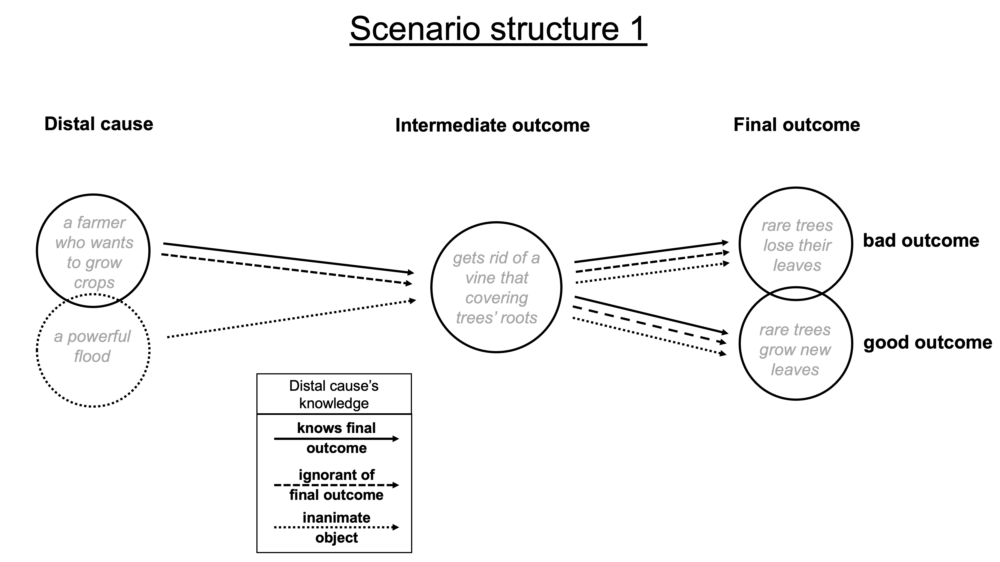
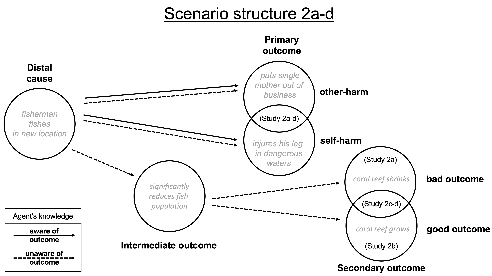
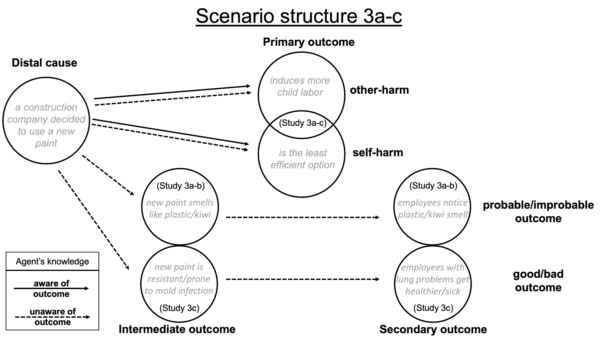
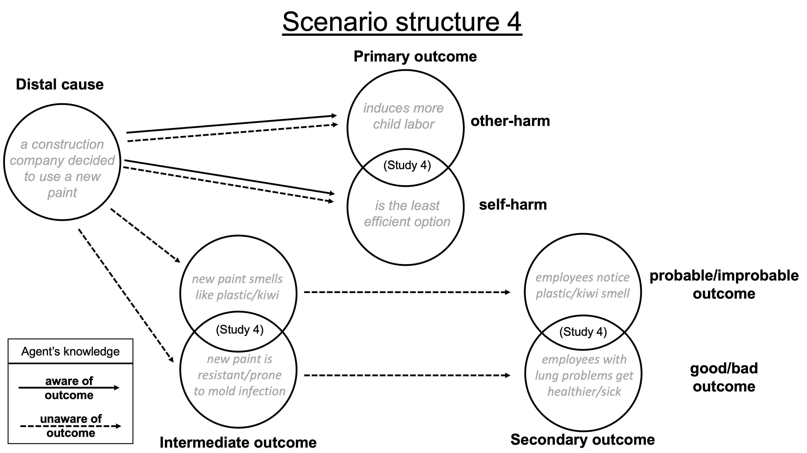

```{r setup, include=FALSE}
knitr::opts_chunk$set(echo = TRUE)
knitr::opts_chunk$set(fig.pos = 'H')
# knitr::opts_knit$set('/Users/erawu/Dropbox (Dartmouth College)/Research./causalityNormality/Cleaning (ESW)')
# knitr::opts_knit$set(root.dir = '/tmp')
```

```{r load_pkg, include=FALSE}

#install.packages("wesanderson", repos = "http://cran.us.r-project.org")
#install.packages("lme4", repos = "http://cran.us.r-project.org")
#install.packages("gridExtra", repos = "http://cran.us.r-project.org")
#install.packages("mediation", repos = "http://cran.us.r-project.org")
#install.packages("bookdown")
#install.packages("tinytex")
#install.packages("Matrix", repos = "http://cran.us.r-project.org")
library(wesanderson)
library(lme4)
library(gridExtra)
library(mediation)
library(tidyverse)
library(tinytex)
library(apa)
library(dplyr)
library(emmeans)
library(lmerTest)
library(pbkrtest)
library(utils)
library(bookdown)
library(mediation)
```

# Intro:

In the critically acclaimed sitcom *Arrested Development*, Lucille Bluth's thirty-two year-old son, Buster, went swimming in the ocean in a brief moment of rebellion against his mother, after he discovered that she had been hiding the true identity of his father from him. In the ocean, Buster encountered a loose seal that had been freed by his magician brother, Gob, after a failed magic show. During this encounter, the seal bit off Buster's left hand. In such a case, one may have many questions, such as: what was the cause of Buster losing his hand? One may attribute Buster’s loss of hand to his imprudent behavior of going into the ocean, the fact that his mother never told him who his true father was, or perhaps the improbable chance encounter with a loose seal. Just like this, we perform causal selection in our daily life.

There are two types of norms that are important to causal cognition: descriptive and prescriptive norms. Descriptive norms refer to how people generally behave while prescriptive norms refer to how people believe we should behave. Prior research has found that both types of norms affect how we think of the cause of an outcome. There has been a number of competing explanations for this effect. For descriptive norms, most researchers believe that the effect is best accounted for by the standard processes of causal reasoning. However, for prescriptive norms, opinions differ. Some believe that the effect simply stems from the responsibility judgment, especially when the outcome is adverse, while others have argued for a more general account emphasizing the general role of normality in causal judgments for both descriptive and prescriptive norms.

We bring in new perspectives to the debate. First, we compare two kinds of prescriptive norms: rationality and morality. Second, we investigate the importance of whether the agent is knowledgeable about violating a norm. Third, unlike prior work, we separate the normality of the action and the valence of the outcome, and we ask whether the effect of the former changes depending on the latter. Fourth, we examine whether descriptive normality of the outcome impacts causal judgments. Accordingly, we add four new findings to the field. First, our studies provide evidence in favor of the general normality account as the two prescriptive norms - rational norms and moral norms - exert similar influence in causal judgment. Second, agent's ignorance about norm violation affects both kinds of norms similarly. Third, both effects are moderated by the valence of the outcome as well as the descriptive normality of the outcome. Fourth, both effects discussed above can be explained by the counterfactual judgment, which provides further support to the theory that normality affects causal judgments by affecting counterfactuals.

## Descriptive Norms

Descriptive norms, including statistical norms, shape judgments of causal selection; specifically, events which violate descriptive norms (e.g., low probability events) are often selected as the cause of later events that depended on their occurrence. It has long been discussed that causal judgments may be sensitive to norm violations or expectations about what will occur (Gorovitz, 1965; Hart & Honoré, 1985; Hilton & Slugoski, 1986; Kahneman & Miller,1986). More recent studies delve into the mechanisms of statistical norm violation in cognition and several models have been proposed to account for the effect. For instance, the counterfactual simulation model (CSM) constructed by Gerstenberg and colleagues shows that the difference between the counterfactual considered and what in fact happened factors into people's causal judgment (2014). Later, researchers expanded the model, arguing that when an unexpected action led to a favorable outcome, the actor would be given credit but when an unexpected action led to an unfavorable outcome, the actor would be assigned blame (Stephan et al., 2017). Furthermore, more credit would be given or more blame would be assigned to agents who are believed to be dispositionally good or bad at acting optimally because when predicting future behavior, people make inferences about agents based on the action history of the latter (Gerstenberg et al., 2017). More specifically, researchers have argued that statistical normality exerts influence on people's causal judgment through probabilistic sampling (Hitchcock & Knobe, 2009). And people's understanding of norms, such as the strength of norm violation, also plays an important role in the causal calculation (Icard et al., 2017). A key concept, counterfactual potency, is constructed to measure the "strength and impact of counterfactual" and has performed well in predicting the impact of counterfactual reasoning in causal judgments (Petrocelli et al., 2011). In addition, the effect of assigning more causation to low probability events is present regardless of the valence of the outcome and it also affects causal attribution to other agents, while higher frequency of norm violation are associated with increased causal attribution (Kominsky et al., 2015; Kirfel & Lagnado, 2017).

## Prescriptive Norms

Prescriptive norms, including moral norms and rational norms, have been shown to have similar effects as descriptive norms on causal selection: immoral actions, for example, tend to be selected as the causes of later events that depended on their occurrence (Alicke, 1992). Moreover, moral judgments have been shown to exert influence on causal cognition, instead of only the other way around (Knobe & Fraser, 2008; Knobe, 2010). Important models proposed for moral norms include the culpable control model, the counterfactual reasoning in causal selection model and the accountability hypothesis (Alicke, 2000; Samland & Waldmann, 2016). The three models attempt to decipher the causal attribution by, respectively, referring to people's exaggeration of the causal strength of moral norm violation, tendency to consider abnormal counterfactuals over normal ones, and propensity to consider factors that are present in moral reasoning generally (Samland & Waldmann, 2016). However, there is no consensus in sight on which account is the most favorable. And as in the case of descriptive norms, the relevance of moral norms is quite important in the causal reasoning process (Phillips et al., 2015).

## Normality

Central to constructing a unified account for causal judgment is the concept of normality. In the current context, normality means alignment with norms, either descriptive or prescriptive (Halpern & Hitchcock, 2015; Icard et al., 2017). Descriptive normality concerns the probability of the event's occurrence while prescriptive normality may concern the righteousness, legality or reasonableness of the action, depending on the relevant prescriptive norm in the given situation. Actions that are not in accordance with either descriptive or prescriptive norms are thus termed "abnormal". In our experiments below, we will investigate the impact of normality in causal cognition across different types of norms by way of affecting the counterfactuals that come to people's minds.

## Ongoing Debate

There is an ongoing debate about whether the two effects discussed above should be understood as arising from the normal process by which people make causal judgments. On the one hand, many have argued that they should not, and that the effect of moral norms or statistical norms are not part of the process of causal reasoning in the first place. Rather, the significant element in the causal reasoning is the valence of the situation or ascription of responsibility (Samland & Waldman, 2016; Alicke et al., 2011; Livengood et al., 2017). On the other hand, a number of researchers have argued that the impact of both descriptive and prescriptive norms should be understood as part of the normal process of causal judgments and counterfactual structure by appealing to the role of counterfactuals in causal cognition. Supporters of the second theory suggest that people's consideration of relevant counterfactuals may be the basis of a unified account of causal judgments (Phillips et al., 2015; Phillips & Knobe, 2018).

Using empirical experiments reported below, we contribute to the existing debate in several ways. First, we consider a new kind of norm violations, rational norm violations, and find that they have a similar impact as moral norm violations on causal selection (see Johnson & Rips, 2015 and Halpern & Hitchcock, 2015 for previous work on what effect violating rational norms has on causal judgments). Second, we replicate the previously demonstrated outcome moderation effects where negative outcomes are more associated with causal attribution than positive outcomes. but also find that they occur for rational norm violations, further prompting the search for a theory that is not specific to moral norm violations. Third, we find that all of the above-mentioned effects are mediated by participants' counterfactual judgments. Fourth, we Fifth, we demonstrate that these outcome effects are not driven by the valence of the outcome but rather by the normality of the outcome by showing that the same pattern is more frequently observed in the cases of abnormal outcomes than normal outcomes. Finally, we test three different accounts of these effects, one that depends only on the morality of the events, one that depends only on the probability of the events, and one that depends on the normality of the events. We find that the normality accounts best captures people's causal judgments, which calls for a unifying model of causal judgments that is grounded in the normality of relevant events.

# Experiment 1: Characterizing moral norm violations in causal chains

To begin our investigation in causal reasoning about agents and inanimate objects, we started by attempting to replicate the effect of norm violations previously found in the literature in a new set of scenarios involving causal chains (see *Fig* 1.). We used 24 scenarios involving a distal cause, which brings about some immediate outcome, which then in turn contributes to a subsequent, final outcome. In these scenarios, we varied the type of distal cause (knowledgeable human agent, ignorant human agent, or inanimate object) and the valence of the final outcome (good or bad). Critically, this design allowed us to replicate prior work by asking whether agents who knowingly bring about bad outcomes are judged to be more causal than agents who knowingly bring about good outcomes. In addition, we can compare this effect of outcome for knowledgeable agents to (1) agents who unknowingly bring about good vs. bad outcomes, and to (2) inanimate objects that make the same causal contribution.

Across all of these conditions, we ask participants both to make judgments of whether the distal cause "caused" the final outcome and to make a counterfactual judgments about what would would have prevented the outcome from occurring.

```{r, illustration1, echo=FALSE, warning=FALSE, message=FALSE, out.width = '100%', fig.cap="Study design for Experiment 1."}

```

## Methods

We report all data exclusions (if any), all manipulations, and all measures in the study. <!-- 21-word solution (Simmons, Nelson & Simonsohn, 2012; retrieved from http://ssrn.com/abstract=2160588) -->

### Participants

```{r study1 participants, echo=FALSE, warning=FALSE, message=FALSE}
d1demo <- read.csv("../data/d2demo.csv") 
# remember that we aren't including the first study with only 3 vignettes
d1demo$age[d1demo$age==1993] <- NA ## one person entered their age as 1993 (presumably the year that they were born) 
d1demo$gender <- factor(c("Male","Female")[d1demo$gender])
d1demo$edu <- factor(c("Grammar School","Highschool or Equivalent","Vocational/Technical School",
                                 "Some College","College Graduate (4 years)","Master's Degree",
                                 "Doctoral Degree (PhD)","Professional Degree (JD,MD,etc.)","Other")[d1demo$edu])
##Age and Gender
d1.age <- matrix(c("mean",mean(d1demo$age,na.rm=T),"sd",sd(d1demo$age,na.rm=T),"n",length(d1demo$age)),ncol = 3)

d1.ageMean <- mean(d1demo$age, na.rm=T)
  
d1.gender <- table(d1demo$gender, exclude=NULL)

###Education
d1.education <- table(d1demo$edu)
```

Since we did not have a priori assumptions, we collected data from 118 participants recruited through Amazon Mechanical Turk (<http://www.mturk.com>) in Experiment 1. `r d1.age[2,3]` participants (*M*~age~=`r round(mean(d1demo$age, na.rm=T),digits=2)`, *SD*~age~=`r round(sd(d1demo$age, na.rm=T),digits=2)`; `r d1.gender[[1]]` females) finished the whole study.

### Materials

Participants completed 24 trials which each involved reading a brief vignette about a causal chain that was initiated by a distal cause, which led to some immediate outcome. This immediate outcome was then the more proximal cause a second, further outcome. This final outcome was either positive or negative, and the distal cause was either a knowledgeable agent (who knew that his action would lead to the occurrence of the further outcome), or an ignorant agent (who did not know that his action would lead to the occurrence of the final outcome) or an inanimate object (see Figure 1). Thus, for example, participants may have read a vignette in which an agent acted with the knowledge that the action in question would result in the occurrence of a bad outcome:

> **Knowledgeable Agent / Bad Outcome**:A farmer plans to clear a plot of land near a forest of rare trees to expand the area in which he can grow his cash crops. As he is clearing this area, an environmentalist sees him and tells him that if he clears this plot of land, he'll actually kill the rare trees in the forest by getting rid of a vine that has been protecting the trees' roots. The farmer replies that he does not care at all about the trees, he just wants to make more money by planting cash crops. He finishes clearing the land and makes more money selling his new crops just like he planned. Not long after the vine is removed, the trees lose all their leaves.

To continue to illustrate with this example, we also altered this vignette in the Ignorant Agent conditions so that the agent simply had no way of knowing that clearing the land would lead the trees to be damaged. In the Inanimate Object conditions, we replaced the farmer with a flood that cleared the same plot of land. Finally, in the conditions where the action eventuated in a Good Outcome, the vine was described as having been damaging the tree's roots and thus removing the vine actually caused the trees to grow new leaves. Conditions were varied across scenarios.

### Procedure

After reading each vignette, participants answered two questions about the events that had occurred. The first asked them to rate their agreement with a statement about the distal agent causing the outcome, as in the following example:

> *Causal question*: The farmer caused the trees to lose all their leaves.

\noindent Participants responded to each of these questions on a scale from 1 ("Completely disagree") to 7 ("Completely agree"). The second question asked participants to complete a counterfactual question, as in the following example:

> *Counterfactual question*: If only $\underline{\hspace{3cm}}$ had been different, the trees wouldn't have lost their leaves.

> a.  The farmer
> b.  The vine

\noindent After completing all 24 trials, participants were asked to complete some optional demographic questions.

### Data analysis

No participants were excluded from the analyses as long as they completed the entire study. The primary analyses were conducted with linear mixed-effects models and included random effects for both participnts and scenarios. These analyses were carried out using the the lme4 pacakage in $\textsf{R}$ [@bates2014lme4]. The significance of an effect for particular factor is calculated by comparing two linear mixed-effects models that vary only in whether factor in question was included in the fixed-effects structure. to the extent that the models differ significantly in their fit, this provides evidence that the factor in question signficantly affected participants' responses.

## Results

### Causal judgments
```{r study1 Cause analyses, echo=FALSE, warning=FALSE, message=FALSE}
d1 <- read.csv("../data/Study2.csv")

d1$Agent <- factor(c("Knowledge","Ignorance","Object")[d1$Agent])
d1$Agent <- factor(d1$Agent, levels=c("Object", "Ignorance","Knowledge"))
d1$Outcome <- factor(c("Good","Bad")[d1$Outcome])
d1$Outcome <- factor(d1$Outcome, levels=c("Good","Bad"))

#d1$causeS <- scale(d1$Cause)
d1$causeS <- d1$Cause


### Interaction:
# lmr1.0 <- lmer(causeS ~ Agent * Outcome + (Agent*Outcome|Vignette) + (1|Subj), data=d1,
            # control = lmerControl(optimizer ='optimx', optCtrl=list(method='nlminb')))
# lmr1.1 <- lmer(causeS ~ Agent + Outcome + (Agent*Outcome|Vignette) + (1|Subj), data=d1,
#                control = lmerControl(optimizer ='optimx', optCtrl=list(method='nlminb'))) #uncon
# lmr1.i <- anova(lmr1.0,lmr1.1)
# saveRDS(lmr1.i,"models/lmr1i.rds")
lmr1.i <- readRDS("models/lmr1i.rds")

### Main effect of agent (significant <.001)
# lmr1.2 <- lmer(causeS ~ Outcome + (Agent*Outcome|Vignette) + (1|Subj), data=d1,
#                control = lmerControl(optimizer ='optimx', optCtrl=list(method='nlminb')))
# lmr1.a <- anova(lmr1.1,lmr1.2)
# saveRDS(lmr1.a,"models/lmr1a.rds")
lmr1.a <- readRDS("models/lmr1a.rds")

### Main effect of outcome (significant 0.007602) (allcom?)
# lmr1.3 <- lmer(causeS ~ Agent + (Agent*Outcome|Vignette) + (1|Subj), data=d1,
#                control = lmerControl(optimizer ='optimx', optCtrl=list(method='nlminb')))
# lmr1.o <- anova(lmr1.1,lmr1.3)
# saveRDS(lmr1.o,"models/lmr1o.rds")
lmr1.o <- readRDS("models/lmr1o.rds")


### d1 causal estimated marginal means

# d1.emsumA <- summary(emmeans::emmeans(lmr1.0, ~ Agent))
# saveRDS(d1.emsumA,"models/d1.emsumA.rds")
d1.emsumA <- readRDS("models/d1.emsumA.rds")
# d1.empairA <- summary(pairs(emmeans(lmr1.0, ~ Agent)))
# saveRDS(d1.empairA,"models/d1.empairA.rds")
d1.empairA <- readRDS("models/d1.empairA.rds")

# d1.emsumO <- summary(emmeans::emmeans(lmr1.0, ~ Outcome))
# saveRDS(d1.emsumO,"models/d1.emsumO.rds")
d1.emsumO <- readRDS("models/d1.emsumO.rds")
# d1.empairO <- summary(pairs(emmeans(lmr1.0, ~ Outcome)))
# saveRDS(d1.empairO,"models/d1.empairO.rds")
d1.empairO <- readRDS("models/d1.empairO.rds")

# d1.emsumAO <- summary(emmeans::emmeans(lmr1.0, ~ Agent*Outcome))
# saveRDS(d1.emsumAO,"models/d1.emsumAO.rds")
d1.emsumAO <- readRDS("models/d1.emsumAO.rds")
# d1.empairAO <- summary(emmeans::emmeans(lmr1.0, pairwise ~ Agent*Outcome))$contrasts
# saveRDS(d1.empairAO,"models/d1.empairAO.rds")
d1.empairAO <- readRDS("models/d1.empairAO.rds")


# d1.sumA <- d1 %>%
#   select(Agent,Cause,Subj) %>%
#   group_by(Agent,Subj) %>%
#   summarise(CauseM = mean(Cause),na.rm=TRUE) %>%
#   group_by(Agent) %>%
#   summarise(N = length(CauseM),
#             mean = mean(CauseM, na.rm=TRUE),
#             sd = sd(CauseM,na.rm=TRUE),
#             se = sd / sqrt(N))
# 
# d1.sumO <- d1 %>% 
#   select(Outcome,Cause,Subj) %>%
#   group_by(Outcome,Subj) %>%
#   summarise(CauseM = mean(Cause),na.rm=TRUE) %>%
#   group_by(Outcome) %>%
#   summarise(N = length(CauseM),
#             mean = mean(CauseM, na.rm=TRUE),
#             sd = sd(CauseM,na.rm=TRUE),
#             se = sd / sqrt(N))

d1.sum <- d1 %>% 
  dplyr::select(Agent,Outcome,Cause,Subj) %>%
  group_by(Agent,Outcome,Subj) %>%
  summarise(CauseM = mean(Cause),na.rm=TRUE) %>%
  group_by(Agent,Outcome) %>%
  summarise(N = length(CauseM),
            mean = mean(CauseM, na.rm=TRUE),
            sd = sd(CauseM,na.rm=TRUE),
            se = sd / sqrt(N))

```

We first analyzed participants' causal judgments, which revealed a main effect of the kind of *Agent* involved, $\chi^2(2)$ = `r round(lmr1.a$Chisq[2],digits=2)`, *p* $<$ .001, such that ignorant agents were overall seen as the least causal (*M* = `r round(d1.emsumA$emmean[2],digits=2)`, 95% CI = [`r round(d1.emsumA$lower.CL[2],digits=2)`, `r round(d1.emsumA$upper.CL[2],digits=2)`]), even less than inanimate objects (*M* = `r sprintf("%.2f", d1.emsumA$emmean[1])`, 95% CI = [`r round(d1.emsumA$lower.CL[1],digits=2)`, `r round(d1.emsumA$upper.CL[1],digits=2)`]), *t*(`r round(d1.empairA$df[1])`) = `r round(d1.empairA$t.ratio[1], digits=2)`, *p* = `r round(d1.empairA$p.value[1], digits=3)`. Knowledgeable agents, on the other hand, were deemed more causal than the ignorant ones (*M* = `r round(d1.emsumA$emmean[3],digits=2)`, 95% CI = [`r round(d1.emsumA$lower.CL[3],digits=2)`, `r round(d1.emsumA$upper.CL[3],digits=2)`]), *t*(`r round(d1.empairA$df[3])`) = `r round(d1.empairA$t.ratio[3], digits=2)`, *p* < .001). We also observed a main effect of the kind of *Outcome* that eventuated, $\chi^2(1)$ = `r round(lmr1.o$Chisq[2],digits=2)`, *p* = `r round(lmr1.o$'Pr(>Chisq)'[2],digits=3)`, suggesting that participants assigned more causality to the distal event when the outcome was bad (*M* = `r round(d1.emsumO$emmean[2],digits=2)`, 95% CI = [`r round(d1.emsumO$lower.CL[2],digits=2)`, `r round(d1.emsumO$upper.CL[2],digits=2)`]) than when it turned out to be good (*M* = `r round(d1.emsumO$emmean[1],digits=2)`, 95% CI = [`r round(d1.emsumO$lower.CL[1],digits=2)`, `r round(d1.emsumO$upper.CL[1],digits=2)`]), *t*(`r round(d1.empairO$df[1])`) = `r round(d1.empairO$t.ratio[1], digits=2)`, *p* = `r round(d1.empairO$p.value[1], digits=3)`. Furthermore, these main effects were qualified by an *Agent* $\times$ *Outcome* interaction, $\chi^2(2)$ = `r round(lmr1.i$Chisq[2],digits=2)`, *p* $<$ .001.

We further decomposed this interaction and found that when agents knew about the outcome that may come as a consequence of their action (*t*(`r round(d1.empairAO$df[12])`) = `r round(d1.empairAO$t.ratio[12], digits=2)`, *p* <.001), they were judged as much more causal for bad outcomes (*M* = `r round(d1.emsumAO$emmean[6],digits=2)`, 95% CI = [`r round(d1.emsumAO$lower.CL[6],digits=2)`, `r round(d1.emsumAO$upper.CL[6],digits=2)`]) than for good outcomes (*M* = `r round(d1.emsumAO$emmean[3],digits=2)`, 95% CI = [`r round(d1.emsumAO$lower.CL[3],digits=2)`, `r round(d1.emsumAO$upper.CL[3],digits=2)`]). In contrast, when agents were oblivious about the outcome (*t*(`r round(d1.empairAO$df[8])`) = `r round(d1.empairAO$t.ratio[8], digits=2)`, *p* = `r round(d1.empairAO$p.value[8], digits=3)`), they were not judged to be much more causal for bad outcomes (*M* = `r round(d1.emsumAO$emmean[5],digits=2)`, 95% CI = [`r round(d1.emsumAO$lower.CL[5],digits=2)`, `r round(d1.emsumAO$upper.CL[5],digits=2)`]) than good outcomes (*M* = `r round(d1.emsumAO$emmean[2],digits=2)`, 95% CI = [`r round(d1.emsumAO$lower.CL[2],digits=2)`, `r round(d1.emsumAO$upper.CL[2],digits=2)`]). Similarly, causal judgments about non-agentic objects (*t*(`r round(d1.empairAO$df[3])`) = `r round(d1.empairAO$t.ratio[3], digits=2)`, *p* = `r round(d1.empairAO$p.value[3], digits=3)`) did not differentiate much between bad outcomes (*M* = `r round(d1.emsumAO$emmean[4],digits=2)`, 95% CI = [`r round(d1.emsumAO$lower.CL[4],digits=2)`, `r round(d1.emsumAO$upper.CL[4],digits=2)`]) and good outcomes (*M* = `r round(d1.emsumAO$emmean[1],digits=2)`, 95% CI = [`r round(d1.emsumAO$lower.CL[1],digits=2)`, `r round(d1.emsumAO$upper.CL[1],digits=2)`]). In short, the valence of the outcome only affected participants' causal judgments when the agent at the beginning of the causal chain *knew* about the valence of the outcome (see *Figure* 2).

### Counterfactual judgments

```{r study1 counterfactual analyses, echo=FALSE, warning=FALSE, message=FALSE}
  
d1$Counterfactual <- factor(d1$Counterfactual)

## Interaction (significant <.001)
# glmr1.0 <- glmer(Counterfactual ~ Agent * Outcome + (Agent*Outcome|Vignette) + (1|Subj), data=d1, family = "binomial",
                 # control=glmerControl(optimizer="bobyqa", optCtrl=list(maxfun=100000)))
# glmr1.1 <- glmer(Counterfactual ~ Agent + Outcome + (Agent*Outcome|Vignette) + (1|Subj), data=d1, family = "binomial",
#                  control=glmerControl(optimizer="bobyqa", optCtrl=list(maxfun=100000)))
# glmr1.i <- anova(glmr1.0,glmr1.1)
# saveRDS(glmr1.i,"models/glmr1i.rds")
glmr1.i <- readRDS("models/glmr1i.rds")

## Main effect of agent (significant <.001, 0.0003983)
# glmr1.2 <- glmer(Counterfactual ~ Outcome + (Agent*Outcome|Vignette) + (1|Subj), data=d1, family = "binomial",
#                  control=glmerControl(optimizer="bobyqa", optCtrl=list(maxfun=100000)))
# glmr1.a <- anova(glmr1.1,glmr1.2)
# saveRDS(glmr1.a,"models/glmr1a.rds")
glmr1.a <- readRDS("models/glmr1a.rds")

# Main effect of outcome (significant 0.00119)
# glmr1.3 <- glmer(Counterfactual ~ Agent + (Agent*Outcome|Vignette) + (1|Subj), data=d1, family = "binomial",
#                  control=glmerControl(optimizer="bobyqa", optCtrl=list(maxfun=100000)))
# glmr1.o <- anova(glmr1.1,glmr1.3)
# saveRDS(glmr1.o,"models/glmr1o.rds")
glmr1.o <- readRDS("models/glmr1o.rds")

### d1 counterfactual estimated marginal means & proportions

# d1.cfsumA <- summary(emmeans::emmeans(glmr1.0, ~ Agent))
# saveRDS(d1.cfsumA,"models/d1.cfsumA.rds")
d1.cfsumA <- readRDS("models/d1.cfsumA.rds")
# d1.cfpairA <- summary(pairs(emmeans(glmr1.0, ~ Agent)))
# saveRDS(d1.cfpairA,"models/d1.cfpairA.rds")
d1.cfpairA <- readRDS("models/d1.cfpairA.rds")

# d1.cfsumO <- summary(emmeans::emmeans(glmr1.0, ~ Outcome))
# saveRDS(d1.cfsumO,"models/d1.cfsumO.rds")
d1.cfsumO <- readRDS("models/d1.cfsumO.rds")
# d1.cfpairO <- summary(pairs(emmeans(glmr1.0, ~ Outcome)))
# saveRDS(d1.cfpairO,"models/d1.cfpairO.rds")
d1.cfpairO <- readRDS("models/d1.cfpairO.rds")

# d1.cfsumAO <- summary(emmeans::emmeans(glmr1.0, ~ Agent*Outcome))
# saveRDS(d1.cfsumAO,"models/d1.cfsumAO.rds")
d1.cfsumAO <- readRDS("models/d1.cfsumAO.rds")
# d1.cfpairAO <- summary(pairs(emmeans(glmr1.0, ~ Agent*Outcome)))
# saveRDS(d1.cfpairAO,"models/d1.cfpairAO.rds")
d1.cfpairAO <- readRDS("models/d1.cfpairAO.rds")


d1.tabA <- data.frame(aggregate(Counterfactual ~ Agent, FUN=table,data=d1))
d1.tabO <- data.frame(aggregate(Counterfactual ~ Outcome, FUN=table,data=d1))
d1.tabI <- data.frame(aggregate(Counterfactual ~ Outcome * Agent, FUN=table,data=d1))

#, such that ignorant agents were overall less frequently selected as the more relevant focus of counterfactuals (*M* = `r round(d1.sumA_cf$mean[d1.sumA$Agent=="Ignorance"],digits=2)`, *SD* = `r round(d1.sumA$sd[d1.sumA$Agent=="Ignorance"],digits=2)`) than knowledgeable agents (*M* = `r round(d1.sumA$mean[d1.sumA$Agent=="Knowledge"],digits=2)`, *SD* = `r round(d1.sumA$sd[d1.sumA$Agent=="Knowledge"],digits=2)`), or inanimae objects (*M* = `r round(d1.sumA$mean[d1.sumA$Agent=="Object"],digits=2)`, *SD* = `r round(d1.sumA$sd[d1.sumA$Agent=="Object"],digits=2)`).
```

We next analyzed participants' counterfactul judgments using generalized linear mixed-effects models. These analyses again revealed a main effect of the kind of *Agent* the distal event involved, $\chi^2(2)$ = `r round(glmr1.a$Chisq[2],digits=2)`, $p$ $<$ `r max(.001,round(glmr1.a$'Pr(>Chisq)'[2],digits=3))`, such that ignorant agents were less frequently selected as the focus of the most relevant counterfactual (`r 100*(round(d1.tabA$Counterfactual[2,1][[1]]/(d1.tabA$Counterfactual[2,2][[1]]+d1.tabA$Counterfactual[2,1][[1]]), digits=2))`%), than knowledgeable agents were (`r 100*(round(d1.tabA$Counterfactual[3,1][[1]]/(d1.tabA$Counterfactual[3,2][[1]]+d1.tabA$Counterfactual[3,1][[1]]), digits=2))`%),  *z* = `r round(d1.cfpairA$z.ratio[3], digits=2)`, *p* < .001. Ignorant agents were also less likely to be selected as the counterfactual focus than objects (`r 100*(round(d1.tabA$Counterfactual[1,1][[1]]/(d1.tabA$Counterfactual[1,2][[1]]+d1.tabA$Counterfactual[1,1][[1]]), digits=2))`%), *z* = `r round(d1.cfpairA$z.ratio[1], digits=2)`, *p* < .001. In addition, we observed a main effect of *Outcome valence* once more, $\chi^2(1)$ = `r round(glmr1.o$Chisq[2],digits=2)`, *p* = `r round(glmr1.o$'Pr(>Chisq)'[2],digits=3)`, such that the distal agent was more selected as the focus of the most relevant counterfactual for bad outcomes (`r (round((d1.tabO$Counterfactual[2,2][[1]]/(d1.tabO$Counterfactual[2,2][[1]]+d1.tabO$Counterfactual[2,1][[1]])), digits=2))*100` %) than for good outcomes (`r (round((d1.tabO$Counterfactual[1,2][[1]]/(d1.tabO$Counterfactual[1,2][[1]]+d1.tabO$Counterfactual[1,1][[1]])), digits=2))*100`%), *z* = `r round(d1.cfpairO$z.ratio[1], digits=2)`, *p* < .001. More importantly, we again observed a significant *Agent* $\times$ *Outcome* interaction effect, $\chi^2(2)$ = `r round(glmr1.i$Chisq[2],digits=2)`, *p* $<$ `r max(.001,round(glmr1.i$'Pr(>Chisq)'[2],digits=3))`.

Mirroring participants' causal judgments, we found that outcome valence strongly affected participants' counterfactual judgments when the agent was knowledgeable, such that the distal agent was the focus of counterfactuals more for bad outcomes (`r 100*(round(d1.tabI$Counterfactual[6,1][[1]]/(d1.tabI$Counterfactual[6,2][[1]]+d1.tabI$Counterfactual[6,1][[1]]), digits=2))`%), than for good outcomes (`r 100*(round(d1.tabI$Counterfactual[5,1][[1]]/(d1.tabI$Counterfactual[5,2][[1]]+d1.tabI$Counterfactual[5,1][[1]]), digits=2))`%), *z* = `r round(d1.cfpairAO$z.ratio[12], digits=2)`, *p* < .001. In contrast, when the agent was ignorant of the outcome, there was little difference in their tendency to focous on the distal agent in their counterfactual judgments in cases with bad (`r 100*(round(d1.tabI$Counterfactual[4,1][[1]]/(d1.tabI$Counterfactual[4,2][[1]]+d1.tabI$Counterfactual[4,1][[1]]), digits=2))`%) or good outcomes (`r 100*(round(d1.tabI$Counterfactual[3,1][[1]]/(d1.tabI$Counterfactual[3,2][[1]]+d1.tabI$Counterfactual[3,1][[1]]), digits=2))`%), *z* = `r round(d1.cfpairAO$z.ratio[8], digits=2)`, *p* = `r round(d1.cfpairAO$p.value[8], digits=3)`. That remains true for non-agentic objects in bad outcomes (`r 100*(round(d1.tabI$Counterfactual[2,1][[1]]/(d1.tabI$Counterfactual[2,2][[1]]+d1.tabI$Counterfactual[2,1][[1]]), digits=2))`%) versus good outcomes (`r 100*(round(d1.tabI$Counterfactual[1,1][[1]]/(d1.tabI$Counterfactual[1,2][[1]]+d1.tabI$Counterfactual[1,1][[1]]), digits=2))`%),  *z* = `r round(d1.cfpairAO$z.ratio[3], digits=2)`, *p* = `r round(d1.cfpairAO$p.value[3], digits=3)`.

In short, participants' counterfactual judgments were only affected by the valence of the outcome when the agent acted with knowledge of the valence (see *Figure* 2).

```{r, d1Fig, fig.pos="H", fig.width=8.5, fig.height=10, echo=FALSE, warning=FALSE, message=FALSE, fig.cap="Participants' causal and counterfactual judgments as a function of both the kind of agent who initiated the causal chain and the valence of the outcome that eventuated. Error bars indicate +/- 1 *SEM*."}

d1plot <- d1 %>%
  dplyr::select(Subj, Cause, Agent, Outcome) %>%
  group_by(Subj, Agent, Outcome) %>% 
  summarise(N = length(Cause),
            mean = mean(as.numeric(Cause), na.rm=TRUE)) %>%
  dplyr::rename(causeN = N) %>%
  rename(causeMean = mean)

d1plot.sum <- d1plot %>%
  group_by(Agent, Outcome) %>%
  summarise(N = length(causeMean),
            mean = mean(as.numeric(causeMean), na.rm=TRUE),
            sd = sd(as.numeric(causeMean),na.rm=TRUE),
            se = sd / sqrt(N)) %>%
  dplyr::rename(causeN = N) %>%
  rename(causeMean = mean) %>%
  rename(causesumSD = sd) %>%
  rename(causesumSE = se)

d1.plot1 <- ggplot(data=d1plot, aes(x=Agent, y=causeMean, fill=Outcome)) +
  geom_violin(alpha=.6, linewidth=.1) +
  scale_fill_manual(values=c("#bdd7e7", "#2171b5")) + ###bdd7e7 #6baed6
  geom_point(stat="identity",position=position_jitterdodge(jitter.width=.1,dodge.width=.9),alpha=.05, color="black") +
  geom_point(data=d1plot.sum, aes(x=Agent, y=causeMean, fill=Outcome), shape=16, size=2,position=position_dodge(.9), color="black") +
  geom_line(data=d1plot.sum, aes(x=Agent, y=causeMean), size=1) +
  geom_errorbar(data=d1plot.sum,aes(ymin=causeMean-causesumSE, ymax=causeMean+causesumSE), width=.2, position=position_dodge(.9),color="black") +
  ylab("Causation rating") +
  xlab("") +
  theme_bw() +
  theme(
    plot.background = element_blank(),
    panel.grid.major = element_blank(),
    panel.grid.minor = element_blank(),
    strip.text.x = element_text(size=rel(2)),
    strip.text.y = element_text(size=rel(2)),
    legend.title=element_blank(),
    #legend.text=element_text(size=rel(1)),
    legend.text=element_text(size=10),
    legend.position="right",
    legend.justification=c(1,1),
    legend.key.width = unit(0.8, "cm"),
    legend.key.height = unit(0.4, "cm"),
    # axis.text.y=element_text(size=rel(1)),
    # axis.title.y=element_text(size=rel(2),vjust=.9),
    axis.text.y = element_text(size=12),
    axis.title.y = element_text(size=14, vjust=.9),
    axis.title.x=element_blank(),
    axis.text.x=element_text(size=rel(1.5)),
    axis.ticks = element_blank()) +
    scale_y_continuous(breaks=c(1, 3, 5, 7))
#ggsave("d1.plot1.pdf", width=8, height=12, path="figures")


d1$Counterfactual <- factor(c("Distal","Proximal")[d1$Counterfactual])
d1$Counterfactual <- factor(d1$Counterfactual, levels=c("Proximal","Distal"))

d1.plot2 <- ggplot(d1,aes(x=Outcome, fill=Counterfactual)) +
  geom_bar(position="stack") +
  ylab("Counterfactual focus") +
  xlab("") +
  #scale_fill_manual("Event:",values=wes_palette("Chevalier1",2)) + 
  scale_fill_manual(values=c("#bdd7e7", "#2171b5")) +
  facet_grid( ~ Agent) +
  theme_bw() +
  theme(
    plot.background = element_blank()
    ,panel.grid.major = element_blank()
    ,panel.grid.minor = element_blank(),
    # ,legend.text=element_text(size=rel(1))
    # ,axis.text.y=element_text(size=rel(1))
    # ,axis.text.x=element_text(size=rel(1))
    # ,axis.title.y=element_text(vjust=.9)
    legend.text = element_text(size = 10),
    axis.text.y = element_text(size = 12),
    axis.text.x = element_text(size = 12),
    axis.title.y = element_text(size=14, vjust=.9),
    axis.ticks = element_blank()
    ,axis.title=element_text(size=rel(1))
    ,strip.text=element_text(size=rel(.9))
    ,legend.position = "right",
    legend.justification = "right",
    legend.box.margin = margin(0, 0, 5, 0)
  )

grid.arrange(d1.plot1, d1.plot2, nrow=2)

```

### Relationship between causal and counterfactual judgments

```{r study1 correlation and mediation, echo=FALSE, message=FALSE}

## correlation at the level of participants
d1.sumCorSub <- d1 %>% 
  dplyr::select(Agent,Outcome,Cause,Counterfactual,Subj,Vignette) %>%
  group_by(Agent,Outcome,Subj,Vignette) %>%
  summarise(CauseM = mean(Cause,na.rm=TRUE),
            CntrfM = mean(as.numeric(Counterfactual)))

d1.corSub <- cor.test(d1.sumCorSub$CauseM,d1.sumCorSub$CntrfM)

## correlation at the level of scenario
d1.sumCorVign <- d1 %>% 
  dplyr::select(Agent,Outcome,Cause,Counterfactual,Vignette) %>%
  group_by(Agent,Outcome,Vignette) %>%
  summarise(CauseM = mean(Cause,na.rm=TRUE),
            CntrfM = mean(as.numeric(Counterfactual)))

d1.corVign <- cor.test(d1.sumCorVign$CauseM,d1.sumCorVign$CntrfM)

# SO FAR THIS IS STILL NOT WORKING
# d1.m <- d1[d1$Agent!="Object",]
# 
# #lm1.m1 <- lmer(causeS ~ Counterfactual + Agent*Outcome + (Agent*Outcome|Subj) + (1|Vignette), data=d1.m)
# #lm1.m2 <- lmer(causeS ~ Counterfactual + Agent + Outcome + (Agent*Outcome|Subj) + (1|Vignette), data=d1.m)
# #anova(lm1.m1,lm1.m2)
#   
# d1.m$Interaction[d1.m$Agent=="Knowledge" & d1.m$Outcome=="Bad"] <- -1
# d1.m$Interaction[d1.m$Agent=="Knowledge" & d1.m$Outcome=="Good"] <- 1
# d1.m$Interaction[d1.m$Agent=="Ignorance" & d1.m$Outcome=="Bad"] <- 1
# d1.m$Interaction[d1.m$Agent=="Ignorance" & d1.m$Outcome=="Good"] <- -1
# 
# #d1$Interaction <- factor(d1$Interaction)
# d1.m$Counterfactual <- as.numeric(as.character(d1.m$Counterfactual))
# d1.m$Agent <- as.numeric(as.character(d1.m$Agent))
# 
# med.fit <- glm(Counterfactual ~ Agent, data=d1.m, family="binomial")
# out.fit <- lm(Cause ~ Counterfactual + Agent, data=d1.m)
# 
# med.out <- mediate.sed("causeS", "Counterfactual", boot=TRUE, treat="Agent", SI=TRUE,data=d1.m)
# 

# library(arm)
# d1.m$Subj <- factor(d1.m$Subj)
# med.fit <- glmer(Counterfactual ~ Interaction + Agent + Outcome + (1|Subj), family=binomial(link="logit"), data=d1.m)
# out.fit <- lmer(causeS ~ Interaction + Counterfactual + Agent + Outcome + (Agent*Outcome|Subj), data=d1.m)
# med.out <- mediate(med.fit, out.fit, sims=1000, treat="Interaction", mediator="Counterfactual")

# Recode levels of Counterfactual, Agent, Outcome
# Convert factors to numeric outside the models 
# Construct an interaction variable

# 
# d1.m <- d1[d1$Agent!="Object",]
# 
# d1.m$Counterfactual <- as.factor(d1.m$Counterfactual)
# levels(d1.m$Counterfactual) <- c(0, 1)
# d1.m$Counterfactual_num <- as.numeric(as.character(d1.m$Counterfactual))
# 
# d1.m$agent <- as.factor(d1.m$Agent)
# d1.m$agent <- factor(d1.m$Agent, levels = c("Ignorance","Knowledge"), labels = c(0, 1))
# d1.m$outcome <- as.factor(d1.m$Outcome)
# levels(d1.m$outcome) <- c(0,1)
# d1.m$interaction <- interaction(d1.m$agent, d1.m$outcome)
# d1.m$interaction_num <- as.numeric(as.character(d1.m$interaction))
# 
# # Fit models using these numeric variables
# d1med.fit <- glmer(as.factor(Counterfactual) ~ agent + outcome + interaction_num + (1|Subj), family="binomial", data=d1.m)
# d1out.fit <- lmer(causeS ~ Counterfactual_num + interaction_num + (1|Subj), data=d1.m)
# d1med.out <- mediate(d1med.fit, d1out.fit, sims=1000, treat="interaction_num", mediator="Counterfactual_num")
# d1med <- summary(d1med.out)

d1.m <- d1[d1$Agent!="Object",]

d1.m$Counterfactual <- as.factor(d1.m$Counterfactual)
levels(d1.m$Counterfactual) <- c(0, 1)
d1.m$Counterfactual_num <- as.numeric(as.character(d1.m$Counterfactual))
d1.m$agent <- as.factor(d1.m$Agent)
d1.m$agent <- factor(d1.m$Agent, levels = c("Ignorance","Knowledge"), labels = c(0, 1))
d1.m$outcome <- as.factor(d1.m$Outcome)
d1.m$outcome <- factor(d1.m$Outcome, levels = c("Bad","Good"), labels = c(0, 1))

d1.m$Interaction[d1.m$Agent=="Knowledge" & d1.m$Outcome=="Bad"] <- 0
d1.m$Interaction[d1.m$Agent=="Knowledge" & d1.m$Outcome=="Good"] <- 1
d1.m$Interaction[d1.m$Agent=="Ignorance" & d1.m$Outcome=="Bad"] <- 1
d1.m$Interaction[d1.m$Agent=="Ignorance" & d1.m$Outcome=="Good"] <- 0
d1med.fit <- glmer(as.factor(Counterfactual_num) ~ agent + outcome + Interaction + (1|Subj), family="binomial", data=d1.m)
d1out.fit <- lmer(causeS ~ Counterfactual_num + agent + outcome + Interaction + (1|Subj), data=d1.m)
d1med.out <- mediate(d1med.fit, d1out.fit, sims=1000, treat="Interaction", mediator="Counterfactual_num")
d1med <- summary(d1med.out)
```

Finally, we considered the relationship between participants' causal and counterfactual judgments, and found that they were highly correlated both when considered at the level of each participants' judgments ($r =$ `r sprintf("%.2f", d1.corSub$estimate[[1]])`, $p$ $<$ `r max(.001,round(d1.corSub$p.value, digits = 3))`, and at the level of each the different scenarios ($r =$ `r round(d1.corVign$estimate[[1]], digits=2)`, $p$ $<$ `r max(.001, round(d1.corVign$p.value, digits = 3))`) (see *Figure* 3). We also asked whether the counterfactual judgments mediated the observed Knowledge $\times$ Outcome interaction effect observed for ignorant agents, and found that they did: counterfactual selection mediated the relationship between causal judgment and the interaction between *Knowledge* and *Outcome* , with an average causal mediation effect (ACME) of -0.11, (95% CI = [-0.18, -0.04], *p* = 0.002). Controlling for the main effect of agent and knowledge, the proportion mediated is 0.307 (95% CI = [0.14, 0.54], *p* = 0.002).

```{r fig.width=8.5, echo=FALSE, message=FALSE, fig.cap="Depiction of the relationship between participants' causal and counterfactual judgments for each of the scenarios. Shape depicts the valence of the outcome; color indicates the kind of agent involved in the distal event; and the number indicates which of the 24 vignettes the judgments were about."}

d1.sumCorGraph <- d1 %>% 
  dplyr::select(Agent,Outcome,Cause,Counterfactual,Vignette) %>%
  group_by(Agent,Outcome,Vignette) %>%
  summarise(CauseM = mean(Cause,na.rm=TRUE),
            CauseN = length(Cause),
            CauseSD = sd(Cause,na.rm=TRUE),
            CauseSE =  CauseSD / sqrt(CauseN),
            CntrfM = mean(as.numeric(Counterfactual)),
            CntrfN = length(Counterfactual),
            CntrfSD = sd(as.numeric(Counterfactual),na.rm=TRUE),
            CntrfSE =  CntrfSD / sqrt(CntrfN)) %>%
  dplyr::select(Agent,Outcome,Vignette,CauseM,CauseSE,CntrfM,CntrfSE) %>%
  gather("JudgmentSE","SE",c("CauseSE","CntrfSE")) %>%
  mutate(CntrfMr = (CntrfM-1))


d1.plot3 <- ggplot(d1.sumCorGraph, aes(y=CauseM, x=CntrfMr,color=Outcome))+
                  geom_smooth(method=lm, formula = y ~ x) +
                  geom_point(aes(color=Outcome, shape=Outcome),size=3) +
                  geom_text(aes(label=Vignette),size=1.5,color="black") +
                  facet_grid(~Agent) + 
                  #geom_errorbar(aes(ymax=CauseM - SE, ymin=CauseM-SE)) +
                  #geom_errorbarh(aes(xmax=CntrfMr - SE, xmin=CntrfMr-SE)) +
                  xlab("Average Counterfactual Prefence for the distal agent per Scenario") +
                  ylab("Average Causal Judgment per Scenario") +
                  scale_color_manual("Outcome", values=wes_palette("Royal1",2)) + 
                  theme_bw() +
                  theme(
                    plot.background = element_blank()
                    ,panel.grid.major = element_blank()
                    ,panel.grid.minor = element_blank()
                    ,legend.text=element_text(size=rel(1))
                    #,legend.position=c(.9,.25)
                    ,axis.text.y=element_text(size=rel(1))
                    ,axis.text.x=element_text(size=rel(1))
                    ,axis.title.y=element_text(vjust=.9)
                    ,axis.ticks = element_blank()
                    ,axis.title=element_text(size=rel(1))
                    ,strip.text=element_text(size=rel(.9))
                  )

plot(d1.plot3)
```

## Discussion

Experiment 1 investigated participants' causal and counterfactual judgments in a simple causal chain which eventuates in either good or bad outcomes. We found that agents who started this causal chain with knowledge of the outcome that their action would lead to were judged to be more causal of bad than good outcomes. By comparison, agents who were ignorant about the outcome that would eventually occur were not judged to be more causal of bad (v.s. good) outcomes. Thus this first experiment demonstrates the effect of norm violations in causal chains across many scenarios and shows that it critically depends on the information available to the agent acting. The observed interaction effect between knowledge and outcome in participants' causal judgments was mirrored by a similar pattern in their counterfactual judgments: in cases where the agent *knew* about the outcome, participants were more inclined to judge that the bad (v.s. good) outcome would not have occurred if the agent had acted differently. This effect was again not seen for agents who acted in ignorance of the outcome. Across all of these conditions, we also found that participants' causal and counterfactual judgments were tightly correlated. Notably, across scenarios, we also found that the pattern of causal and counterfactual judgments for ignorant human agents resembled the pattern observed for inanimate objects, possibly suggesting a unified process for causal reasoning about both agents and inanimate objects that is underwritten by counterfactual reasoning.

Before continuing to pursue this line of reasoning, we first want to address a confound that exists in both our experiment and in much of the empirical work on the topic, specifically that the morality of the agent's action is typically confounded with the goodness or badness of the outcome (see @hitchcock2009cause and @kominsky2015superseding for two notable exceptions). In the next series of studies, we independently vary the valence of the outcome and the morality of the agents' actions to allow us to ask how they separately contribute to participants' causal judgments.


# Experiment 2a: Causal judgment in cases of bad outcomes and prescriptive norm violations

In this next Experiment, we began by directly addressing the confound between outcome valence and the morality of the agent's action. We did this by introducing two separate outcomes that arose from the agent's actions (see *Fig.* 4). We used the first (primary) outcome to manipulate whether the agent's action would be seen as violating a norm, by having the agent knowingly or ignorantly acting in a way that brought about some harm. In addition, we used the secondary outcome to independently manipulate the valence of a subsequent downstream consequence of their action. The agent was always ignorant of this secondary outcome, regardless of whether it was positive or negative Critically, we still always asked whether the agent caused the downstream, secondary outcome that was either positive or negative. This design allowed us to dissociate whether or not the agent violated a norm from whether the agent acted in way that eventually led to negative or positive outcome. In this first Experiment (2a), we begin by considering cases in which the secondary outcome is always negative, and the agent could either knowingly or ignorantly bring about some other harm (the primary outcome).

A second innovation in this Experiment was to introduce a second kind of prescriptive norm violation, namely, violations of norms of rationality. Moral norm violations often involve an agent bringing about an outcome that is not in someone else's best interest, while rational norm violations often involve agents bringing about outcomes that are not in their own best interest. In this study, we also systematically vary whether the agent violated a moral or rational norm and ask whether the observed effect on causal judgments is specific to moral norm violations or extends to other kinds of prescriptive norm violations. This addition should help us address a concern raised by researchers who argue that the effect of normality is driven disproportionately by the immorality of actions. [CITEs]

To summarize, in this experiment we used 24 scenarios where an agent (i.e., the distal cause) either knowingly or ignorantly performed an action that harmed either the another person or the agent her/himself. This harm serves as the primary outcome of the agent's action. At the same time, the agent's action led to a second downstream consequence (i.e., the proximal cause) which in turn led to another downstream consequence (the secondary outcome). In this experiment the secondary outcome was always negative and the agent was always unaware of it. We then asked for participants' whether the agent (the distal cause) "caused" the secondary outcome (see *Fig. 4*).


```{r illustration 2, echo=FALSE, fig.cap="Study design for Experiment series 2", out.width = '100%'}

```

## Methods

### Participants

```{r study2a participants, echo=FALSE}
d2ademo <- read.csv("../data/d4demo.csv") # remember that we aren't including the first study with only 3 vignettes
#d2demo$age[d1demo$age==1993] <- NA ## one person entered their age as 1993 (presumably the year that they were born) 
d2ademo$gender <- factor(c("Male","Female")[d2ademo$gender])
d2ademo$edu <- factor(c("Grammar School","Highschool or Equivalent","Vocational/Technical School",
                                 "Some College","College Graduate (4 years)","Master's Degree",
                                 "Doctoral Degree (PhD)","Professional Degree (JD,MD,etc.)","Other")[d2ademo$edu])
##Age and Gender
d2a.age <- matrix(c("mean",mean(d2ademo$age,na.rm=T),"sd",sd(d2ademo$age,na.rm=T),"n",length(d2ademo$age)),ncol = 3)
d2a.gender <- table(d2ademo$gender, exclude=NULL)

###Education
d2.education <- table(d2ademo$edu)

```

In Experiment 2a, `r d2a.age[2,3]` participants (*M*~age~=`r round(mean(d2ademo$age, na.rm=T),digits=2)`, *SD*~age~=`r round(sd(d2ademo$age, na.rm=T),digits=2)`; `r d2a.gender[[1]]` females) were recruited through Amazon Mechanical Turk (<http://www.mturk.com>).

### Materials

Participants completed 16 trials which each involved reading a brief vignette about a causal chain. The causal chain started with a distal agent who knowingly or ignorantly caused harm upon other people or themself. Separate from this event and unbeknownst to the agent, their action led to some immediate outcome that eventually resulted in a second outcome. In this particular experiment, the secondary outcome was invariably negative. Consider the following example from one of the scenarios we used:

> **Scenario 8 / Other-Harm / Ignorant Agent**: Harry was a fisherman applying for a license to fish in a certain coastal area. The government said that Harry could have a license to fish in this area or in a second area. They failed to tell him that choosing to fish in the first area would cause him to put a single working mother out of business. Without this information, Harry chose the license to fish in the area he initially wanted. He fished in this area every day, significantly reducing the local fish population. As a result of the lower fish population, the coral reef along the coast shrunk by several meters in every direction.

In this specific version, the agent did not know that his action (fishing in the first location) would harm another person (putting a single mother out of work). Additionally, not knowing any side effects, the agent fished at that location, which directly resulted in the intermediate event (the reduction of the fish population) that led to the occurrence of a final negative outcome (the coral reef shrinking). In the version of a knowledgeable agent, Harry was told that fishing in the area would put a single mother out of business but decided to do so anyway.

In a different version of the same scenario, the agent did something that was not to his advantage (i.e., choosing to fish at a dangerous place rather than a safer one). Consider the following example:

> **Scenario 8 / Self-Harm / Knowledgeable Agent** Harry was a fisherman applying for a license to fish in a certain coastal area. The government said that Harry could have a license to fish in this area, but that fishing there would be very difficult due to dangerous conditions. They recommended that he accept a license to fish in a second area that was much safer. Harry chose the license to fish in the area he initially wanted. He fished in this area every day, until a large wave knocked him into the rocks and he injured his leg. As a result of the lower fish population, the coral reef along the coast shrunk by several meters in every direction.

Systematically manipulating these factors resulted in an overall 2 (Harm Type) $\times$ 2 (Agent Knowledge) $\times$ 16 (Scenario) design, that was administered in a mixed within- and between-subjects fashion, such that participants saw all 16 scenarios, and on each trial were randomly assigned to read one of the 4 different versions of that scenario.

### Procedure

After reading each vignette, participants rated their agreement with a statement about the distal agent causing the outcome, as in the following example:

> *Causal question*: Harry caused the coral reef to shrink by several meters in every direction.

\noindent Participants responded to each of these questions on a scale from 1 ("Completely disagree") to 7 ("Completely agree"). After completing all 16 trials, participants were asked to complete some optional demographic questions.

### Data analysis

No participants were excluded from the analyses as long as they completed the entire study. The primary analyses were conducted with linear mixed-effects models and included random intercepts for both participants and scenarios as well as a random slope that measures how the impact of knowledge, harm type and their interaction may vary across scenarios.

## Results

```{r study2a causeAnalyses, echo=FALSE, warning=FALSE, message=FALSE}

d2a <- read.csv("../data/irrationalityBadLong.csv")

d2a$knowledge <- factor(d2a$knowledge, levels=c("Ignorance","Knowledge"))
d2a$norm <- factor(d2a$norm)
d2a <- d2a %>%
  mutate(norm = case_when(norm =="Rationality" ~ "Rational Norm",
                          norm == "Morality" ~ "Moral Norm"))
d2a$causeS <- d2a$cause


## Interaction (insignificant)
# lmr2a.0 <- lmer(causeS ~ knowledge * norm + (knowledge*norm|vign) + (1|subj), data=d2a,
#                  control = lmerControl(optimizer = "bobyqa"))
# lmr2a.1 <- lmer(causeS ~ knowledge + norm + (knowledge*norm|vign) + (1|subj), data=d2a, 
#                 control = lmerControl(optimizer = "bobyqa"))
# lmr2a.i <- anova(lmr2a.0,lmr2a.1)
# saveRDS(lmr2a.i,"models/lmr2ai.rds")
lmr2a.i <- readRDS("models/lmr2ai.rds")

# main effect of knowledge (significant, <.001)
# lmr2a.2 <- lmer(causeS ~ norm + (knowledge*norm|vign) + (1|subj), data=d2a,
#                 control = lmerControl(optimizer = "bobyqa"))
# lmr2a.k <- anova(lmr2a.1,lmr2a.2)
# saveRDS(lmr2a.k,"models/lmr2ak.rds")
lmr2a.k <- readRDS("models/lmr2ak.rds")


# no main effect of norm
# lmr2a.3 <- lmer(causeS ~ knowledge + (knowledge*norm|vign) + (1|subj), data=d2a,
#                 control = lmerControl(optimizer = "bobyqa"))
# lmr2a.n <- anova(lmr2a.1,lmr2a.3)
# saveRDS(lmr2a.n,"models/lmr2an.rds")
lmr2a.n <- readRDS("models/lmr2an.rds")

## 2a estimated marginal means
# d2a.emsumK <- summary(emmeans::emmeans(lmr2a.0, ~ knowledge))
# saveRDS(d2a.emsumK,"models/d2a.emsumK.rds")
d2a.emsumK <- readRDS("models/d2a.emsumK.rds")
# d2a.empairK <- summary(pairs(emmeans(lmr2a.0, ~ knowledge)))
# saveRDS(d2a.empairK,"models/d2a.empairK.rds")
d2a.empairK <- readRDS("models/d2a.empairK.rds")

# d2a.emsumN <- summary(emmeans::emmeans(lmr2a.0, ~ norm))
# saveRDS(d2a.emsumN,"models/d2a.emsumN.rds")
d2a.emsumN <- readRDS("models/d2a.emsumN.rds")
# d2a.empairN <- summary(pairs(emmeans(lmr2a.0, ~ norm)))
# saveRDS(d2a.empairN,"models/d2a.empairN.rds")
d2a.empairN <- readRDS("models/d2a.empairN.rds")

# d2a.sumK <- d2a %>% 
#   select(knowledge,cause,subj) %>%
#   group_by(knowledge,subj) %>%
#   summarise(CauseM = mean(cause),na.rm=TRUE) %>%
#   group_by(knowledge) %>%
#   summarise(N = length(CauseM),
#             mean = mean(CauseM, na.rm=TRUE),
#             sd = sd(CauseM,na.rm=TRUE),
#             se = sd / sqrt(N))
# 
# d2a.sumN <- d2a %>% 
#   select(norm,cause,subj) %>%
#   group_by(norm,subj) %>%
#   summarise(CauseM = mean(cause),na.rm=TRUE) %>%
#   group_by(norm) %>%
#   summarise(N = length(CauseM),
#             mean = mean(CauseM, na.rm=TRUE),
#             sd = sd(CauseM,na.rm=TRUE),
#             se = sd / sqrt(N))

d2a.sum <- d2a %>% 
  dplyr::select(knowledge,norm,cause,subj) %>%
  group_by(knowledge,norm,subj) %>%
  summarise(CauseM = mean(cause),na.rm=TRUE) %>%
  group_by(knowledge,norm) %>%
  summarise(N = length(CauseM),
            mean = mean(CauseM, na.rm=TRUE),
            sd = sd(CauseM,na.rm=TRUE),
            se = sd / sqrt(N))
```

We analyzed participants' causal judgments, which revealed a main effect of *Knowledge*, $\chi^2(1)$ = `r round(lmr2a.k$Chisq[2],digits=2)`, *p* $<$ .001, such that agents knowingly bringing about harm were seen as more causal (*M* = `r round(d2a.emsumK$emmean[2],digits=2)`, 95% CI = [`r round(d2a.emsumK$lower.CL[2],digits=2)`, `r round(d2a.emsumK$upper.CL[2],digits=2)`]) than those who did so ignorantly  (*M* = `r round(d2a.emsumK$emmean[1],digits=2)`, 95% CI = [`r round(d2a.emsumK$lower.CL[1],digits=2)`, `r round(d2a.emsumK$upper.CL[1],digits=2)`]) regardless of the victim, *t*(`r round(d2a.empairK$df[1], digits=2)`) = `r sprintf("%.2f", d2a.empairK$t.ratio[1])`, *p* < .001, because we observed neither a main effect of *Harm Type*, $\chi^2(1)$ = `r round(lmr2a.n$Chisq[2],digits=2)`, *p* = `r round(lmr2a.n$'Pr(>Chisq)'[2],digits=3)`, nor a *Knowledge* $\times$ *Harm Type* interaction effect, $\chi^2(1)$ = `r round(lmr2a.i$Chisq[2],digits=2)`, *p* = `r round(lmr2a.i$'Pr(>Chisq)'[2],digits=3)`. In other words, causal judgments did not differ between harm to self (*M* = `r round(d2a.emsumN$emmean[2],digits=2)`, 95% CI = [`r round(d2a.emsumN$lower.CL[2],digits=2)`, `r round(d2a.emsumN$upper.CL[2],digits=2)`]) and harm to others (*M* = `r round(d2a.emsumK$emmean[2],digits=2)`, 95% CI = [`r round(d2a.emsumK$lower.CL[2],digits=2)`, `r round(d2a.emsumK$upper.CL[2],digits=2)`]), *t*(`r round(d2a.empairN$df[1], digits=2)`) = `r round(d2a.empairN$t.ratio[1], digits=2)`, *p* = `r sprintf("%.3f", d2a.empairN$p.value[1])`. Taken together, findings suggest that other-harm and self-harm do not differentiate in regard to impact on causal judgments (*Fig*. 5).

```{r 2aFig, fig.pos="H", fig.width=8.5, fig.height=6, echo=FALSE, warning=FALSE, message=FALSE, fig.cap="Participants' causal judgments as a function of both the knowledge of the agent who initiated the causal chain and the kind of norm that governed the agent's action, for both bad outcomes. Error bars indicate +/- 1 *SEM*."}
d2a.plot <- d2a %>%
  dplyr::select(subj, cause, norm, knowledge) %>%
  group_by(subj, knowledge, norm) %>% 
  summarise(N = length(cause),
            mean = mean(as.numeric(cause), na.rm=TRUE)) %>%
  dplyr::rename(causeN = N) %>%
  rename(causeMean = mean)

d2a.plotsum <- d2a.plot %>%
  group_by(knowledge,norm) %>% 
  summarise(N = length(causeMean),
            mean = mean(as.numeric(causeMean), na.rm=TRUE),
            sd = sd(as.numeric(causeMean),na.rm=TRUE),
            se = sd / sqrt(N)) %>%
  dplyr::rename(causeN = N) %>%
  rename(causeMean = mean) %>%
  rename(causesumSD = sd) %>%
  rename(causesumSE = se)
  
d2a.fig <- ggplot(data=d2a.plot, aes(x=knowledge, y=causeMean, fill=knowledge)) +
  geom_violin(alpha=.6, linewidth=.1) +
  scale_fill_manual(values=c("#bdd7e7", "#2171b5")) + ###bdd7e7 #6baed6
  geom_point(stat="identity",position=position_jitterdodge(jitter.width=.1,dodge.width=.9),alpha=.05, color="black") +
  geom_point(data=d2a.plotsum, aes(x=knowledge, y=causeMean, fill=knowledge), shape=17, size=2,position=position_dodge(.9), color="black") +
  geom_line(data=d2a.plotsum, aes(x=knowledge, y=causeMean, group=norm),size=1) +
  geom_errorbar(data=d2a.plotsum,aes(ymin=causeMean-causesumSE, ymax=causeMean+causesumSE), width=.2, position=position_dodge(.9),color="black") +
  facet_grid(~norm) +
  ylab("Causation rating") +
  xlab("") +
  theme_bw() +
  theme(
    plot.background = element_blank(),
    panel.grid.major = element_blank(),
    panel.grid.minor = element_blank(),
    strip.text.x = element_text(size=rel(2)),
    strip.text.y = element_text(size=rel(2)),
    legend.title=element_blank(),
    legend.text=element_text(size=rel(1)),
    legend.justification=c(1,1),
    legend.position="right",
    legend.key.width = unit(0.8, "cm"),
    legend.key.height = unit(0.4, "cm"),
    axis.text.y=element_text(size=rel(2)),
    axis.title.y=element_text(size=rel(2),vjust=.9),
    axis.title.x=element_blank(),
    axis.text.x=element_text(size=rel(2)),
    axis.ticks = element_blank()) +
  scale_y_continuous(breaks=c(1, 3, 5, 7))
#ggsave("d2a.fig.pdf", width=8, height=12, path="figures")
d2a.fig

```

## Discussion

Experiment 2a revealed three insights that have not been widely documented in existing literature: first, agents who knowingly preformed actions that were detrimental to themselves or to others were judged as more causal of the subsequent negative outcome, even when the immorality or irrationality of such action was completely independent of the eventual secondary outcome. Second, the normality effect on causal judgments depends on the knowledge that one's action is violating a norm (in our paradigm, knowledge that one's action is causing harm), and not knowledge about valence of secondary outcomes: Even though the agent was always ignorant of the negative outcome we asked about (the secondary outcome), they were judged as more more of a cause of that outcome when they acted in a way that knowingly brought about some harm. Third, the effect. of normality is not specific to moral norm violations, as we found a remarkably similar pattern when the agent knowingly acted in a way that brought about harm to themselves rather than someone else. This final finding suggests that the underlying mechanism for for the norm effect in causal selection generalizes to various kinds of prescriptive norm violations. 

In all of the contexts used thus far, the eventual outcome about which participants are making causal judgments is negatively valenced. Thus, one possibility is that the patterns described above depend on the negative valence of the eventual outcome, and may not extend to cases where the eventual outcome is neutral or actually positive. Such an difference might be predicted by accounts where these causal judgments are reflecting some form of motivated cognition (Alicke, Rose & Bloom, 2011; CITE). We explore this question next.

# Experiment 2b: Causal judgment in cases of good outcomes and prescriptive norm violations

In Experiment 2a, we started teasing apart primary and secondary outcomes and we held fixed the secondary outcome to be negative for simplicity. However, a natural question to ask is whether the valence of the outcome may have some additional effect on causal judgments, either alone or in combination with the other factors we previously manipulated. For example, it may be that people attribute more causality overall to negative than positive outcomes, or it may be that an agents' knowledge of violating a norm does not affect causal judgments when they concern positive rather than negative outcomes. To investigate this, Experiment 2b  differs from Experiment 2a in only one way: the secondary outcome resulted from the intermediate event was always positive. Again, we always asked for participants' causal judgments about this *secondary outcome*. Some previous work has found an effect of moral norm violations even in good outcomes (e.g., Knobe & Hitchcock, XX; CITE), while others argue that this effect is attenuated or even nonexistent in the face of positive outcomes (e.g., Alicke, Rose & Bloom, 2011).


## Methods


### Participants

```{r study2b participants, echo=FALSE}
d2bdemo <- read.csv("../data/d5demo.csv") # remember that we aren't including the first study with only 3 vignettes
#d2demo$age[d1demo$age==1993] <- NA ## one person entered their age as 1993 (presumably the year that they were born) 
d2bdemo$gender <- factor(c("Male","Female")[d2bdemo$gender])
d2bdemo$edu <- factor(c("Grammar School","Highschool or Equivalent","Vocational/Technical School",
                                 "Some College","College Graduate (4 years)","Master's Degree",
                                 "Doctoral Degree (PhD)","Professional Degree (JD,MD,etc.)","Other")[d2bdemo$edu])
##Age and Gender
d2b.age <- matrix(c("mean",mean(d2bdemo$age,na.rm=T),"sd",sd(d2bdemo$age,na.rm=T),"n",length(d2bdemo$age)),ncol = 3)
d2b.gender <- table(d2bdemo$gender, exclude=NULL)

###Education
d2b.education <- table(d2bdemo$edu)

```

In Experiment 2b, `r d2b.age[2,3]` participants (*M*~age~=`r round(mean(d2bdemo$age, na.rm=T),digits=2)`, *SD*~age~=`r round(sd(d2bdemo$age, na.rm=T),digits=2)`; `r d2b.gender[[1]]` females) were recruited through Amazon Mechanical Turk (<http://www.mturk.com>).

### Materials

Participants completed 16 trials, each of which involved reading a brief vignette about two causal chains. As in the previous study, the agent acted, with or without knowledge, in a way that adversely impacted someone else or themself. Simultaneously, the action led to some intermediate outcome that in the end resulted in a second, final outcome that was positive, of which the distal agent was completely ignorant. Consider the following variation from a scenario we used:

> **Scenario 8 / Rational Norm / Knowledgeable Agent** Harry was a fisherman applying for a license to fish in a certain coastal area. The government said that Harry could have a license to fish in this area, but that fishing there would be very difficult due to dangerous conditions. They recommended that he accept a license to fish in a second area that was much safer. Harry chose the license to fish in the area he initially wanted. He fished in this area every day, until a large wave knocked him into the rocks and he injured his leg. As a result of the lower fish population, the coral reef along the coast grew by several meters in every direction.

This design, again, resulted in an overall 2 (Harm Type) $\times$ 2 (Agent Knowledge) $\times$ 16 (Scenario) design, that was administered in a mixed within- and between-subjects fashion, such that participants saw all 16 scenarios, and on each trial were randomly assigned to read one of the 4 different versions of that scenario.

### Procedure

After reading each vignette, participants rated their agreement with a statement about the distal agent causing the outcome, as in the following example:

> *Causal question*: Harry caused the coral reef to grow by several meters in every direction.

\noindent Participants responded to each of these questions on a scale from 1 ("Completely disagree") to 7 ("Completely agree"). After completing all 16 trials, participants were asked to complete some optional demographic questions.

### Data analysis

No participants were excluded from the analyses as long as they completed the entire study. The primary analyses were conducted with linear mixed-effects models and included random intercepts for both participants and scenarios as well as a random slope that measures how the impact of knowledge, harm type and their interaction may vary across scenarios.

## Results

```{r study2b causeAnalyses, echo=FALSE, warning=FALSE, message=FALSE}

d2b <- read.csv("../data/irrationalityGoodLong.csv")


d2b$knowledge <- factor(d2b$knowledge)
d2b$knowledge <- factor(d2b$knowledge, levels=c("Ignorance","Knowledge"))
d2b$norm <- factor(d2b$norm)
d2b <- d2b %>%
  mutate(norm = case_when(norm =="Rationality" ~ "Rational Norm",
                          norm == "Morality" ~ "Moral Norm"))
d2b$causeS <- d2b$cause

## Interaction (insignificant)
# lmr2b.0 <- lmer(causeS ~ knowledge * norm + (knowledge*norm|vign) + (1|subj), data=d2b,
#                 control = lmerControl(optimizer = "bobyqa"))
# lmr2b.1 <- lmer(causeS ~ knowledge + norm + (knowledge*norm|vign) + (1|subj), data=d2b,
#                 control = lmerControl(optimizer = "bobyqa"))
# lmr2b.i <- anova(lmr2b.0,lmr2b.1)
# saveRDS(lmr2b.i,"models/lmr2bi.rds")
lmr2b.i <- readRDS("models/lmr2bi.rds")

# no main effect of knowledge 
# lmr2b.2 <- lmer(causeS ~ norm + (knowledge*norm|vign) + (1|subj), data=d2b,
#                 control = lmerControl(optimizer = "bobyqa"))
# lmr2b.k <- anova(lmr2b.1,lmr2b.2)
# saveRDS(lmr2b.k,"models/lmr2bk.rds")
lmr2b.k <- readRDS("models/lmr2bk.rds")

# no main effect of norm
# lmr2b.3 <- lmer(causeS ~ knowledge + (knowledge*norm|vign) + (1|subj), data=d2b,
#                 control = lmerControl(optimizer = "bobyqa"))
# lmr2b.n <- anova(lmr2b.1,lmr2b.3)
# saveRDS(lmr2b.n,"models/lmr2bn.rds")
lmr2b.n <- readRDS("models/lmr2bn.rds")


## 2b estimated marginal means
# d2b.emsumK <- summary(emmeans::emmeans(lmr2b.0, ~ knowledge))
# saveRDS(d2b.emsumK,"models/d2b.emsumK.rds")
d2b.emsumK <- readRDS("models/d2b.emsumK.rds")
# d2b.empairK <- summary(pairs(emmeans(lmr2b.0, ~ knowledge)))
# saveRDS(d2b.empairK,"models/d2b.empairK.rds")
d2b.empairK <- readRDS("models/d2b.empairK.rds")

# d2b.emsumN <- summary(emmeans::emmeans(lmr2b.0, ~ norm))
# saveRDS(d2b.emsumN,"models/d2b.emsumN.rds")
d2b.emsumN <- readRDS("models/d2b.emsumN.rds")
# d2b.empairN <- summary(pairs(emmeans(lmr2b.0, ~ norm)))
# saveRDS(d2b.empairN,"models/d2b.empairN.rds")
d2b.empairN <- readRDS("models/d2b.empairN.rds")


# d2b.sumK <- d2b %>% select(knowledge,cause,subj) %>%
#   group_by(knowledge,subj) %>%
#   summarise(CauseM = mean(cause),na.rm=TRUE) %>%
#   group_by(knowledge) %>%
#   summarise(N = length(CauseM),
#             mean = mean(CauseM, na.rm=TRUE),
#             sd = sd(CauseM,na.rm=TRUE),
#             se = sd / sqrt(N))
# 
# d2b.sumN <- d2b %>% 
#   select(norm,cause,subj) %>%
#   group_by(norm,subj) %>%
#   summarise(CauseM = mean(cause),na.rm=TRUE) %>%
#   group_by(norm) %>%
#   summarise(N = length(CauseM),
#             mean = mean(CauseM, na.rm=TRUE),
#             sd = sd(CauseM,na.rm=TRUE),
#             se = sd / sqrt(N))

d2b.sum <- d2b %>% 
  dplyr::select(knowledge,norm,cause,subj) %>%
  group_by(knowledge,norm,subj) %>%
  summarise(CauseM = mean(cause),na.rm=TRUE) %>%
  group_by(knowledge,norm) %>%
  summarise(N = length(CauseM),
            mean = mean(CauseM, na.rm=TRUE),
            sd = sd(CauseM,na.rm=TRUE),
            se = sd / sqrt(N))

```

We analyzed participants' causal judgments, which did not reveal any main effects or interaction, including agents' *Knowledge* about the direct consequence of their action, $\chi^2(1)$ = `r round(lmr2b.k$Chisq[2],digits=2)`, *p* = `r round(lmr2b.k$'Pr(>Chisq)'[2],digits=3)`, the *Harm Type*, $\chi^2(1)$ = `r round(lmr2b.n$Chisq[2],digits=2)`, *p* = `r round(lmr2b.n$'Pr(>Chisq)'[2],digits=3)`, and the *Knowledge* $\times$ *Norm* interaction $\chi^2(1)$ = `r round(lmr2b.i$Chisq[2],digits=2)`, *p* = `r round(lmr2b.i$'Pr(>Chisq)'[2],digits=3)` (*Fig*. 6). That is, when the final outcome was good, knowledgeable agents were not deemed more causal (*M* = `r round(d2b.emsumK$emmean[2],digits=2)`, 95% CI = [`r round(d2b.emsumK$lower.CL[2],digits=2)`, `r sprintf("%.2f", d2b.emsumK$upper.CL[2])`]) than ignorant ones (*M* = `r round(d2b.emsumK$emmean[1],digits=2)`, 95% CI = [`r round(d2b.emsumK$lower.CL[1],digits=2)`, `r round(d2b.emsumK$upper.CL[1],digits=2)`]), *t*(`r round(d2b.empairK$df[1], digits=2)`) = `r round(d2b.empairK$t.ratio[1], digits=2)`, *p* = `r sprintf("%.3f", d2b.empairK$p.value[1])`, no matter if the harm incurred at the same time affected the agents themselves (*M* = `r round(d2b.emsumN$emmean[2],digits=2)`, 95% CI = [`r round(d2b.emsumN$lower.CL[2],digits=2)`, `r sprintf("%.2f",d2b.emsumN$upper.CL[2])`]) or others (*M* = `r round(d2b.emsumN$emmean[1],digits=2)`, 95% CI = [`r round(d2b.emsumN$lower.CL[1],digits=2)`, `r sprintf("%.2f",d2b.emsumN$upper.CL[1])`]), *t*(`r round(d2b.empairN$df[1], digits=2)`) = `r round(d2b.empairN$t.ratio[1], digits=2)`, *p* = `r sprintf("%.3f", d2b.empairN$p.value[1])`.


```{r 2bFig, fig.pos="H", fig.width=8.5, fig.height=6, echo=FALSE, warning=FALSE, message=FALSE, fig.cap="Participants' causal judgments as a function of both the knowledge of the agent who initiated the causal chain and the kind of norm that governed the agent's action, for good outcomes. Error bars indicate +/- 1 *SEM*."}

d2b.plot <- d2b %>%
  dplyr::select(subj, cause, norm, knowledge) %>%
  group_by(subj, knowledge, norm) %>% 
  summarise(N = length(cause),
            mean = mean(as.numeric(cause), na.rm=TRUE)) %>%
  dplyr::rename(causeN = N) %>%
  rename(causeMean = mean)

d2b.plotsum <- d2b.plot %>%
  group_by(knowledge,norm) %>% 
  summarise(N = length(causeMean),
            mean = mean(as.numeric(causeMean), na.rm=TRUE),
            sd = sd(as.numeric(causeMean),na.rm=TRUE),
            se = sd / sqrt(N)) %>%
  dplyr::rename(causeN = N) %>%
  rename(causeMean = mean) %>%
  rename(causesumSD = sd) %>%
  rename(causesumSE = se)

d2b.fig <- ggplot(data=d2b.plot, aes(x=knowledge, y=causeMean, fill=knowledge)) +
  geom_violin(alpha=.6, linewidth=.1) +
  scale_fill_manual(values=c("#bdd7e7", "#2171b5")) + ###bdd7e7 #6baed6
  geom_point(stat="identity",position=position_jitterdodge(jitter.width=.1,dodge.width=.9),alpha=.05, color="black") +
  geom_point(data=d2b.plotsum, aes(x=knowledge, y=causeMean, fill=knowledge), shape=17, size=2,position=position_dodge(.9), color="black") +
  geom_line(data=d2b.plotsum, aes(x=knowledge, y=causeMean, group=norm),size=1) +
  geom_errorbar(data=d2b.plotsum,aes(ymin=causeMean-causesumSE, ymax=causeMean+causesumSE), width=.2, position=position_dodge(.9),color="black") +
  facet_grid(~norm) +
  ylab("Causation rating") +
  xlab("") +
  theme_bw() +
  theme(
    plot.background = element_blank(),
    panel.grid.major = element_blank(),
    panel.grid.minor = element_blank(),
    strip.text.x = element_text(size=rel(2)),
    strip.text.y = element_text(size=rel(2)),
    legend.title=element_blank(),
    legend.text=element_text(size=rel(1)),
    legend.justification=c(1,1),
    legend.position="right",
    legend.key.width = unit(0.8, "cm"),
    legend.key.height = unit(0.4, "cm"),
    axis.text.y=element_text(size=rel(2)),
    axis.title.y=element_text(size=rel(2),vjust=.9),
    axis.title.x=element_blank(),
    axis.text.x=element_text(size=rel(2)),
    axis.ticks = element_blank()) +
  scale_y_continuous(breaks=c(1, 3, 5, 7))
#ggsave("d2b.fig.pdf", width=8, height=12, path="figures")
d2b.fig
```

## Discussion

In contrast to the findings in Experiment 2a, in Experiment 2b we observed much weaker and non-significant effects of agents' knowledge that they were violating a norm. That is, agents who knew that they were violating a norm when acting were judged to be somewhat similarly causal of downstream, secondary outcomes as agents who were ignorant that they were violating a norm when acting. This pattern broadly held for both rational and moral norms. Taken together then, Experiment 2a and 2b suggest that the valence of the secondary outcome may influence the extent to which agents' knowledge impacts causal judgments. 

At the same time, it is difficult to estimate such an interaction effect, because these two studies were conducted independently. Accordingly, a better way to directly investigate such a potential interaction would be to vary the valence of the outcome in addition to the other key factors manipulated in Experiments 2a-b. We pursue this next.


# Experiment 2c: Causal judgment in cases of bad/good outcomes and prescriptive norm violations

In Experiment 2a and 2b, we investigated causal cognition in bad and good outcomes separately. Now, we would like to replicate and substantiate these findings in a within-subjects design by systematically manipulating the outcome valence. Based on prior results, we expected to see in varied outcomes an interaction effect between knowledge status and secondary outcome valence where ignorant agents would be considered more causal of negative outcomes but not positive outcomes. In the current Experiment 2c, study design differs from that of 2a and 2b in one way only: the outcome may be positive or negative (see *Fig.* 4). 

## Methods

### Participants

```{r study2c participants, echo=FALSE, message=FALSE, warning=FALSE}
d2cdemo <- read.csv("../data/d6demo.csv") 
d2cdemo$gender <- factor(c("Male","Female")[d2cdemo$gender])
d2cdemo$edu <- factor(c("Grammar School","Highschool or Equivalent","Vocational/Technical School",
                                 "Some College","College Graduate (4 years)","Master's Degree",
                                 "Doctoral Degree (PhD)","Professional Degree (JD,MD,etc.)","Other")[d2cdemo$edu])
##Age and Gender
d2c.age <- matrix(c("mean",mean(d2cdemo$age,na.rm=T),"sd",sd(d2cdemo$age,na.rm=T),"n",length(d2cdemo$age)),ncol = 3)
d2c.gender <- table(d2cdemo$gender, exclude=NULL)

###Education
d2c.education <- table(d2cdemo$edu)

```

In Experiment 2c, `r d2c.age[2,3]` participants (*M*~age~=`r round(mean(d2cdemo$age, na.rm=T),digits=2)`, *SD*~age~=`r round(sd(d2cdemo$age, na.rm=T),digits=2)`; `r d2c.gender[[1]]` females) were recruited through Amazon Mechanical Turk (<http://www.mturk.com>).

### Materials

Participants completed 16 trials which each involved reading a brief vignette about events in two separate causal chains. The general design remains the same as that in Experiment 2a and 2b except that the secondary outcome resulting from the intermediate outcome of the agent's action was either negative or positive. 

This design resulted in an overall 2 (Harm Type) $\times$ 2 (Agent Knowledge) $\times$ 2 (Outcome Valence) $\times$ 16 (Scenario) design, that was administered in a mixed within- and between-subjects fashion, such that participants saw all 16 scenarios, and on each trial were randomly assigned to read one of the 8 different versions of that scenario.

### Procedure

After reading each vignette, participants rated their agreement with a statement about the distal agent causing the final secondary outcome as before by responding on a scale of 1 ("Completely disagree") to 7 ("Completely agree"), and were asked to complete some optional demographic questions after rating all 16 scenarios.

### Data analysis

No participants were excluded from the analyses as long as they completed the entire study. The primary analyses were conducted with linear mixed-effects models and included random intercepts for both participants and scenarios as well as a random slope that measures how the impact of knowledge, outcome and their interaction may vary across scenarios.

## Results

```{r study2c causeAnalyses, echo=FALSE, message=FALSE, warning=FALSE}

d2c <- read.csv("../data/irrationalityWithin-subjsLong.csv")

d2c$knowledge <- factor(d2c$knowledge, levels=c("Ignorance","Knowledge"))
d2c$norm <- factor(d2c$norm)
d2c <- d2c %>%
  mutate(norm = case_when(norm =="Rationality" ~ "Rational Norm",
                          norm == "Morality" ~ "Moral Norm"))
d2c$outcome <- factor(d2c$outcome)
d2c$causeS <- d2c$cause

## 2c Main effects (knowledge significant <.001 0.0002386)
# lmr2c.main <- lmer(causeS ~ knowledge + outcome + norm  + (knowledge*outcome|vign) + (1|subj), data=d2c,
#                    control = lmerControl(optimizer = "bobyqa"))
# 
# lmr2c.outcome <- lmer(causeS ~ knowledge + norm + (knowledge*outcome|vign) + (1|subj),data=d2c,
#                       control = lmerControl(optimizer = "bobyqa"))
# lmr2c.outcome <- anova(lmr2c.main,lmr2c.outcome)
# saveRDS(lmr2c.outcome,"models/lmr2c.outcome.rds")
lmr2c.outcome <- readRDS("models/lmr2c.outcome.rds")

# lmr2c.knowledge <- lmer(causeS ~ outcome + norm + (knowledge*outcome|vign) + (1|subj), data=d2c,
#                         control = lmerControl(optimizer = "bobyqa"))
# lmr2c.knowledge <- anova(lmr2c.main,lmr2c.knowledge)
# saveRDS(lmr2c.knowledge,"models/lmr2c.knowledge.rds")
lmr2c.knowledge <- readRDS("models/lmr2c.knowledge.rds")

# lmr2c.norm <- lmer(causeS ~ outcome + knowledge + (knowledge*outcome|vign) + (1|subj), data=d2c,
#                    control = lmerControl(optimizer = "bobyqa"))
# lmr2c.norm <- anova(lmr2c.main,lmr2c.norm)
# saveRDS(lmr2c.norm,"models/lmr2c.norm.rds")
lmr2c.norm <- readRDS("models/lmr2c.norm.rds")


## 2c Interactions (only Outcome x Knowledge significant 0.002199)
### 3-way interactions
# lmr2c.0 <- lmer(causeS ~ knowledge * norm * outcome + (knowledge*outcome|vign) + (1|subj), data=d2c,
#                 control = lmerControl(optimizer = "bobyqa"))
# lmr2c.1 <- lmer(causeS ~ (knowledge * norm) + (outcome * knowledge) + (outcome * norm) + (knowledge*outcome|vign) + (1|subj), data=d2c,
#                 control = lmerControl(optimizer = "bobyqa"))
# lmr2c.i3x <- anova(lmr2c.0,lmr2c.1)
# saveRDS(lmr2c.i3x,"models/lmr2ci3x.rds")
lmr2c.i3x <- readRDS("models/lmr2ci3x.rds")

### Norm x Knowledge interaction (insignificant)
# lmr2c.NK <- lmer(causeS ~ (knowledge * outcome) + (outcome * norm) + (knowledge*outcome|vign) + (1|subj), data=d2c,
#                 control = lmerControl(optimizer = "bobyqa"))
# lmr2c.NxK <- anova(lmr2c.NK,lmr2c.1)
# saveRDS(lmr2c.NxK,"models/lmr2cNxK.rds")
lmr2c.NxK <- readRDS("models/lmr2cNxK.rds")

### Norm x Outcome interaction (insignificant)
# lmr2c.NO <- lmer(causeS ~ (knowledge * outcome) + (knowledge * norm) + (knowledge*outcome|vign) + (1|subj), data=d2c,
#                 control = lmerControl(optimizer = "bobyqa"))
# lmr2c.NxO <- anova(lmr2c.NO,lmr2c.1)
# saveRDS(lmr2c.NxO,"models/lmr2cNxO.rds")
lmr2c.NxO <- readRDS("models/lmr2cNxO.rds")

### Outcome x Knowledge interaction (significant 0.002199)
# lmr2c.OK <- lmer(causeS ~ (knowledge * norm) + (outcome * norm) + (knowledge*outcome|vign) + (1|subj), data=d2c,
#                 control = lmerControl(optimizer = "bobyqa"))
# lmr2c.OxK <- anova(lmr2c.OK,lmr2c.1)
# saveRDS(lmr2c.OxK,"models/lmr2cOxK.rds")
lmr2c.OxK <- readRDS("models/lmr2cOxK.rds")


### 2c estimated marginal means
# d2c.emsumK <- summary(emmeans::emmeans(lmr2c.0, ~ knowledge, pbkrtest.limit = 3419))
# saveRDS(d2c.emsumK,"models/d2c.emsumK.rds")
d2c.emsumK<- readRDS("models/d2c.emsumK.rds")
# d2c.empairK <- summary(pairs(emmeans(lmr2c.0, ~ knowledge, pbkrtest.limit = 3419)))
# saveRDS(d2c.empairK,"models/d2c.empairK.rds")
d2c.empairK <- readRDS("models/d2c.empairK.rds")

# d2c.emsumOK <- summary(emmeans::emmeans(lmr2c.0, ~ outcome*knowledge, pbkrtest.limit = 3419))
# saveRDS(d2c.emsumOK,"models/d2c.emsumOK.rds")
d2c.emsumOK <- readRDS("models/d2c.emsumOK.rds")
# d2c.empairOK <- summary(emmeans::emmeans(lmr2c.0, pairwise ~ outcome*knowledge, pbkrtest.limit = 3419))$contrasts
# saveRDS(d2c.empairOK,"models/d2c.empairOK.rds")
d2c.empairOK <- readRDS("models/d2c.empairOK.rds")

# ## (Discard?) decomposing the interaction effect, by asking about the effect of knowledge for both bad and good outcomes:
# 
# ## Bad outcomes
# # lmr2c.4b1 <- lmer(causeS ~ knowledge + norm + (knowledge*norm|subj) + (1|vign), data=d2c[d2c$outcome=="Bad Outcome",])
# # lmr2c.4b2 <- lmer(causeS ~ norm + (knowledge*norm|subj) + (1|vign), data=d2c[d2c$outcome=="Bad Outcome",])
# # lmr2c.K_B <- anova(lmr2c.4b1,lmr2c.4b2)
# # saveRDS(lmr2c.K_B,"models/lmr2cK_B.rds")
# lmr2c.K_B <- readRDS("models/lmr2cK_B.rds")
# 
# ### Good outcomes
# # lmr2c.4g1 <- lmer(causeS ~ knowledge + norm + (knowledge*norm|subj) + (1|vign), data=d2c[d2c$outcome=="Good Outcome",])
# # lmr2c.4g2 <- lmer(causeS ~ norm + (knowledge*norm|subj) + (1|vign), data=d2c[d2c$outcome=="Good Outcome",])
# # lmr2c.K_G <- anova(lmr2c.4g1,lmr2c.4g2)
# # saveRDS(lmr2c.K_G,"models/lmr2cK_G.rds")
# lmr2c.K_G <- readRDS("models/lmr2cK_G.rds")
# 
# d2c.sumOK <- d2c %>% select(knowledge,outcome,cause,subj) %>%
#   group_by(knowledge,outcome,subj) %>%
#   summarise(CauseM = mean(cause),na.rm=TRUE) %>%
#   group_by(knowledge,outcome) %>%
#   summarise(N = length(CauseM),
#             mean = mean(CauseM, na.rm=TRUE),
#             sd = sd(CauseM,na.rm=TRUE),
#             se = sd / sqrt(N))

d2c.sum <- d2c %>% 
  dplyr::select(knowledge,norm,outcome,cause,subj) %>%
  group_by(knowledge,norm,outcome,subj) %>%
  summarise(CauseM = mean(cause),na.rm=TRUE) %>%
  group_by(knowledge,norm,outcome) %>%
  summarise(N = length(CauseM),
            mean = mean(CauseM, na.rm=TRUE),
            sd = sd(CauseM,na.rm=TRUE),
            se = sd / sqrt(N))
```

We analyzed participants' causal judgments. To start with, we found a significant main effect in *Knowledge*, $\chi^2(1)$ = `r sprintf("%.2f", lmr2c.knowledge$Chisq[2])`, *p* <.001, where knowledgeable agents were deemed more causal (*M* = `r sprintf("%.2f", d2c.emsumK$emmean[2])`, 95% CI = [`r round(d2c.emsumK$lower.CL[2],digits=2)`, `r round(d2c.emsumK$upper.CL[2],digits=2)`]) than ignorant agents (*M* = `r round(d2c.emsumK$emmean[1],digits=2)`, 95% CI = [`r round(d2c.emsumK$lower.CL[1],digits=2)`, `r round(d2c.emsumK$upper.CL[1],digits=2)`]) for the secondary outcome, *t*(`r round(d2c.empairK$df[1], digits=2)`) = `r round(d2c.empairK$t.ratio[1], digits=2)`, *p* < .001. No significant results came from analysis on main effects of *Harm Type*, $\chi^2(1)$ = `r round(lmr2c.norm$Chisq[2],digits=2)`, *p* = `r round(lmr2c.norm$'Pr(>Chisq)'[2],digits=3)` or the valence of *Outcome*, $\chi^2(1)$ = `r round(lmr2c.outcome$Chisq[2],digits=2)`, *p* = `r round(lmr2c.outcome$'Pr(>Chisq)'[2],digits=3)`. Moreover, we saw a significant *Knowledge* $\times$ *Outcome* interaction effect that ties back to the results of Study 2a and 2b, $\chi^2(1)$ = `r round(lmr2c.OxK$Chisq[2],digits=2)`, *p* = `r round(lmr2c.OxK$'Pr(>Chisq)'[2],digits=3)`, such that when secondary outcomes were bad, participants attributed more causation to knowledgeable agents (*M* = `r sprintf("%.2f", d2c.emsumOK$emmean[3])`, 95% CI = [`r sprintf("%.2f", d2c.emsumOK$lower.CL[3])`, `r sprintf("%.2f",d2c.emsumOK$upper.CL[3])`]) than ignorant agents (*M* = `r round(d2c.emsumOK$emmean[1],digits=2)`, 95% CI = [`r round(d2c.emsumOK$lower.CL[1],digits=2)`, `r round(d2c.emsumOK$upper.CL[1],digits=2)`]), *t*(`r round(d2c.empairOK$df[2])`) = `r sprintf("%.2f", d2c.empairOK$t.ratio[2])`, *p* <.001. But when secondary outcomes turned out to be good, the causal ratings differed less between agents who caused harm knowingly (*M* = `r round(d2c.emsumOK$emmean[4],digits=2)`, 95% CI = [`r round(d2c.emsumOK$lower.CL[4],digits=2)`, `r round(d2c.emsumOK$upper.CL[4],digits=2)`]) and those who did so obliviously (*M* = `r sprintf("%.2f", d2c.emsumOK$emmean[2])`, 95% CI = [`r round(d2c.emsumOK$lower.CL[2],digits=2)`, `r round(d2c.emsumOK$upper.CL[2],digits=2)`]), *t*(`r round(d2c.empairOK$df[5])`) = `r round(d2c.empairOK$t.ratio[5], digits=2)`, *p* = `r round(d2c.empairOK$p.value[5], digits=3)` (*Fig*. 7). There was no significant *Knowledge* $\times$ *Norm* $\times$ *Outcome* interaction effect, $\chi^2(1)$ = `r round(lmr2c.i3x$Chisq[2],digits=2)`, *p* = `r round(lmr2c.i3x$'Pr(>Chisq)'[2],digits=3)`, *Norm* $\times$ *Outcome* interaction effect, $\chi^2(1)$ = `r round(lmr2c.NxO$Chisq[2],digits=2)`, *p* = `r round(lmr2c.NxO$'Pr(>Chisq)'[2],digits=3)`, or *Norm* $\times$ *Knowledge* interaction effect, $\chi^2(1)$ = `r round(lmr2c.NxK$Chisq[2],digits=2)`, *p* = `r round(lmr2c.NxK$'Pr(>Chisq)'[2],digits=3)`.

```{r 2cFig, fig.pos="H", fig.width=8.5, fig.height=7, echo=FALSE, warning=FALSE, message=FALSE, fig.cap="Participants' causal judgments as a function of both the knowledge of the agent who initiated the causal chain and the kind of norm that governed the agent's action, for both bad outcomes (left) and good outcomes (right). Error bars indicate +/- 1 *SEM*."}
d2c.plot <- d2c %>%
  dplyr::select(subj, cause, norm, knowledge, outcome) %>%
  group_by(subj, knowledge, norm, outcome) %>% 
  summarise(N = length(cause),
            mean = mean(as.numeric(cause), na.rm=TRUE)) %>%
  dplyr::rename(causeN = N) %>%
  rename(causeMean = mean)

d2c.plotsum <- d2c.plot %>%
  group_by(knowledge,norm,outcome) %>% 
  summarise(N = length(causeMean),
            mean = mean(as.numeric(causeMean), na.rm=TRUE),
            sd = sd(as.numeric(causeMean),na.rm=TRUE),
            se = sd / sqrt(N)) %>%
  dplyr::rename(causeN = N) %>%
  rename(causeMean = mean) %>%
  rename(causesumSD = sd) %>%
  rename(causesumSE = se)

d2c.fig <- ggplot(data=d2c.plot, aes(x=knowledge, y=causeMean, fill=knowledge)) +
  geom_violin(alpha=.6, linewidth=.1) +
  scale_fill_manual(values=c("#bdd7e7", "#2171b5")) + ###bdd7e7 #6baed6
  geom_point(stat="identity",position=position_jitterdodge(jitter.width=.1,dodge.width=.9),alpha=.05, color="black") +
  geom_point(data=d2c.plotsum, aes(x=knowledge, y=causeMean, fill=knowledge), shape=17, size=2,position=position_dodge(.9), color="black") +
  geom_line(data=d2c.plotsum, aes(x=knowledge, y=causeMean, group=norm),size=1) +
  geom_errorbar(data=d2c.plotsum,aes(ymin=causeMean-causesumSE, ymax=causeMean+causesumSE), width=.2, position=position_dodge(.9),color="black") +
  facet_grid(outcome~norm) +
  ylab("Causation rating") +
  xlab("") +
  theme_bw() +
  theme(
    plot.background = element_blank(),
    panel.grid.major = element_blank(),
    panel.grid.minor = element_blank(),
    strip.text.x = element_text(size=rel(2)),
    strip.text.y = element_text(size=rel(2)),
    legend.title=element_blank(),
    legend.text=element_text(size=rel(1)),
    legend.justification=c(1,1),
    legend.position="right",
    legend.key.width = unit(0.8, "cm"),
    legend.key.height = unit(0.4, "cm"),
    axis.text.y=element_text(size=rel(2)),
    axis.title.y=element_text(size=rel(2),vjust=.9),
    axis.title.x=element_blank(),
    axis.text.x=element_text(size=rel(2)),
    axis.ticks = element_blank()) +
  scale_y_continuous(breaks=c(1, 3, 5, 7))
#ggsave("d2c.fig.pdf", width=8, height=12, path="figures")
d2c.fig
```

## Discussion

Besides replicating the knowledge effect, the most substantial finding of Experiment 2c is the interaction between knowledge and outcome, such that more causation was attributed to knowledgeable agents than ignorant ones only when the secondary outcome was negative rather than positive. This interaction occurs in both moral norm violations (i.e., harming others) and rational norm violations (i.e., harming selves), suggesting that the it is unlikely to be explained by polysemy or the motivation to judge someone harshly because she/he did something bad. Put differently, if participants were confused by the multiple meanings embedded in the word "cause" or were inclined to have a lower opinion about someone who harmed others, we would see a differentiation in causal judgment between moral norm violation and rational norm violation. Therefore, we can say that causal selection works in a similar manner across different types of prescriptive norms.

However, if not explained by confusion or moral aversion, what is the underlying mechanism for this interaction effect? One previously underdiscussed feature of outcome valence is that it is often tied with normality: good outcomes are perceived as more normal than bad outcomes (Bear & Knobe, 2017). In studies conducted so far, positive outcomes have been generally more descriptively likely than negative outcomes. We need to further dissect the phenomenon by disentangling descriptive normality and prescriptive normality, as we will do shortly (in Experiment 3a-3c).


# Experiment 2d: Combined analyses and new ratings on morality and rationality
Following results from Experiment 2a-2c, Experiment 2d delved into participants' morality and rationality ratings on the same scenarios to investigate how moral and rational norm violations are perceived, at the same time performing a manipulation check on the experimental material. Instead of using binary labels (i.e., immoral or irrational), we are able to make use of the variance in these ratings to examine whether they can predict causal judgments. Additionally, we collected people's counterfactual judgments for the same set of stimuli to study what is actually driving the effect observed earlier, as what we did in Experiment 1.


## Methods


### Participants

```{r study2d participants, echo=FALSE}

# morality and rationality ratings of the agent's actions: 
d2da_demo <- read.csv("../data/d8demo.csv")
d2da_demo$gender <- factor(c("Male","Female")[d2da_demo$gender])
d2da_demo$edu <- factor(c("Grammar School","Highschool or Equivalent","Vocational/Technical School",
                                 "Some College","College Graduate (4 years)","Master's Degree",
                                 "Doctoral Degree (PhD)","Professional Degree (JD,MD,etc.)","Other")[d2da_demo$edu])
##Age and Gender
d2da.age <- matrix(c("mean",mean(d2da_demo$age,na.rm=T),"sd",sd(d2da_demo$age,na.rm=T),"n",length(d2da_demo$age)),ncol = 3)
d2da.gender <- table(d2da_demo$gender, exclude=NULL)

###Education
d2da.education <- table(d2da_demo$edu)

# counterfactual ratings: 
d2dc_demo <- read.csv("../data/d9demo.csv")
d2dc_demo$gender <- factor(c("Male","Female")[d2dc_demo$gender])
d2dc_demo$edu <- factor(c("Grammar School","Highschool or Equivalent","Vocational/Technical School",
                                 "Some College","College Graduate (4 years)","Master's Degree",
                                 "Doctoral Degree (PhD)","Professional Degree (JD,MD,etc.)","Other")[d2dc_demo$edu])
##Age and Gender
d2dc.age <- matrix(c("mean",mean(d2dc_demo$age,na.rm=T),"sd",sd(d2dc_demo$age,na.rm=T),"n",length(d2dc_demo$age)),ncol = 3)
d2dc.gender <- table(d2dc_demo$gender, exclude=NULL)

###Education
d2dc.education <- table(d2dc_demo$edu)
```

For ratings of the morality and rationality of the agent's actions, `r d2da.age[2,3]` participants (*M*~age~=`r round(mean(d2da_demo$age, na.rm=T),digits=2)`, *SD*~age~=`r round(sd(d2da_demo$age, na.rm=T),digits=2)`; `r d2da.gender[[1]]` females) were recruited. For ratings of which counterfactual choices were relevant, `r d2dc.age[2,3]` participants (*M*~age~=`r round(mean(d2dc_demo$age, na.rm=T),digits=2)`, *SD*~age~=`r round(sd(d2dc_demo$age, na.rm=T),digits=2)`; `r d2dc.gender[[1]]` females) were recruited. All participants were recruited through Amazon Mechanical Turk (<http://www.mturk.com>).

### Materials

In both studies, participants completed 16 trials which each involved reading the brief vignettes about causal chains as in the previous studies. As in Study 2c, the design for both studies was a 2 (Harm Type) $\times$ 2 (Agent Knowledge) $\times$ 2 (Outcome Valence) $\times$ 16 (Scenario) design that was administered in a mixed within- and between-subjects fashion, such that participants saw all 16 scenarios and on each trial were randomly assigned to read 1 of the 8 different versions of that scenario.

### Procedure

For the ratings of the morality and rationality, participants first read the brief vignette and then answered two questions about the morality and rationality of the agent's action. In the example scenario we have been using throughout, these questions read as follows:

> *Morality Question*: Was it immoral for Harry to choose the lisence to fish in the area he initially wanted?

> *Rationality Question*: Was it irrational for Harry to choose the lisence to fish in the area he initially wanted?

Participants answered both questions on a 7-point Likert scale from 1 ('Not at all') to 7 ('Completely'), with a midpoint of 4 ('In between').

For the counterfactual question, participants selected the best way to complete a counterfactual statement about the prevention of the outcome from two options. For example, in the good outcome versions of the scenario with Harry, this question reads as follows:

> *Counterfactual Question*: If only $\underline{\hspace{3cm}}$ had been different, the coral reef would not have grown by several meters in every direction.\
> a. Harry\
> b. the fish population

Participants were asked to complete a brief demographic questionnaire after completing all 16 trials.

### Data analysis

No participant was excluded from the analyses as long as the entire study was completed. For analyses involving causal judgments, we used data collected in Studies 2a-2c. We then combined and analyzed all relevant data at the level of the various scenarios. Besides... 

## Results

```{r study2d morality & rationality analyses, echo=FALSE, message=FALSE, warning=FALSE}


## load data for morality and rationality ratings
d2da <- read.csv("../data/d8data.csv")
d2da$norm <- factor(d2da$norm)
d2da$norm <- factor(c("Moral Norm","Rational Norm")[d2da$norm])
d2da$quest <- factor(d2da$quest)
d2da$quest <- factor(c("Morality","Rationality")[d2da$quest])

d2da$valueS[d2da$quest=="Morality"] <- d2da$value[d2da$quest=="Morality"]
d2da$valueS[d2da$quest=="Rationality"] <- d2da$value[d2da$quest=="Rationality"]

### in vignette 1 RKB+MKG+MIG, the likert scale was mistakenly coded as 1,8,2,3,4,5,6
### fixing it here
fixed <- d2da %>%
  filter(vign == "1") %>%
  filter(cond=='RKB' | cond=='MKG' | cond=='MIG') %>%
  mutate(valueS = case_when(valueS == 1 ~ 1,
                            valueS == 8 ~ 2,
                            valueS == 2 ~ 3,
                            valueS == 3 ~ 4,
                            valueS == 4 ~ 5,
                            valueS == 5 ~ 6,
                            valueS == 6 ~ 7))
d2da[d2da$vign == "1" & d2da$cond %in% c('RKB', 'MKG', 'MIG'), "valueS"] <- fixed$valueS

### reverse likert coding to make results more intuitive
d2da <- d2da %>%
  mutate(valueS = case_when(valueS == 1 ~ 7,
                            valueS == 2 ~ 6,
                            valueS == 3 ~ 5,
                            valueS == 4 ~ 4,
                            valueS == 5 ~ 3,
                            valueS == 6 ~ 2,
                            valueS == 7 ~ 1))


#MORALITY RATINGS:


## Morality main effects (outcome significant <.001, norm significant <.001, knowledge significant <.001)
# lmr2d.m.main <- lmer(valueS ~ knowledge + outcome + norm + (knowledge+outcome+norm|vign) + (1|subj), data=d2da[d2da$quest=="Morality",])
# 
# lmr2d.m.outcome <- lmer(valueS ~ knowledge + norm + (knowledge+outcome+norm|vign) + (1|subj), data=d2da[d2da$quest=="Morality",])
# lmr2d.m.outcome <- anova(lmr2d.m.main,lmr2d.m.outcome)
# saveRDS(lmr2d.m.outcome,"models/lmr2d.m.outcome.rds")
lmr2d.m.outcome <- readRDS("models/lmr2d.m.outcome.rds")

# lmr2d.m.norm <- lmer(valueS ~ knowledge + outcome + (knowledge+outcome+norm|vign) + (1|subj), data=d2da[d2da$quest=="Morality",])
# lmr2d.m.norm <- anova(lmr2d.m.main,lmr2d.m.norm)
# saveRDS(lmr2d.m.norm,"models/lmr2d.m.norm.rds")
lmr2d.m.norm <- readRDS("models/lmr2d.m.norm.rds")

# lmr2d.m.knowledge <- lmer(valueS ~ outcome + norm + (knowledge*outcome+norm|vign) + (1|subj), data=d2da[d2da$quest=="Morality",])
# lmr2d.m.knowledge <- anova(lmr2d.m.main,lmr2d.m.knowledge)
# saveRDS(lmr2d.m.knowledge,"models/lmr2d.m.knowledge.rds")
lmr2d.m.knowledge <- readRDS("models/lmr2d.m.knowledge.rds")

## Morality three-way interaction (insignificant)
# lmr2d.0m <- lmer(valueS ~ knowledge * norm * outcome + (knowledge+outcome+norm|vign) + (1|subj), data=d2da[d2da$quest=="Morality",],
#                  control = lmerControl(optimizer = "bobyqa"))
# lmr2d.1m <- lmer(valueS ~ (knowledge * norm) + (outcome * knowledge) + (outcome * norm) + (knowledge+outcome+norm|vign) + (1|subj), data=d2da[d2da$quest=="Morality",],
#                  control = lmerControl(optimizer = "bobyqa"))
# lmr2da.i3x.m <- anova(lmr2d.0m,lmr2d.1m)
# saveRDS(lmr2da.i3x.m,"models/lmr2di3x_m.rds")
lmr2d.i3x.m <- readRDS("models/lmr2di3x_m.rds")

## Morality: Norm x Knowledge interaction (significant, <.001)
# lmr2d.2m <- lmer(valueS ~ (knowledge * outcome) + (outcome * norm) + (knowledge+outcome+norm|vign) + (1|subj), data=d2da[d2da$quest=="Morality",],
#                  control = lmerControl(optimizer = "bobyqa"))
# lmr2d.NxK.m <- anova(lmr2d.1m,lmr2d.2m)
# saveRDS(lmr2d.NxK.m,"models/lmr2dNxK_m.rds")
lmr2d.NxK.m <- readRDS("models/lmr2dNxK_m.rds")


## Morality: Norm x Outcome interaction (significant, <.001)
# lmr2d.3m <- lmer(valueS ~ (knowledge * outcome) + (knowledge * norm) + (knowledge+outcome+norm|vign) + (1|subj), data=d2da[d2da$quest=="Morality",])
# lmr2d.NxO.m <- anova(lmr2d.1m,lmr2d.3m)
# saveRDS(lmr2d.NxO.m,"models/lmr2dNxO_m.rds")
lmr2d.NxO.m <- readRDS("models/lmr2dNxO_m.rds")


## Morality: Outcome valence x Knowledge interaction (insignificant)
# lmr2d.4m <- lmer(valueS ~ (norm * outcome) + (knowledge * norm) + (knowledge+outcome+norm|vign) + (1|subj), data=d2da[d2da$quest=="Morality",],
#                  control = lmerControl(optimizer = "bobyqa"))
# lmr2d.OxK.m <- anova(lmr2d.1m,lmr2d.4m)
# saveRDS(lmr2d.OxK.m,"models/lmr2dOxK_m.rds")
lmr2d.OxK.m <- readRDS("models/lmr2dOxK_m.rds") 


## MORALITY estimated marginal means

# d2dmor.emsumN <- summary(emmeans::emmeans(lmr2d.0m, ~ norm, pbkrtest.limit = 3179))
# saveRDS(d2dmor.emsumN,"models/d2dmor.emsumN.rds")
d2dmor.emsumN <- readRDS("models/d2dmor.emsumN.rds")

# d2dmor.emsumO <- summary(emmeans::emmeans(lmr2d.0m, ~ outcome, pbkrtest.limit = 3179))
# saveRDS(d2dmor.emsumO,"models/d2dmor.emsumO.rds")
d2dmor.emsumO <- readRDS("models/d2dmor.emsumO.rds")

# d2dmor.emsumK <- summary(emmeans::emmeans(lmr2d.0m, ~ knowledge, pbkrtest.limit = 3179))
# saveRDS(d2dmor.emsumK,"models/d2dmor.emsumK.rds")
d2dmor.emsumK <- readRDS("models/d2dmor.emsumK.rds")

# d2dmor.emsumNO <- summary(emmeans::emmeans(lmr2d.0m, ~ outcome*norm, pbkrtest.limit = 3179))
# saveRDS(d2dmor.emsumNO,"models/d2dmor.emsumNO.rds")
d2dmor.emsumNO <- readRDS("models/d2dmor.emsumNO.rds")
# d2dmor.empairNO <- summary(emmeans::emmeans(lmr2d.0m, pairwise ~ outcome*norm, pbkrtest.limit = 3179))$contrasts
# saveRDS(d2dmor.empairNO,"models/d2dmor.empairNO.rds")
d2dmor.empairNO <- readRDS("models/d2dmor.empairNO.rds")

# d2dmor.emsumNK <- summary(emmeans::emmeans(lmr2d.0m, ~ knowledge*norm, pbkrtest.limit = 3179))
# saveRDS(d2dmor.emsumNK,"models/d2dmor.emsumNK.rds")
d2dmor.emsumNK <- readRDS("models/d2dmor.emsumNK.rds")
# d2dmor.empairNK <- summary(emmeans::emmeans(lmr2d.0m, pairwise ~ knowledge*norm, pbkrtest.limit = 3179))$contrasts
# saveRDS(d2dmor.empairNK,"models/d2dmor.empairNK.rds")
d2dmor.empairNK <- readRDS("models/d2dmor.empairNK.rds")

### Norm x Knowledge interaction EMM
# em.M.NxK <- summary((emmeans(lmr2d.0m, specs = pairwise ~ knowledge:norm, lmerTest.limit = 3200, pbkrtest.limit= 3200))$contrasts)
# saveRDS(em.M.NxK, "models/em.M.NxK.rds")
# em.M.NxK <- readRDS("models/em.M.NxK.rds")

### Outcome x Norm interaction EMM
# em.M.NxO <- summary((emmeans(lmr2d.0m, specs = pairwise ~ outcome:norm, lmerTest.limit = 3200, pbkrtest.limit= 3200))$contrasts)
# saveRDS(em.M.NxO, "models/em.M.NxO.rds")
# em.M.NxO <- readRDS("models/em.M.NxO.rds")


# d2da.m.sumK <- d2da %>% 
#   filter(quest == "Morality") %>%
#   dplyr::select(knowledge,value,subj) %>%
#   group_by(knowledge, subj) %>%
#   summarise(moralityK = mean(value),na.rm=TRUE) %>%
#   group_by(knowledge) %>%
#   summarise(N = length(moralityK),
#             mean = mean(moralityK, na.rm=TRUE),
#             sd = sd(moralityK,na.rm=TRUE),
#             se = sd / sqrt(N))
# 
# d2da.m.sumO <- d2da %>% 
#   filter(quest == "Morality") %>%
#   dplyr::select(outcome,value,subj) %>%
#   group_by(outcome, subj) %>%
#   summarise(moralityO = mean(value),na.rm=TRUE) %>%
#   group_by(outcome) %>%
#   summarise(N = length(moralityO),
#             mean = mean(moralityO, na.rm=TRUE),
#             sd = sd(moralityO,na.rm=TRUE),
#             se = sd / sqrt(N))
# 
# d2da.m.sumN <- d2da %>% 
#   filter(quest == "Morality") %>%
#   dplyr::select(norm,value,subj) %>%
#   group_by(norm, subj) %>%
#   summarise(moralityN = mean(value),na.rm=TRUE) %>%
#   group_by(norm) %>%
#   summarise(N = length(moralityN),
#             mean = mean(moralityN, na.rm=TRUE),
#             sd = sd(moralityN,na.rm=TRUE),
#             se = sd / sqrt(N))


#RATIONALITY RATINGS: 

## Rationality main effects (outcome significant <.001, norm .04038, knowledge <.001)
# lmr2d.r.main <- lmer(valueS ~ knowledge + outcome + norm + (knowledge+outcome+norm|vign) + (1|subj), data=d2da[d2da$quest=="Rationality",],
#                      control = lmerControl(optimizer = "bobyqa"))
# 
# lmr2d.r.outcome <- lmer(valueS ~ knowledge + norm + (knowledge+outcome+norm|vign) + (1|subj), data=d2da[d2da$quest=="Rationality",],
#                         control = lmerControl(optimizer = "bobyqa"))
# lmr2d.r.outcome <- anova(lmr2d.r.main,lmr2d.r.outcome)
# saveRDS(lmr2d.r.outcome,"models/lmr2d.r.outcome.rds")
lmr2d.r.outcome <- readRDS("models/lmr2d.r.outcome.rds")

# lmr2d.r.norm <- lmer(valueS ~ knowledge + outcome + (knowledge+outcome+norm|vign) + (1|subj), data=d2da[d2da$quest=="Rationality",],
#                      control = lmerControl(optimizer = "bobyqa")) 
# lmr2d.r.norm <- anova(lmr2d.r.main,lmr2d.r.norm)
# saveRDS(lmr2d.r.norm,"models/lmr2d.r.norm.rds")
lmr2d.r.norm <- readRDS("models/lmr2d.r.norm.rds")

# lmr2d.r.knowledge <- lmer(valueS ~ outcome + norm + (knowledge+norm+outcome|vign) + (1|subj), data=d2da[d2da$quest=="Rationality",],
#                           control = lmerControl(optimizer = "bobyqa")) 
# lmr2d.r.knowledge <- anova(lmr2d.r.main,lmr2d.r.knowledge)
# saveRDS(lmr2d.r.knowledge,"models/lmr2d.r.knowledge.rds")
lmr2d.r.knowledge <- readRDS("models/lmr2d.r.knowledge.rds")

## Rationality three-way interaction (insignificant)
lmr2d.0r <- lmer(valueS ~ knowledge * norm * outcome + (knowledge+norm+outcome|vign) + (1|subj), data=d2da[d2da$quest=="Rationality",],
                 control = lmerControl(optimizer = "bobyqa"))
# lmr2d.1r <- lmer(valueS ~ (knowledge * norm) + (outcome * knowledge) + (outcome * norm) + (knowledge+norm+outcome|vign) + (1|subj), data=d2da[d2da$quest=="Rationality",],
#                  control = lmerControl(optimizer = "bobyqa"))
# lmr2da.i3x.r <- anova(lmr2d.0r,lmr2d.1r)
# saveRDS(lmr2da.i3x.r,"models/lmr2di3x_r.rds")
lmr2d.i3x.r <- readRDS("models/lmr2di3x_r.rds")

## Rationality: Norm x Knowledge interaction (insignificant)
# lmr2d.2r <- lmer(valueS ~ (knowledge * outcome) + (outcome * norm) + (knowledge+norm+outcome|vign) + (1|subj), data=d2da[d2da$quest=="Rationality",],
#                  control = lmerControl(optimizer = "bobyqa"))
# lmr2d.NxK.r <- anova(lmr2d.1r,lmr2d.2r)
# saveRDS(lmr2d.NxK.r,"models/lmr2dNxK_r.rds")
lmr2d.NxK.r <- readRDS("models/lmr2dNxK_r.rds")

## Rationality: Norm x Outcome interaction (significant 0.01878)
# lmr2d.3r <- lmer(valueS ~ (knowledge * outcome) + (knowledge * norm) + (knowledge+norm+outcome|vign) + (1|subj), data=d2da[d2da$quest=="Rationality",],
#                  control = lmerControl(optimizer = "bobyqa"))
# lmr2d.NxO.r <- anova(lmr2d.1r,lmr2d.3r)
# saveRDS(lmr2d.NxO.r,"models/lmr2dNxO_r.rds")
lmr2d.NxO.r <- readRDS("models/lmr2dNxO_r.rds")

## Rationality: Outcome valence x Knowledge interaction (significant 0.01434)
# lmr2d.4r <- lmer(valueS ~ (norm * outcome) + (knowledge * norm) + (knowledge+norm+outcome|vign) + (1|subj), data=d2da[d2da$quest=="Rationality",],
#                  control = lmerControl(optimizer = "bobyqa"))
# lmr2d.OxK.r <- anova(lmr2d.1r,lmr2d.4r)
# saveRDS(lmr2d.OxK.r,"models/lmr2dOxK_r.rds")
lmr2d.OxK.r <- readRDS("models/lmr2dOxK_r.rds")
        


## RATIONALITY estimated marginal means

# d2drat.emsumO <- summary(emmeans::emmeans(lmr2d.0r, ~ outcome, pbkrtest.limit = 3177))
# saveRDS(d2drat.emsumO,"models/d2drat.emsumO.rds")
d2drat.emsumO <- readRDS("models/d2drat.emsumO.rds")

# d2drat.emsumK <- summary(emmeans::emmeans(lmr2d.0r, ~ knowledge, pbkrtest.limit = 3177))
# saveRDS(d2drat.emsumK,"models/d2drat.emsumK.rds")
d2drat.emsumK <- readRDS("models/d2drat.emsumK.rds")

# d2drat.emsumNO <- summary(emmeans::emmeans(lmr2d.0r, ~ outcome*norm, pbkrtest.limit = 3177))
# saveRDS(d2drat.emsumNO,"models/d2drat.emsumNO.rds")
d2drat.emsumNO <- readRDS("models/d2drat.emsumNO.rds")
# d2drat.empairNO <- summary(emmeans::emmeans(lmr2d.0r, pairwise ~ outcome*norm, pbkrtest.limit = 3177))$contrasts
# saveRDS(d2drat.empairNO,"models/d2drat.empairNO.rds")
d2drat.empairNO <- readRDS("models/d2drat.empairNO.rds")

# d2drat.emsumOK <- summary(emmeans::emmeans(lmr2d.0r, ~ knowledge*outcome, pbkrtest.limit = 3177))
# saveRDS(d2drat.emsumOK,"models/d2drat.emsumOK.rds")
d2drat.emsumOK <- readRDS("models/d2drat.emsumOK.rds")
# d2drat.empairOK <- summary(emmeans::emmeans(lmr2d.0r, pairwise ~ knowledge*outcome, pbkrtest.limit = 3177))$contrasts
# saveRDS(d2drat.empairOK,"models/d2drat.empairOK.rds")
d2drat.empairOK <- readRDS("models/d2drat.empairOK.rds")


### Outcome x Norm interaction EMM
# em.R.NxO <- summary((emmeans(lmr2d.0r, specs = pairwise ~ norm:outcome, lmerTest.limit = 3200, pbkrtest.limit= 3200)$contrasts))
# saveRDS(em.R.NxO, "models/em.R.NxO.rds")
# em.R.NxO <- readRDS("models/em.R.NxO.rds")

###  Outcome x Knowledge interaction EMM
# em.R.OxK <- summary((emmeans(lmr2d.0r, specs = pairwise ~ knowledge:outcome, lmerTest.limit = 3200, pbkrtest.limit= 3200))$contrasts)
# saveRDS(em.R.OxK, "models/em.R.OxK.rds")
# em.R.OxK <- readRDS("models/em.R.OxK.rds")


# d2da.r.sumK <- d2da %>% 
#   filter(quest == "Rationality") %>%
#   dplyr::select(knowledge,value,subj) %>%
#   group_by(knowledge, subj) %>%
#   summarise(rationalityK = mean(value),na.rm=TRUE) %>%
#   group_by(knowledge) %>%
#   summarise(N = length(rationalityK),
#             mean = mean(rationalityK, na.rm=TRUE),
#             sd = sd(rationalityK,na.rm=TRUE),
#             se = sd / sqrt(N))
# 
# d2da.r.sumO <- d2da %>% 
#   filter(quest == "Rationality") %>%
#   dplyr::select(outcome,value,subj) %>%
#   group_by(outcome, subj) %>%
#   summarise(rationalityO = mean(value),na.rm=TRUE) %>%
#   group_by(outcome) %>%
#   summarise(N = length(rationalityO),
#             mean = mean(rationalityO, na.rm=TRUE),
#             sd = sd(rationalityO,na.rm=TRUE),
#             se = sd / sqrt(N))
# 
# d2da.r.sumN <- d2da %>% 
#   filter(quest == "Rationality") %>%
#   dplyr::select(norm,value,subj) %>%
#   group_by(norm, subj) %>%
#   summarise(rationalityN = mean(value),na.rm=TRUE) %>%
#   group_by(norm) %>%
#   summarise(N = length(rationalityN),
#             mean = mean(rationalityN, na.rm=TRUE),
#             sd = sd(rationalityN,na.rm=TRUE),
#             se = sd / sqrt(N))


```

First, we asked whether participants' judgments of the morality and rationality of the agents' actions tracked our manipulations as intended. Then we investigated the counterfactual responses in a similar way. 

### Morality Question


We started with participants' moral judgments and found main effects across *Knowledge*, *Harm Type* and *Outcome* respectively. First, the main effect of the agent's *Knowledge* about the consequence of their action, $\chi^2(1)$ = `r round(lmr2d.m.knowledge$Chisq[2],digits=2)`, *p* <.001, indicates that events knowledgeable agents were overall seen as less moral (*M* = `r round(d2dmor.emsumK$emmean[2],digits=2)`, 95% CI = [`r round(d2dmor.emsumK$lower.CL[2],digits=2)`, `r round(d2dmor.emsumK$upper.CL[2],digits=2)`]) than ignorant agents (*M* = `r round(d2dmor.emsumK$emmean[1],digits=2)`, 95% CI = [`r round(d2dmor.emsumK$lower.CL[1],digits=2)`, `r round(d2dmor.emsumK$upper.CL[1],digits=2)`]). Second, morality judgments also differentiated between *Harm Types*, $\chi^2(1)$ = `r round(lmr2d.m.norm$Chisq[2],digits=2)`, *p* $<$.001, which suggests that agents who caused harm to others were considered less moral (*M* = `r round(d2dmor.emsumN$emmean[1],digits=2)`, 95% CI = [`r round(d2dmor.emsumN$lower.CL[1],digits=2)`, `r round(d2dmor.emsumN$upper.CL[1],digits=2)`]) than those who did harm to themselves (*M* = `r round(d2dmor.emsumN$emmean[2],digits=2)`, 95% CI = [`r round(d2dmor.emsumN$lower.CL[2],digits=2)`, `r round(d2dmor.emsumN$upper.CL[2],digits=2)`]). Third, a main effect of the final *Outcome* was discovered, $\chi^2(1)$ = `r round(lmr2d.m.outcome$Chisq[2],digits=3)`, *p* $<$.001: participants considered agents whose actions resulted in a bad outcome to be more immoral (*M* = `r round(d2dmor.emsumO$emmean[1],digits=2)`, 95% CI = [`r round(d2dmor.emsumO$lower.CL[1],digits=2)`, `r round(d2dmor.emsumO$upper.CL[1],digits=2)`]) than agents whose actions resulted in a good one (*M* = `r round(d2dmor.emsumO$emmean[2],digits=2)`, 95% CI = [`r round(d2dmor.emsumO$lower.CL[2],digits=2)`, `r round(d2dmor.emsumO$upper.CL[2],digits=2)`]).

We then looked into interaction effects for moral ratings. A significant *Norm* $\times$ *Knowledge* interaction $\chi^2(1)$ = `r round(lmr2d.NxK.m$Chisq[2],digits=2)`, *p* <.001, was observed. More specifically, when agents acted ignorantly, moral judgment on them harming selves (*M* = `r round(d2dmor.emsumNK$emmean[3],digits=2)`, 95% CI = [`r round(d2dmor.emsumNK$lower.CL[3],digits=2)`, `r round(d2dmor.emsumNK$upper.CL[3],digits=2)`) and that on harming others (*M* = `r round(d2dmor.emsumNK$emmean[1],digits=2)`, 95% CI = [`r round(d2dmor.emsumNK$lower.CL[1],digits=2)`, `r round(d2dmor.emsumNK$upper.CL[1],digits=2)`) was not outstanding, but when acting knowingly, agents who harmed others were deemed much more immoral (*M* = `r round(d2dmor.emsumNK$emmean[2],digits=2)`, 95% CI = [`r round(d2dmor.emsumNK$lower.CL[2],digits=2)`, `r round(d2dmor.emsumNK$upper.CL[2],digits=2)`) than those who merely acted to their own disadvantage (*M* = `r round(d2dmor.emsumNK$emmean[4],digits=2)`, 95% CI = [`r round(d2dmor.emsumNK$lower.CL[4],digits=2)`, `r round(d2dmor.emsumNK$upper.CL[4],digits=2)`). There was also a (unexpectedly??) significant *Norm* $\times$ *Outcome* interaction, $\chi^2(1)$ = `r round(lmr2d.NxO.m$Chisq[2],digits=3)`, *p* $<$.001, such that when the final outcome was good (*t*(`r round(d2dmor.empairNO$df[5])`) = `r round(d2dmor.empairNO$t.ratio[5], digits=2)`, *p* = `r round(d2dmor.empairNO$p.value[5], digits=3)`), participants believed agents who committed harm on others were less moral (*M* = `r round(d2dmor.emsumNO$emmean[2],digits=2)`, 95% CI = [`r round(d2dmor.emsumNO$lower.CL[2],digits=2)`, `r round(d2dmor.emsumNO$upper.CL[2],digits=2)`]) than those who harmed only themselves (*M* = `r round(d2dmor.emsumNO$emmean[4],digits=2)`, 95% CI = [`r round(d2dmor.emsumNO$lower.CL[4],digits=2)`, `r round(d2dmor.emsumNO$upper.CL[4],digits=2)`), but when this secondary outcome was bad (*t*(`r round(d2dmor.empairNO$df[2])`) = `r round(d2dmor.empairNO$t.ratio[2], digits=2)`, *p* = `r round(d2dmor.empairNO$p.value[2], digits=3)`), this difference in morality rating between other-harming agents (*M* = `r round(d2dmor.emsumNO$emmean[1],digits=2)`, 95% CI = [`r round(d2dmor.emsumNO$lower.CL[1],digits=2)`, `r round(d2dmor.emsumNO$upper.CL[1],digits=2)`) and self-harming agents became smaller (*M* = `r round(d2dmor.emsumNO$emmean[3],digits=2)`, 95% CI = [`r round(d2dmor.emsumNO$lower.CL[3],digits=2)`, `r round(d2dmor.emsumNO$upper.CL[3],digits=2)`). Analyses did not yield statistically significant results in the *Knowledge* $\times$ *Outcome* interaction, $\chi^2(1)$ = `r round(lmr2d.OxK.m$Chisq[2],digits=2)`, *p* = `r round(lmr2d.OxK.m$'Pr(>Chisq)'[2], digits=3)` or the three-way *Knowledge* $\times$ *Norm* $\times$ *Outcome* interaction, $\chi^2(1)$ = `r round(lmr2d.i3x.m$Chisq[2],digits=2)`, *p* = `r round(lmr2d.i3x.m$'Pr(>Chisq)'[2],digits=3)`.


### Rationality Question

We next examined participants' judgments of rationality in the same manner. We found main effects in *Knowledge* and *Outcome*, but not *Harm Type*, $\chi^2(1)$ = `r round(lmr2d.r.norm$Chisq[2],digits=2)`, *p* = `r round(lmr2d.r.norm$'Pr(>Chisq)'[2],digits=3)`. The *Knowledge* effect, $\chi^2(1)$ = `r round(lmr2d.r.knowledge$Chisq[2],digits=3)`, *p* < .001, indicates that agents who knowingly caused harm were believed to be less rational (*M* = `r round(d2drat.emsumK$emmean[2],digits=2)`, 95% CI = [`r round(d2drat.emsumK$lower.CL[2],digits=2)`, `r round(d2drat.emsumK$upper.CL[2],digits=2)`]) than agents who ignorantly did so (*M* = `r round(d2drat.emsumK$emmean[1],digits=2)`, 95% CI = [`r round(d2drat.emsumK$lower.CL[1],digits=2)`, `r round(d2drat.emsumK$upper.CL[1],digits=2)`]). We also discovered a main effect of the final *Outcome*, $\chi^2(1)$ = `r round(lmr2d.r.outcome$Chisq[2],digits=2)`, *p* < .001: agents whose action resulted in a bad outcome were considered less rational (*M* = `r round(d2drat.emsumO$emmean[1],digits=2)`, 95% CI = [`r round(d2drat.emsumO$lower.CL[1],digits=2)`, `r round(d2drat.emsumO$upper.CL[1],digits=2)`]) than agents whose action resulted in a good one (*M* = `r round(d2drat.emsumO$emmean[2],digits=2)`, 95% CI = [`r round(d2drat.emsumO$lower.CL[2],digits=2)`, `r round(d2drat.emsumO$upper.CL[2],digits=2)`]). 

Like in the morality rating, responses to the rationality question saw a (unexpected??) *Harm Type* $\times$ *Outcome* interaction, $\chi^2(1)$ = `r round(lmr2d.NxO.r$Chisq[2],digits=2)`, *p* = `r round(lmr2d.NxO.r$'Pr(>Chisq)'[2], digits=3)`, such that when the agent's action eventually led to a bad outcome (*t*(`r round(d2drat.empairNO$df[2])`) = `r round(d2drat.empairNO$t.ratio[2], digits=2)`, *p* = `r round(d2drat.empairNO$p.value[2], digits=3)`), those who did not act in alignment with their own best interest were thought to be less rational (*M* = `r round(d2drat.emsumNO$emmean[3],digits=2)`, 95% CI = [`r round(d2drat.emsumNO$lower.CL[3],digits=2)`, `r round(d2drat.emsumNO$upper.CL[3],digits=2)`]) than those who harmed others (*M* = `r round(d2drat.emsumNO$emmean[1],digits=2)`, 95% CI = [`r round(d2drat.emsumNO$lower.CL[1],digits=2)`, `r round(d2drat.emsumNO$upper.CL[1],digits=2)`), but when the end outcome was positive (*t*(`r round(d2drat.empairNO$df[5])`) = `r round(d2drat.empairNO$t.ratio[5], digits=2)`, *p* = `r round(d2drat.empairNO$p.value[5], digits=3)`), participants did not differ much in their rationality ratings about harming others (*M* = `r round(d2drat.emsumNO$emmean[2],digits=2)`, 95% CI = [`r round(d2drat.emsumNO$lower.CL[2],digits=2)`, `r round(d2drat.emsumNO$upper.CL[2],digits=2)`) and those about harming selves (*M* = `r round(d2drat.emsumNO$emmean[4],digits=2)`, 95% CI = [`r round(d2drat.emsumNO$lower.CL[4],digits=2)`, `r round(d2drat.emsumNO$upper.CL[4],digits=2)`). Moreover, we found a *Knowledge* $\times$ *Outcome* interaction effect, $\chi^2(1)$ = `r round(lmr2d.OxK.r$Chisq[2],digits=2)`, *p* = `r round(lmr2d.OxK.r$'Pr(>Chisq)'[2], digits=3)`, which shows that when agents acted with knowledge (*t*(`r round(d2drat.empairOK$df[5])`) = `r round(d2drat.empairOK$t.ratio[5], digits=2)`, *p* = `r round(d2drat.empairOK$p.value[5], digits=3)`), the ones who indirectly brought about good outcomes (*M* = `r round(d2drat.emsumOK$emmean[4],digits=2)`, 95% CI = [`r round(d2drat.emsumOK$lower.CL[4],digits=2)`, `r round(d2drat.emsumOK$upper.CL[4],digits=2)`]) were seen as more rational than those who brought about bad outcomes (*M* = `r round(d2drat.emsumOK$emmean[2],digits=2)`, 95% CI = [`r round(d2drat.emsumOK$lower.CL[2],digits=2)`, `r round(d2drat.emsumOK$upper.CL[2],digits=2)`]). However, when agents acted ignorantly (*t*(`r round(d2drat.empairOK$df[2])`) = `r round(d2drat.empairOK$t.ratio[2], digits=2)`, *p* = `r round(d2drat.empairOK$p.value[2], digits=3)`), rationality judgments differed less between those who eventually caused bad outcomes (*M* = `r round(d2drat.emsumOK$emmean[1],digits=2)`, 95% CI = [`r round(d2drat.emsumOK$lower.CL[1],digits=2)`, `r round(d2drat.emsumOK$upper.CL[1],digits=2)`]) and those who caused good outcomes (*M* = `r round(d2drat.emsumOK$emmean[3],digits=2)`, 95% CI = [`r round(d2drat.emsumOK$lower.CL[3],digits=2)`, `r round(d2drat.emsumOK$upper.CL[3],digits=2)`]). There was no significant *Knowledge* $\times$ *Harm Type* $\times$ *Outcome* interaction effect, $\chi^2(1)$ = `r round(lmr2d.i3x.r$Chisq[2],digits=2)`, *p* = `r round(lmr2d.i3x.r$'Pr(>Chisq)'[2], digits=3)`, nor *Harm Type* $\times$ *Knowledge* interaction effect, $\chi^2(1)$ = `r round(lmr2d.NxK.r$Chisq[2],digits=2)`, *p* = `r round(lmr2d.NxK.r$'Pr(>Chisq)'[2], digits=3)`.


```{r moralRationalfig, fig.width=8.5, fig.height=6, echo=FALSE, warning=FALSE, message=FALSE, fig.cap="Participants' ratings of the agent's morality (top) and rationality (bottom) as a function of the knowledge status, the type of norm violated and the outcome valence."}
###########2d morality
d2da.mor <- d2da[d2da$quest=="Morality",] %>%
  dplyr::select(subj, value, norm, knowledge, outcome) %>%
  group_by(subj, knowledge, norm, outcome) %>% 
  summarise(N = length(value),
            mean = mean(as.numeric(value), na.rm=TRUE)) %>%
  dplyr::rename(moralityN = N) %>%
  rename(moralityMean = mean)

d2da.morsum <- d2da.mor %>%
  group_by(knowledge,norm,outcome) %>% 
  summarise(N = length(moralityMean),
            mean = mean(as.numeric(moralityMean), na.rm=TRUE),
            sd = sd(as.numeric(moralityMean),na.rm=TRUE),
            se = sd / sqrt(N)) %>%
  dplyr::rename(moralityN = N) %>%
  rename(moralityMean = mean) %>%
  rename(moralitysumSD = sd) %>%
  rename(moralitysumSE = se)

d2da.mor.fig <- ggplot(data=d2da.mor, aes(x=knowledge, y=moralityMean, fill=knowledge)) +
  geom_violin(alpha=.6, linewidth=.1) +
  scale_fill_manual(values=c("#bdd7e7", "#2171b5")) + ###bdd7e7 #6baed6
  geom_point(stat="identity",position=position_jitterdodge(jitter.width=.1,dodge.width=.9),alpha=.05, color="black") +
  geom_point(data=d2da.morsum, aes(x=knowledge, y=moralityMean, fill=knowledge), shape=17, size=2,position=position_dodge(.9), color="black") +
  geom_line(data=d2da.morsum, aes(x=knowledge, y=moralityMean, group=norm),size=1) +
  geom_errorbar(data=d2da.morsum,aes(ymin=moralityMean-moralitysumSE, ymax=moralityMean+moralitysumSE), width=.2, position=position_dodge(.9),color="black") +
  facet_grid(outcome~norm) +
  ylab("Morality rating") +
  xlab("") +
  theme_bw() +
  theme(
    plot.background = element_blank(),
    panel.grid.major = element_blank(),
    panel.grid.minor = element_blank(),
    strip.text.x = element_text(size=rel(2)),
    strip.text.y = element_text(size=rel(2)),
    legend.title=element_blank(),
    legend.text=element_text(size=rel(1)),
    legend.justification=c(1,1),
    legend.position="top",
    legend.key.width = unit(0.8, "cm"),
    legend.key.height = unit(0.4, "cm"),
    axis.text.y=element_text(size=rel(1)),
    axis.title.y=element_text(size=rel(2),vjust=.9),
    axis.title.x=element_blank(),
    axis.text.x=element_text(size=rel(2)),
    axis.ticks = element_blank()) +
  scale_y_continuous(breaks=c(1, 3, 5, 7))
#ggsave("d2da.mor.fig.pdf", width=8, height=12, path="figures")
d2da.mor.fig


###########2d rationality
d2da.rat <- d2da[d2da$quest=="Rationality",] %>%
  dplyr::select(subj, value, norm, knowledge, outcome) %>%
  group_by(subj, knowledge, norm, outcome) %>% 
  summarise(N = length(value),
            mean = mean(as.numeric(value), na.rm=TRUE)) %>%
  dplyr::rename(rationalityN = N) %>%
  rename(rationalityMean = mean)

d2da.ratsum <- d2da.rat %>%
  group_by(knowledge,norm,outcome) %>% 
  summarise(N = length(rationalityMean),
            mean = mean(as.numeric(rationalityMean), na.rm=TRUE),
            sd = sd(as.numeric(rationalityMean),na.rm=TRUE),
            se = sd / sqrt(N)) %>%
  dplyr::rename(rationalityN = N) %>%
  rename(rationalityMean = mean) %>%
  rename(rationalitysumSD = sd) %>%
  rename(rationalitysumSE = se)

d2da.rat.fig <- ggplot(data=d2da.rat, aes(x=knowledge, y=rationalityMean, fill=knowledge)) +
  geom_violin(alpha=.6, linewidth=.1) +
  scale_fill_manual(values=c("#bdd7e7", "#2171b5")) + ###bdd7e7 #6baed6
  geom_point(stat="identity",position=position_jitterdodge(jitter.width=.1,dodge.width=.9),alpha=.05, color="black") +
  geom_point(data=d2da.ratsum, aes(x=knowledge, y=rationalityMean, fill=knowledge), shape=17, size=2,position=position_dodge(.9), color="black") +
  geom_line(data=d2da.ratsum, aes(x=knowledge, y=rationalityMean, group=norm),size=1) +
  geom_errorbar(data=d2da.ratsum,aes(ymin=rationalityMean-rationalitysumSE, ymax=rationalityMean+rationalitysumSE), width=.2, position=position_dodge(.9),color="black") +
  facet_grid(outcome~norm) +
  ylab("Rationality rating") +
  xlab("") +
  theme_bw() +
  theme(
    plot.background = element_blank(),
    panel.grid.major = element_blank(),
    panel.grid.minor = element_blank(),
    strip.text.x = element_text(size=rel(2)),
    strip.text.y = element_text(size=rel(2)),
    legend.title=element_blank(),
    legend.text=element_text(size=rel(1)),
    legend.justification=c(1,1),
    legend.position="top",
    legend.key.width = unit(0.8, "cm"),
    legend.key.height = unit(0.4, "cm"),
    axis.text.y=element_text(size=rel(2)),
    axis.title.y=element_text(size=rel(2),vjust=.9),
    axis.title.x=element_blank(),
    axis.text.x=element_text(size=rel(2)),
    axis.ticks = element_blank()) +
  scale_y_continuous(breaks=c(1, 3, 5, 7))
#ggsave("d2da.rat.fig.pdf", width=8, height=12, path="figures")
d2da.rat.fig

#grid.arrange(d2d.fig.m, d2d.fig.r, nrow=2,heights = c(100,100))
#plot_grid(d2d.fig.m, d2d.fig.r, align = "v", nrow = 2)
```


```{r study2d cf, echo=FALSE, warning=FALSE, message=FALSE}
### load counterfactual choices and summarize
d2dc <- read.csv("../data/irrationalityCounterfactuals.csv")

colnames(d2dc) <- c("subj","condCode","cf","norm","outcome","knowledge","vign")

d2dc$norm <- factor(d2dc$norm)
d2dc$norm <- factor(c("Moral Norm","Rational Norm")[d2dc$norm])

d2dc$outcome <- factor(d2dc$outcome)
d2dc$outcome <- factor(c("Bad Outcome","Good Outcome")[d2dc$outcome])

d2dc.sums <- d2dc %>% 
  group_by(knowledge,norm,outcome,vign) %>% 
  summarise(cf.n = length(cf),
            cf.mean = mean(cf, na.rm=TRUE),
            cf.sd = sd(cf,na.rm=TRUE),
            cf.se = cf.sd / sqrt(cf.n))

#reformat counterfactual choice in d2dc to 1) make it a factor and 2) change numbers to words (result is cf.re column)
d2dc <- d2dc %>%
  mutate(cf.re = case_when(cf==1 ~ "Agent",
            cf==2 ~ "External environment"),
         cf.re = factor(cf.re, levels=c("External environment", "Agent")))

d2dc$cf.re <- factor(d2dc$cf.re)

## 2d counterfactual main effects (norm significant 0.01885, knowledge <.001)
# glmr2d_cf.main <- glmer(cf.re ~ knowledge + outcome + norm + (knowledge*outcome*norm|vign) + (1|subj), data=d2dc, family = "binomial",
#                         control=glmerControl(optimizer="bobyqa", optCtrl=list(maxfun=100000)))
# 
# glmr2d_cf.outcome <- glmer(cf.re ~ knowledge + norm + (knowledge*outcome*norm|vign) + (1|subj), data=d2dc, family = "binomial",
#                            control=glmerControl(optimizer="bobyqa", optCtrl=list(maxfun=100000)))
# glmr2d_cf.outcome <- anova(glmr2d_cf.main,glmr2d_cf.outcome)
# saveRDS(glmr2d_cf.outcome,"models/glmr2d_cf.outcome.rds")
glmr2d_cf.outcome <- readRDS("models/glmr2d_cf.outcome.rds")

# glmr2d_cf.norm <- glmer(cf.re ~ knowledge + outcome + (knowledge*outcome*norm|vign) + (1|subj), data=d2dc, family = "binomial",
#                         control=glmerControl(optimizer="bobyqa", optCtrl=list(maxfun=100000)))
# glmr2d_cf.norm <- anova(glmr2d_cf.main,glmr2d_cf.norm)
# saveRDS(glmr2d_cf.norm,"models/glmr2d_cf.norm.rds")
glmr2d_cf.norm <- readRDS("models/glmr2d_cf.norm.rds")

# glmr2d_cf.knowledge <- glmer(cf.re ~ outcome + norm + (knowledge*outcome*norm|vign) + (1|subj), data=d2dc, family = "binomial",
#                              control=glmerControl(optimizer="bobyqa", optCtrl=list(maxfun=100000)))
# glmr2d_cf.knowledge <- anova(glmr2d_cf.main,glmr2d_cf.knowledge)
# saveRDS(glmr2d_cf.knowledge,"models/glmr2d_cf.knowledge.rds")
glmr2d_cf.knowledge <- readRDS("models/glmr2d_cf.knowledge.rds")

## counterfactual interactions (knowledge x outcome significant 0.008016)
# 3-way Interaction:
# glmr2d_cf_3way.0 <- glmer(cf.re ~ knowledge * norm * outcome + (knowledge*norm*outcome|subj) + (1|vign), data=d2dc, family = "binomial")
# glmr2d_cf_3way.1 <- glmer(cf.re ~ (knowledge * norm) + (outcome * knowledge) + (outcome * norm) + (knowledge*norm*outcome|subj) + (1|vign), data=d2dc, family = "binomial")
# glmr2d_cf_3way <- anova(glmr2d_cf_3way.0, glmr2d_cf_3way.1)
# saveRDS(glmr2d_cf_3way,"models/glmr2d_cf_3way.rds")
glmr2d_cf_3way <- readRDS("models/glmr2d_cf_3way.rds")                     

## knowledge x norm interaction
# glmr2d_cf_kn <- glmer(cf.re ~ (knowledge * outcome) + (outcome * norm) + (knowledge*norm*outcome|subj) + (1|vign), data=d2dc, family = "binomial")
# glmr2d_cf_KxN <- anova(glmr2d_cf_3way.1, glmr2d_cf_kn)
# saveRDS(glmr2d_cf_KxN, "models/glmr2d_cf_KxN.rds")
glmr2d_cf_KxN <- readRDS("models/glmr2d_cf_KxN.rds")

## knowledge x outcome interaction
# glmr2d_cf_ko <- glmer(cf.re ~ (knowledge * norm) + (outcome * norm) + (knowledge*norm*outcome|subj) + (1|vign), data=d2dc, family = "binomial")
# glmr2d_cf_KxO <- anova(glmr2d_cf_3way.1, glmr2d_cf_ko)
# saveRDS(glmr2d_cf_KxO, "models/glmr2d_cf_KxO.rds")
glmr2d_cf_KxO <- readRDS("models/glmr2d_cf_KxO.rds")
d2da.OxK.r <- d2da %>% filter(d2da$quest=="Rationality") %>%
                       group_by(knowledge,outcome,subj) %>% 
                       summarise(means=mean(value, na.rm = T)) 
###  knowledge x outcome interaction EMM
#em_2d_cf_KxO <- summary((emmeans(glmr2d_cf_3way.0, specs = pairwise ~ knowledge:outcome))$contrasts)
#saveRDS(em_2d_cf_KxO, "models/em_2d_cf_KxO.rds")
# em_2d_cf_KxO <- readRDS("models/em_2d_cf_KxO.rds")
#emmeans(glmr2d_cf_3way.0, specs = pairwise ~ knowledge:outcome)
#emmip(glmr2d_cf_3way.0, knowledge~outcome)

## outcome x norm interaction
# glmr2d_cf_on <- glmer(cf.re ~ (knowledge * outcome) + (knowledge * norm) + (knowledge*norm*outcome|subj) + (1|vign), data=d2dc, family = "binomial")
# glmr2d_cf_OxN <- anova(glmr2d_cf_3way.1, glmr2d_cf_on)
# saveRDS(glmr2d_cf_OxN, "models/glmr2d_cf_OxN.rds")
glmr2d_cf_OxN <- readRDS("models/glmr2d_cf_OxN.rds")


### d2d counterfactual estimated marginal means & proportions

# d2d.cfsumO <- summary(emmeans::emmeans(glmr2d_cf_3way.0, ~ outcome))
# saveRDS(d2d.cfsumO,"models/d2d.cfsumO.rds")
d2d.cfsumO <- readRDS("models/d2d.cfsumO.rds")
# d2d.cfpairO <- summary(pairs(emmeans(glmr2d_cf_3way.0, ~ outcome)))
# saveRDS(d2d.cfpairO,"models/d2d.cfpairO.rds")
d2d.cfpairO <- readRDS("models/d2d.cfpairO.rds")

# d2d.cfsumK <- summary(emmeans::emmeans(glmr2d_cf_3way.0, ~ knowledge))
# saveRDS(d2d.cfsumK,"models/d2d.cfsumK.rds")
d2d.cfsumK <- readRDS("models/d2d.cfsumK.rds")
# d2d.cfpairK <- summary(pairs(emmeans(glmr2d_cf_3way.0, ~ knowledge)))
# saveRDS(d2d.cfpairK,"models/d2d.cfpairK.rds")
d2d.cfpairK <- readRDS("models/d2d.cfpairK.rds")

# d2d.cfsumN <- summary(emmeans::emmeans(glmr2d_cf_3way.0, ~ norm))
# saveRDS(d2d.cfsumN,"models/d2d.cfsumN.rds")
d2d.cfsumN <- readRDS("models/d2d.cfsumN.rds")
# d2d.cfpairN <- summary(pairs(emmeans(glmr2d_cf_3way.0, ~ norm)))
# saveRDS(d2d.cfpairN,"models/d2d.cfpairN.rds")
d2d.cfpairN <- readRDS("models/d2d.cfpairN.rds")

# d2d.cfsumKO <- summary(emmeans::emmeans(glmr2d_cf_3way.0, ~ knowledge*outcome))
# saveRDS(d2d.cfsumKO,"models/d2d.cfsumKO.rds")
d2d.cfsumKO <- readRDS("models/d2d.cfsumKO.rds")
# d2d.cfpairKO <- summary(pairs(emmeans(glmr2d_cf_3way.0, ~ knowledge*outcome)))
# saveRDS(d2d.cfpairKO,"models/d2d.cfpairKO.rds")
d2d.cfpairKO <- readRDS("models/d2d.cfpairKO.rds")


d2d.tabO <- data.frame(aggregate(cf.re ~ outcome, FUN=table,data=d2dc))
d2d.tabK <- data.frame(aggregate(cf.re ~ knowledge, FUN=table,data=d2dc))
d2d.tabN <- data.frame(aggregate(cf.re ~ norm, FUN=table,data=d2dc))
d2d.tabI <- data.frame(aggregate(cf.re ~ outcome*knowledge, FUN=table,data=d2dc))

```

### Counterfactual Question

We asked participants about the relevance of counterfactuals by examining their choice of the cause - the human agent or the external environment. Then we analyzed responses using generalized linear mixed-effects models and found main effects of *Harm Type*, $\chi^2(1)$ = `r round(glmr2d_cf.norm$Chisq[2],digits=2)`, *p* = `r round(glmr2d_cf.norm$'Pr(>Chisq)'[2],digits=3)`, and agent *Knowledge*, $\chi^2(1)$ = `r round(glmr2d_cf.knowledge$Chisq[2],digits=2)`, *p* < .001. In other words, agents were more likely to be selected as the counterfactual focus when the harm affected others (`r 100*(round(d2d.tabN$cf.re[1,2][[1]]/(d2d.tabN$cf.re[1,2][[1]]+d2d.tabN$cf.re[1,1][[1]]), digits=2))`%) instead of themselves (`r 100*(round(d2d.tabN$cf.re[2,2][[1]]/(d2d.tabN$cf.re[2,2][[1]]+d2d.tabN$cf.re[2,1][[1]]), digits=2))`%), *z* = `r round(d2d.cfpairK$z.ratio[1], digits=2)`, *p* < .001, and when the agent knew about the consequence (`r 100*(round(d2d.tabK$cf.re[2,2][[1]]/(d2d.tabK$cf.re[2,2][[1]]+d2d.tabK$cf.re[2,1][[1]]), digits=2))`%) instead of being oblivious (`r 100*(round(d2d.tabK$cf.re[1,2][[1]]/(d2d.tabK$cf.re[1,2][[1]]+d2d.tabK$cf.re[1,1][[1]]), digits=2))`%), *z* = `r round(d2d.cfpairK$z.ratio[1], digits=2)`, *p* < .001 (see *Figure* 8). There was not a significant main effect of *Outcome*, $\chi^2(1)$ = `r round(glmr2d_cf.outcome$Chisq[2],digits=2)`, *p* = `r round(glmr2d_cf.outcome$'Pr(>Chisq)'[2],digits=3)`.

As for interactions, we once again saw a significant *Knowledge* $\times$ *Outcome* effect, $\chi^2(1)$ = `r round(glmr2d_cf_KxO$Chisq[2],digits=2)`, *p* = `r round(glmr2d_cf_KxO$'Pr(>Chisq)'[2],digits=3)`, suggesting that participants' counterfactual choice tends to differentiate more between knowledgeable agent and ignorant agent when the event resulted in a bad outcome, *z* $=$ `r round(d2d.cfpairKO[1,5],digits=2)`, *p* < .001, than in a good outcome, *z* $=$ `r round(d2d.cfpairKO[6,5],digits=2)`, *p* $<$ .001. Specifically, when knowledge about action consequence was available, the agent was more likely to be selected as the counterfactual focus than the external environment for bad outcomes (`r 100*(round(d2d.tabI$cf.re[3,2][[1]]/(d2d.tabI$cf.re[3,2][[1]]+d2d.tabI$cf.re[3,1][[1]]), digits=2))`%), than for good outcomes (`r 100*(round(d2d.tabI$cf.re[4,2][[1]]/(d2d.tabI$cf.re[4,2][[1]]+d2d.tabI$cf.re[4,1][[1]]), digits=2))`%), *z* = `r round(d2d.cfpairKO$z.ratio[5], digits=2)`, *p* < .001. In contrast, when agents were oblivious, there was little difference in participants' counterfactual choice between bad outcomes (`r 100*(round(d2d.tabI$cf.re[1,2][[1]]/(d2d.tabI$cf.re[1,2][[1]]+d2d.tabI$cf.re[1,1][[1]]), digits=2))`%) and good outcomes (`r 100*(round(d2d.tabI$cf.re[2,2][[1]]/(d2d.tabI$cf.re[2,2][[1]]+d2d.tabI$cf.re[2,1][[1]]), digits=2))`%), *z* = `r round(d2d.cfpairKO$z.ratio[2], digits=2)`, *p* = `r round(d2d.cfpairKO$p.value[2], digits=3)`. Other than that, analyses did not reveal significant results in the *Knowledge* $\times$ *Harm Type* interaction, $\chi^2(1)$ = `r round(glmr2d_cf_KxN$Chisq[2],digits=2)`, *p* = `r round(glmr2d_cf_KxN$'Pr(>Chisq)'[2],digits=3)`, the *Harm Type* $\times$ *Outomce* interaction, $\chi^2(1)$ = `r round(glmr2d_cf_OxN$Chisq[2],digits=2)`, *p* = `r round(glmr2d_cf_OxN$'Pr(>Chisq)'[2],digits=3)`, or the three-way *Knowledge* $\times$ *Harm Type* $\times$ *Outcome* interaction, $\chi^2(1)$ = `r round(glmr2d_cf_3way$Chisq[2],digits=2)`, *p* = `r round(glmr2d_cf_3way$'Pr(>Chisq)'[2],digits=3)`. Like we see in Experiment 1, counterfactual choice only differentiated between good and bad outcomes when knowledge was available to the agents (see *Figure* 8).


```{r 2d_cf_Fig, fig.pos="H", fig.width=8.5, fig.height=8, echo=FALSE, warning=FALSE, message=FALSE, fig.cap="Counterfactual choices in good and bad outcomes."}

# Counterfactual plots

# d2dc_counterfactual.plot.bo <- ggplot(d2dc[d2dc$outcome=="Bad Outcome",], aes(x=knowledge, fill=cf.re)) +
#   geom_bar(position="stack") + 
#   geom_text(aes(label = ..count..), stat = "count", hjust=1, size=3, position = position_stack(vjust = .5)) +
#   ggtitle("Counterfactual choice in cases of bad outcome") + 
#   ylab("Counterfactual choice") +
#   facet_grid(~norm) +
#   xlab("") +
#   scale_fill_manual("Counterfactual choice", values=c("#bdd7e7", "#2171b5")) + 
#   theme_bw() +
#   theme(
#     plot.title = element_text(hjust = 0.5),
#     plot.background = element_blank()
#     ,panel.grid.major = element_blank()
#     ,panel.grid.minor = element_blank(),
#     #,legend.position = c(.1,.9)
#     legend.title = element_text(size = 14),
#     legend.text = element_text(size = 10),
#     axis.text.y = element_text(size = 12),
#     axis.text.x = element_text(size = 12),
#     axis.title.y = element_text(size=14, vjust=.9),
#     axis.ticks = element_blank()
#     ,axis.title=element_text(size=rel(1))
#     ,strip.text=element_text(size=rel(.9))
#     ,legend.position = "right",
#     legend.justification = "right"
#   )
# 
# d2dc_counterfactual.plot.go <- ggplot(d2dc[d2dc$outcome=="Good Outcome",], aes(x=knowledge, fill=cf.re)) +
#   geom_bar(position="stack") + 
#   geom_text(aes(label = ..count..), stat = "count", hjust=1, size=3, position = position_stack(vjust = .5)) +
#   ggtitle("Counterfactual choice in cases of good outcome") + 
#   ylab("Counterfactual choice") +
#   facet_grid(~norm) +
#   xlab("") +
#   scale_fill_manual("Counterfactual choice", values=c("#bdd7e7", "#2171b5")) + 
#   theme_bw() +
#   theme(
#     plot.title = element_text(hjust = 0.5),
#     plot.background = element_blank()
#     ,panel.grid.major = element_blank()
#     ,panel.grid.minor = element_blank(),
#     #,legend.position = c(.1,.9)
#     legend.title = element_text(size = 14),
#     legend.text = element_text(size = 10),
#     axis.text.y = element_text(size = 12),
#     axis.text.x = element_text(size = 12),
#     axis.title.y = element_text(size=14, vjust=.9),
#     axis.ticks = element_blank()
#     ,axis.title=element_text(size=rel(1))
#     ,strip.text=element_text(size=rel(.9))
#     ,legend.position = "right",
#     legend.justification = "right"
#   )

# grid.arrange(d2dc_counterfactual.plot.bo, d2dc_counterfactual.plot.go, nrow = 2)

d2dc_counterfactual.plot <- ggplot(d2dc, aes(x=knowledge, fill=cf.re)) +
  geom_bar(position="stack") + 
  geom_text(aes(label = ..count..), stat = "count", hjust=1, size=3, position = position_stack(vjust = .5)) +
  ggtitle("Counterfactual choice in cases of bad and good outcomes") + 
  ylab("Counterfactual choice") +
  facet_grid(outcome~norm) +
  xlab("") +
  scale_fill_manual("Counterfactual choice", values=c("#bdd7e7", "#2171b5")) + 
  theme_bw() +
  theme(
    plot.title = element_text(hjust = 0.5),
    plot.background = element_blank()
    ,panel.grid.major = element_blank()
    ,panel.grid.minor = element_blank(),
    #,legend.position = c(.1,.9)
    legend.title = element_text(size = 14),
    legend.text = element_text(size = 10),
    axis.text.y = element_text(size = 12),
    axis.text.x = element_text(size = 12),
    axis.title.y = element_text(size=14, vjust=.9),
    axis.ticks = element_blank()
    ,axis.title=element_text(size=rel(1))
    ,strip.text=element_text(size=rel(.9))
    ,legend.position = "right",
    legend.justification = "right"
  )

d2dc_counterfactual.plot
```


### Combined Analyses

#### Pooled causal judgments


```{r CombinedAnalyses, echo=FALSE, warning=FALSE, message=FALSE}

## load data from studies 2a-2c
d2a$outcome <- "Bad Outcome"
d2b$outcome <- "Good Outcome"
d2 <- rbind(d2a,d2b,d2c)
d2.sums <- d2 %>% 
  group_by(knowledge,norm,outcome,vign) %>% 
  summarise(N.cause = length(cause),
            mean.cause = mean(cause, na.rm=TRUE),
            sd.cause = sd(cause,na.rm=TRUE),
            se.cause = sd.cause / sqrt(N.cause))


## summary of morality + rationality
d2da.sums <- d2da %>% group_by(knowledge,norm,outcome,vign,quest) %>% 
                      summarise(N = length(value),
                                mean = mean(value, na.rm=TRUE),
                                sd = sd(value,na.rm=TRUE),
                                se = sd / sqrt(N))

## attach the ratings together
d2.r <-left_join(d2.sums,d2da.sums[d2da.sums$quest=="Morality",-5],by=c("knowledge","norm","outcome","vign"))

d2.r <-left_join(d2.r,d2da.sums[d2da.sums$quest=="Rationality",-5],by=c("knowledge","norm","outcome","vign"))

colnames(d2.r) <- c("knowledge","norm","outcome","vign",
                    "cause.n","cause.mean","cause.sd","cause.se",
                    "moral.n","moral.mean","moral.sd","moral.se",
                    "rational.n","rational.mean","rational.sd","rational.se")

d2dc <- read.csv("../data/irrationalityCounterfactuals.csv")

colnames(d2dc) <- c("subj","condCode","cf","norm","outcome","knowledge","vign")
  
d2dc$norm <- factor(d2dc$norm)
d2dc$norm <- factor(c("Moral Norm","Rational Norm")[d2dc$norm])

d2dc$outcome <- factor(d2dc$outcome)
d2dc$outcome <- factor(c("Bad Outcome","Good Outcome")[d2dc$outcome])

d2dc.sums <- d2dc %>% group_by(knowledge,norm,outcome,vign) %>% 
                      summarise(cf.n = length(cf),
                                cf.mean = mean(cf, na.rm=TRUE),
                                cf.sd = sd(cf,na.rm=TRUE),
                                cf.se = cf.sd / sqrt(cf.n))

d2.r <- left_join(d2.r,d2dc.sums,by=c("knowledge","norm","outcome","vign"))

d2.r$cf.meanS <- scale(d2.r$cf.mean)
d2.r$cause.meanS <- scale(d2.r$cause.mean) 

d2d.sums1 <- d2.r %>% group_by(knowledge,norm,outcome) %>%
                      summarise(moral.Mean = mean(moral.mean),
                                rational.Mean = mean(rational.mean),
                                cf.Mean = mean(cf.mean))
# 
# 
# d2d.lm_m <- summary(aov(moral.mean ~ knowledge*norm*outcome + Error(vign/ (knowledge*norm*outcome)), data=d2.r))
# d2d.lm_r <- summary(aov(rational.mean ~ knowledge*norm*outcome + Error(vign/ (knowledge*norm*outcome)), data=d2.r))
# 
# d2d.lm_cf <- summary(aov(cause.meanS ~ cf.meanS + knowledge*norm*outcome + Error(vign/(cf.mean + knowledge*norm*outcome)), data=d2.r)) 
#   
# anova(lm(cause.mean ~ cf.mean, data=d2.r))
```

```{r 2d pooled causation Fig, fig.pos="H", fig.width=8.5, fig.height=7.5, echo=FALSE, warning=FALSE, message=FALSE, fig.cap="Participants' causal judgments as a function of knowledge status, outcome valence, and the kind of harm caused. Error bars indicate +/- 1 *SEM*."}

### plot for causation from 2a~2c
d2_bind.plot <- d2 %>%
  dplyr::select(cause, norm, knowledge, outcome, vign, subj) %>%
  group_by(knowledge, norm, outcome, subj) %>% 
  summarise(N = length(cause),
            mean = mean(as.numeric(cause), na.rm=TRUE)) %>%
  dplyr::rename(causeN = N) %>%
  rename(causeMean = mean)

d2_bind.plotsum <- d2_bind.plot %>%
  group_by(knowledge,norm,outcome) %>% 
  summarise(N = length(causeMean),
            mean = mean(as.numeric(causeMean), na.rm=TRUE),
            sd = sd(as.numeric(causeMean),na.rm=TRUE),
            se = sd / sqrt(N)) %>%
  dplyr::rename(causeN = N) %>%
  rename(causeMean = mean) %>%
  rename(causesumSD = sd) %>%
  rename(causesumSE = se)

d2_sumplot <- ggplot(data=d2_bind.plot, aes(x=knowledge, y=causeMean, fill=knowledge)) +
  geom_violin(alpha=.6, linewidth=.1) +
  scale_fill_manual(values=c("#bdd7e7", "#2171b5")) + ###bdd7e7 #6baed6
  geom_point(stat="identity",position=position_jitterdodge(jitter.width=.1,dodge.width=.9),alpha=.05, color="black") +
  geom_point(data=d2_bind.plotsum, aes(x=knowledge, y=causeMean, fill=knowledge), shape=17, size=2,position=position_dodge(.9), color="black") +
  geom_line(data=d2_bind.plotsum, aes(x=knowledge, y=causeMean, group=norm),linewidth=1) +
  geom_errorbar(data=d2_bind.plotsum,aes(ymin=causeMean-causesumSE, ymax=causeMean+causesumSE), width=.2, position=position_dodge(.9),color="black") +
  facet_grid(outcome~norm) + 
  ylab("Causation rating") +
  xlab("") +
  theme_bw() +
  theme(
    plot.background = element_blank(),
    panel.grid.major = element_blank(),
    panel.grid.minor = element_blank(),
    strip.text.x = element_text(size=rel(2)),
    strip.text.y = element_text(size=rel(2)),
    legend.title=element_blank(),
    legend.text=element_text(size=rel(1)),
    legend.justification=c(1,1),
    legend.position="right",
    legend.key.width = unit(0.8, "cm"),
    legend.key.height = unit(0.4, "cm"),
    axis.text.y=element_text(size=rel(2)),
    axis.title.y=element_text(size=rel(2),vjust=.9),
    axis.title.x=element_blank(),
    axis.text.x=element_text(size=rel(2)),
    axis.ticks = element_blank()) +
  scale_y_continuous(breaks=c(1, 3, 5, 7))
d2_sumplot
```


```{r, correlation & mediation analyses, fig.pos="H", fig.width=8.5, fig.height=7, echo=FALSE, warning=FALSE, message=FALSE}
# Correlation between counterfactual and morality & rationality ratings, no longer included in main text
# d2da.m <- d2da %>%
#   subset(quest == "Morality") %>%
#   dplyr::select(value, norm, outcome, knowledge, vign) %>%
#   group_by(knowledge,norm,outcome,vign) %>% 
#                       summarise(N = length(value),
#                                 mean = mean(value, na.rm=TRUE),
#                                 sd = sd(value,na.rm=TRUE),
#                                 se = sd / sqrt(N)) %>%
#   dplyr::rename(moralityN = N) %>%
#   rename(moralityMean = mean) %>%
#   rename(moralitySD = sd) %>%
#   rename(moralitySE = se)
# 
# d2da.r <- d2da %>%
#   subset(quest == "Rationality") %>%
#   dplyr::select(value, norm, outcome, knowledge, vign) %>%
#   group_by(knowledge,norm,outcome,vign) %>% 
#                       summarise(N = length(value),
#                                 mean = mean(value, na.rm=TRUE),
#                                 sd = sd(value,na.rm=TRUE),
#                                 se = sd / sqrt(N)) %>%
#   dplyr::rename(rationalityN = N) %>%
#   rename(rationalityMean = mean) %>%
#   rename(rationalitySD = sd) %>%
#   rename(rationalitySE = se)
# 
# d2d.cor.cf <- d2d.cor %>%
#   select(outcome, knowledge, norm, vign, cfM, cfN, cfSD, cfSE)
# 
# d2d.cf.m <- inner_join(d2d.cor.cf, d2da.m, by=c("norm", "knowledge", "outcome", "vign"))
# d2d.cf.r <- inner_join(d2d.cor.cf, d2da.r, by=c("norm", "knowledge", "outcome", "vign"))
# 
# 
# #Cf & Morality correlation:
# d2d.cf.m.cor <- cor.test(d2d.cf.m$cfM, d2d.cf.m$moralityMean)
# 
# #Cf & Rationality correlation: 
# d2d.cf.r.cor <- cor.test(d2d.cf.r$cfM, d2d.cf.r$rationalityMean) 
# 
# 
# #Cf & Normality correlation: 
# #average morality / rationality rating for each condition within scenario
# d2da.normality <- d2da %>%
#   dplyr::select(quest, value, norm, outcome, knowledge, vign) %>%
#   group_by(knowledge,norm,outcome,vign) %>%
#                       summarise(N = length(value),
#                                 mean = mean(value, na.rm=TRUE),
#                                 sd = sd(value,na.rm=TRUE),
#                                 se = sd / sqrt(N)) %>%
#   dplyr::rename(noramalityN = N) %>%
#   rename(normalityMean = mean) %>%
#   rename(normalitySD = sd) 
# 
# d2d.cf.normality <- inner_join(d2d.cor.cf, d2da.normality, by=c("norm", "knowledge", "outcome", "vign"))
# 
# d2d.cf.normality.cor <- cor.test(d2d.cf.normality$cfM, d2d.cf.normality$normalityMean)


##2d CF-CS CORRELATION & MEDIATION

#for correlation analysis and plotting, recoded cf rating [(1/2) to (1/0), 0=environment 1= agent].
d2dc.cor <- d2dc
d2dc.cor$cf <- ifelse(d2dc.cor$cf == 2, 0, 1)

d2dc.cor <- d2dc.cor %>%
  dplyr::select(cf, norm, outcome, knowledge, vign) %>%
  group_by(norm, outcome, knowledge, vign) %>%
  summarise(cfM = mean(as.numeric(cf),na.rm=TRUE),
            cfN = length(cf),
            cfSD = sd(as.numeric(cf),na.rm=TRUE),
            cfSE =  cfSD / sqrt(cfN))

#join cf ratings with causal ratings from 2a~2c
d2d.cor <- inner_join(d2dc.cor, d2.sums, by=c("norm", "knowledge", "outcome", "vign"))
#cor.test(d2d.cor$cfM, d2d.cor$mean.cause)
#plot(d2d.cor$cfM, d2d.cor$mean.cause)

##won't need participant level because data come from two studies
# correlation at the level of scenario
d2d.corVign <- cor.test(d2d.cor$mean.cause,d2d.cor$cfM)


# CF-Cause mediation
# Use mean counterfactual as numeric
# Construct an interaction variable
# Recoding scheme below:
## outcome_good = 1, outcome_bad = 0
## agent_knowledge = 1, agent_ignorance = 0
### good+knowledge = 1, bad+ignorance = 1; good+ignorance  = 0, bad+knowledge = 0


# d2d.cor$Counterfactual <- as.factor(d2d.cor$cf.re)
# levels(d2d.cor$Counterfactual) <- c(0, 1)
# d2d.cor$Counterfactual_num <- as.numeric(as.character(d2d.cor$Counterfactual))
d2d.cor$knowledge_f <- factor(d2d.cor$knowledge, levels = c("Ignorance","Knowledge"), labels = c(0, 1))
d2d.cor$outcome_f <- factor(d2d.cor$outcome, levels = c("Bad Outcome","Good Outcome"), labels = c(0, 1))

d2d.cor$Interaction[d2d.cor$knowledge=="Knowledge" & d2d.cor$outcome=="Bad Outcome"] <- 0
d2d.cor$Interaction[d2d.cor$knowledge=="Knowledge" & d2d.cor$outcome=="Good Outcome"] <- 1
d2d.cor$Interaction[d2d.cor$knowledge=="Ignorance" & d2d.cor$outcome=="Bad Outcome"] <- 1
d2d.cor$Interaction[d2d.cor$knowledge=="Ignorance" & d2d.cor$outcome=="Good Outcome"] <- 0

d2d.cor$Interaction <- factor(d2d.cor$Interaction)


d2dmed.fit <- lme4::lmer(cfM ~ knowledge_f + outcome_f + Interaction + (1|vign), data=d2d.cor)
d2dout.fit <- lme4::lmer(mean.cause ~ cfM + Interaction + knowledge_f + outcome_f + (1|vign), data=d2d.cor)

d2dmed.out <- mediate(d2dmed.fit, d2dout.fit, sims=1000, treat="Interaction", mediator="cfM", covariates=c("knowledge_f","outcome_f"))
d2dmed <- summary(d2dmed.out)

```

#### Relationship between causal and counterfactual judgments

We considered the relationship between causal judgments and counterfactual choices, using data from the current study and Experiments 2a-2c. 

Mirroring analyses conducted in Experiment 1, we investigated the relationship between participants' causal and counterfactual judgments, and found that they were highly correlated across experimental conditions ($r =$ `r round(d2d.corVign$estimate[[1]], 2)`(see *Figure* 10). We also looked into whether the counterfactual judgments mediated the observed Knowledge $\times$ Outcome interaction effect observed for ignorant agents, and found that they did: counterfactual selection mediated the relationship between causal judgment and the interaction between *Knowledge* and *Outcome* , with an average causal mediation effect (ACME) of -0.09, (95% CI = [-0.16, -0.03], *p* = 0.002). Controlling for the main effect of agent and knowledge, the proportion mediated is 0.33 (95% CI = [0.17, 0.58], *p* = 0.002).

```{r, d2d cf-cs Fig, fig.pos="H", fig.width=8.5, fig.height=6, echo=FALSE, warning=FALSE, message=FALSE, fig.cap="Depiction of the relationship between participants' causal and counterfactual judgments for each of the scenarios."}

# plot of correlation between cf and causation
d2d.corplot <- d2d.cor %>%
  rename(`Harm Type` = norm, `Outcome` = outcome) 
  
d2d.corplot$`Harm Type` <- factor(d2d.corplot$`Harm Type`, levels = c("Moral Norm", "Rational Norm"))
levels(d2d.corplot$`Harm Type`) <- c("Other harm", "Self harm")
d2d.corplot$`Outcome` <- factor(d2d.corplot$`Outcome`, levels = c("Bad Outcome", "Good Outcome"))
levels(d2d.corplot$`Outcome`) <- c("Bad", "Good")

d2d_cfcscor.plot <- ggplot(d2d.corplot, aes(y=mean.cause, x=cfM, color=Outcome)) +
  geom_smooth(method=lm, formula = y ~ x) +
  geom_point(aes(shape=`Harm Type`), size=3.5) +
  geom_text(aes(label=vign), size=1.5,color="black") +
  xlab("Average Counterfactual Preference") +
  ylab("Average Causal Judgment") +
  # scale_color_manual("Outcome", values=wes_palette("Royal1",2)) + 
  # scale_shape_manual("Outcome", values=c(16, 17)) +
  #labs(color="Outcome", shape="Outcome") +
  facet_grid(~knowledge) +
  theme_bw() +
  theme(
    plot.background = element_blank()
    ,panel.grid.major = element_blank()
    ,panel.grid.minor = element_blank()
    ,legend.text=element_text(size=rel(1))
    #,legend.position=c(.9,.25)
    ,axis.text.y=element_text(size=rel(1))
    ,axis.text.x=element_text(size=rel(1))
    ,axis.title.y=element_text(vjust=.9)
    ,axis.ticks = element_blank()
    ,axis.title=element_text(size=rel(1))
    ,strip.text=element_text(size=rel(.9))
  )
d2d_cfcscor.plot
```

```{r, echo=FALSE, warning=FALSE, message=FALSE}
# No longer including plots of cf with mor/rat ratings in main manuscript

# #"Shape depicts the valence of the outcome; color indicates the kind of agent involved in the distal event; and the number indicates the which of the 16 vignettes the judgments were about."
# 
# # d2d_cor.plot<- ggplot(d2d.cor, aes(y=mean.cause, x=cfM,color=factor(outcome, levels = c("Good Outcome", "Bad Outcome")), shape=factor(outcome, levels = c("Good Outcome", "Bad Outcome")))) +
# #                   geom_smooth(method=lm, formula = y ~ x) +
# #                   geom_point(aes(color=factor(outcome, levels = c("Good Outcome", "Bad Outcome")), shape=factor(outcome, levels = c("Good Outcome", "Bad Outcome"))), size=2) +
# #                   geom_text(aes(label=vign), size=1.5,color="black") +
# #                   facet_grid(norm~knowledge) + 
# #                   xlab("Average Counterfactual Prefence: 0 = External environment, 1 = agent") +
# #                   ylab("Average Causal Judgment per Scenario") +
# #                   scale_color_manual("Outcome", values=wes_palette("Royal1",2)) + 
# #                   scale_shape_manual("Outcome", values=c(16, 17)) +
# #                   #labs(color="Outcome", shape="Outcome") +
# #                   theme_bw() +
# #                   theme(
# #                     plot.background = element_blank()
# #                     ,panel.grid.major = element_blank()
# #                     ,panel.grid.minor = element_blank()
# #                     ,legend.text=element_text(size=rel(1))
# #                     #,legend.position=c(.9,.25)
# #                     ,axis.text.y=element_text(size=rel(1))
# #                     ,axis.text.x=element_text(size=rel(1))
# #                     ,axis.title.y=element_text(vjust=.9)
# #                     ,axis.ticks = element_blank()
# #                     ,axis.title=element_text(size=rel(1))
# #                     ,strip.text=element_text(size=rel(.9))
# #                   )
# # d2d_cor.plot
# 
# #simple version of cf and causal plot
# d2d_cor.plot <- ggplot(d2d.cor, aes(y=mean.cause, x=cfM)) +
#                   geom_smooth(method=lm, formula = y ~ x) +
#                   geom_point(size=2) +
#                   geom_text(aes(label=vign), size=1.5,color="black") +
#                   xlab("Average Counterfactual Prefence for the Agent per Condition") +
#                   ylab("Average Causal Judgment per Scenario") +
#                   scale_color_manual("Outcome", values=wes_palette("Royal1",2)) + 
#                   scale_shape_manual("Outcome", values=c(16, 17)) +
#                   #labs(color="Outcome", shape="Outcome") +
#                   theme_bw() +
#                   theme(
#                     plot.background = element_blank()
#                     ,panel.grid.major = element_blank()
#                     ,panel.grid.minor = element_blank()
#                     ,legend.text=element_text(size=rel(1))
#                     #,legend.position=c(.9,.25)
#                     ,axis.text.y=element_text(size=rel(1))
#                     ,axis.text.x=element_text(size=rel(1))
#                     ,axis.title.y=element_text(vjust=.9)
#                     ,axis.ticks = element_blank()
#                     ,axis.title=element_text(size=rel(1))
#                     ,strip.text=element_text(size=rel(.9))
#                   )
# d2d_cor.plot
# ```
# 
# ```{r, fig.width=8.5, echo=FALSE, warning=FALSE, message=FALSE, fig.cap=c("Depiction of the relationship between participants' counterfactual judgments and morality for each of the scenarios.", "Depiction of the relationship between participants' counterfactual judgments and rationality for each of the scenarios.", "Depiction of the relationship between participants' counterfactual judgments and normality for each of the scenarios.")}
# #Cf & Morality correlation:
# ggplot(d2d.cf.m, aes(y=moralityMean, x=cfM)) +
#                   geom_smooth(method=lm, formula = y ~ x) +
#                   geom_point(size=2) +
#                   geom_text(aes(label=vign), size=1.5,color="black") +
#                   xlab("Average Counterfactual Prefence for the Agent per Condition") +
#                   ylab("Average Morality Rating per Scenario") +
#                   scale_color_manual("Outcome", values=wes_palette("Royal1",2)) + 
#                   scale_shape_manual("Outcome", values=c(16, 17)) +
#                   #labs(color="Outcome", shape="Outcome") +
#                   theme_bw() +
#                   theme(
#                     plot.background = element_blank()
#                     ,panel.grid.major = element_blank()
#                     ,panel.grid.minor = element_blank()
#                     ,legend.text=element_text(size=rel(1))
#                     #,legend.position=c(.9,.25)
#                     ,axis.text.y=element_text(size=rel(1))
#                     ,axis.text.x=element_text(size=rel(1))
#                     ,axis.title.y=element_text(vjust=.9)
#                     ,axis.ticks = element_blank()
#                     ,axis.title=element_text(size=rel(1))
#                     ,strip.text=element_text(size=rel(.9))
#                   )
# 
# 
# #Cf & Rationality correlation: 
# ggplot(d2d.cf.r, aes(y=rationalityMean, x=cfM)) +
#                   geom_smooth(method=lm, formula = y ~ x) +
#                   geom_point(size=2) +
#                   geom_text(aes(label=vign), size=1.5,color="black") +
#                   xlab("Average Counterfactual Prefence for the Agent per Condition") +
#                   ylab("Average Rationality Rating per Scenario") +
#                   scale_color_manual("Outcome", values=wes_palette("Royal1",2)) + 
#                   scale_shape_manual("Outcome", values=c(16, 17)) +
#                   #labs(color="Outcome", shape="Outcome") +
#                   theme_bw() +
#                   theme(
#                     plot.background = element_blank()
#                     ,panel.grid.major = element_blank()
#                     ,panel.grid.minor = element_blank()
#                     ,legend.text=element_text(size=rel(1))
#                     #,legend.position=c(.9,.25)
#                     ,axis.text.y=element_text(size=rel(1))
#                     ,axis.text.x=element_text(size=rel(1))
#                     ,axis.title.y=element_text(vjust=.9)
#                     ,axis.ticks = element_blank()
#                     ,axis.title=element_text(size=rel(1))
#                     ,strip.text=element_text(size=rel(.9))
#                   )
# 
# 
# #Cf & Normality correlation: 
# #average morality / rationality rating for each condition within scenario
# # d2da.normality <- d2da %>%
# #   dplyr::select(quest, value, norm, outcome, knowledge, vign) %>%
# #   group_by(knowledge,norm,outcome,vign) %>%
# #                       summarise(N = length(value),
# #                                 mean = mean(value, na.rm=TRUE),
# #                                 sd = sd(value,na.rm=TRUE),
# #                                 se = sd / sqrt(N)) %>%
# #   dplyr::rename(noramalityN = N) %>%
# #   rename(normalityMean = mean) %>%
# #   rename(normalitySD = sd) 
# 
# # d2d.cf.normality <- inner_join(d2d.cor.cf, d2da.normality, by=c("norm", "knowledge", "outcome", "vign"))
# 
# ggplot(d2d.cf.normality, aes(y=normalityMean, x=cfM)) +
#                   geom_smooth(method=lm, formula = y ~ x) +
#                   geom_point(size=2) +
#                   geom_text(aes(label=vign), size=1.5,color="black") +
#                   xlab("Average Counterfactual Prefence for the Agent per Condition") +
#                   ylab("Average Normality Rating per Scenario") +
#                   scale_color_manual("Outcome", values=wes_palette("Royal1",2)) + 
#                   scale_shape_manual("Outcome", values=c(16, 17)) +
#                   #labs(color="Outcome", shape="Outcome") +
#                   theme_bw() +
#                   theme(
#                     plot.background = element_blank()
#                     ,panel.grid.major = element_blank()
#                     ,panel.grid.minor = element_blank()
#                     ,legend.text=element_text(size=rel(1))
#                     #,legend.position=c(.9,.25)
#                     ,axis.text.y=element_text(size=rel(1))
#                     ,axis.text.x=element_text(size=rel(1))
#                     ,axis.title.y=element_text(vjust=.9)
#                     ,axis.ticks = element_blank()
#                     ,axis.title=element_text(size=rel(1))
#                     ,strip.text=element_text(size=rel(.9))
#                   )
# #d2d.cf.normality.cor <- cor.test(d2d.cf.normality$cfM, d2d.cf.normality$normalityMean)

```

## Discussion
(Not sure how to interpret the rating results in discussion... 
  morality: main effects of knowledge, harm type, outcome; interaction of harm type+knowledge, (unexpected?) harm type+outcome, not outcome+knowledge or three-way; 
  rationality: main effects of knowledge, outcome, NOT harm type; interaction of (unexpected?) harm type+outcome, knowledge+outcome, not harm type+knowledge or three-way.)
  
Like in Experiment 1, human agents were more likely to be selected as the crux of the counterfactual choice when they were aware of the consequences of their actions and this difference became more salient in negative outcomes than good outcomes (even though we did not see the same main effect of outcome valence here). Again, across all of these conditions, we found high correlation between participants' causal and counterfactual judgments. Taken together, Experiment 2d suggests that the strong tie between causal reasoning and counterfactual cognition applies in cases of prescriptive norm violations, and this relationship is mediated by the interaction between agent knowledge and outcome valence.


# Experiment 3

We previously probed the effect of prescriptive norm by manipulating the valence of outcomes, and learned that the two types of prescriptive norms exert similar influence on causal selection. But what about descriptive norms? Existing literature argues that people's perception of normality integrates representations of both descriptive and prescriptive norms, namely, what is statistically expected and what is prescriptively ideal (Bear & Knobe, 2017). In the following experiments, we varied the likelihood of outcomes to examine if descriptive norm has a comparable impact on cognition (inaccurate because we're actually swapping outcome valence with descriptive normality, so how to transition from prescriptive to descriptive?). Such a similarity will provide for a unified account of normality's effect on causal judgment. 

# Experiment 3a: Causal judgment in cases of probable/improbable outcomes and norm violations

Similar to the main causal chains in Experiment 2, Experiment 3a features an agent (i.e., the distal cause) performing an action that is itself the proximal cause for a subsequent outcome which is either probable or improbable in terms of chance of occurrence. This secondary outcome was unknown and unforeseen to the agent. The agent was at the same time knowledgeable or ignorant about a separate primary consequence that was either negative for the agents themselves or negative for other people. In this study, we asked participants to what extent they believed the agent (i.e., the distal cause) was the cause for the likely or unlikely outcome.

```{r illustration 3, echo=FALSE, fig.cap="Study design for Experiment series 3", out.width = '100%'}

```

## Methods


```{r study3a participants&demo, echo=FALSE, warning=FALSE, message=FALSE}
d3.cs <- read.csv("../data/probnor_Causation_num.csv")
d3.cs <- d3.cs[-c(1:2), ]

# ProbNor Causation demo (age, gender, education, ethnicity, ses):
d3.cs_demo <- read.csv("../data/probnor_Causation_txt.csv")
d3.cs_demo <- d3.cs_demo[-(1:2),] %>%
  dplyr::select(c("age", "edu", "gender", "ethn", "ses"))
d3.cs_demo$gender <- as.factor(d3.cs_demo$gender)
d3.cs_demo$edu <- as.factor(d3.cs_demo$edu)
d3.cs_demo$ethn <- as.factor(d3.cs_demo$ethn)
d3.cs_demo$ses <- as.factor(d3.cs_demo$ses)

```

### Participants

For ratings of causation for outcomes that were categorized as probable versus improbable, `r length(d3.cs_demo$age)` participants were recruited (*M*~age~=`r round(mean(as.numeric(d3.cs_demo$age), na.rm=T),digits=2)`, *SD*~age~=`r round(sd(as.numeric(d3.cs_demo$age), na.rm=T),digits=2)`; `r length(which(d3.cs_demo$gender=="Female"))` females), among which `r sum(d3.cs_demo$age != "")` answered all our demographic questions.
All participants were recruited through Amazon Mechanical Turk (<http://www.mturk.com>).

```{r study3a dataset, echo=FALSE, warning=FALSE, message=FALSE}
# ProbNor Causation cleaning
# d3.cspb <- d3.cs[,grepl("caus|ResponseId", colnames(d3.cs))] %>%
#   pivot_longer(col=2:129, names_to = "condition", values_to = "causation response", values_drop_na = T) %>%
#   filter(`causation response` != "") %>%
#   mutate(norm = case_when(str_detect(condition, "R") ~ "Rationality",
#                           str_detect(condition, "M") ~ "Morality")) %>%
#   mutate(knowledge = case_when(str_detect(condition, "K") ~ "Knowledge",
#                           str_detect(condition, "I") ~ "Ignorance")) %>%
#   mutate(outcome = case_when(str_detect(condition, "B") ~ "Abnormal",
#                           str_detect(condition, "G") ~ "Normal")) %>%
#   mutate(scenario = case_when(str_detect(condition, "\\bcaus10.\\b") ~ 10,
#                               str_detect(condition, "\\bcaus11.\\b") ~ 11,
#                               str_detect(condition, "\\bcaus12.\\b") ~ 12,
#                               str_detect(condition, "\\bcaus13.\\b") ~ 13,
#                               str_detect(condition, "\\bcaus14.\\b") ~ 14,
#                               str_detect(condition, "\\bcaus15.\\b") ~ 15,
#                               str_detect(condition, "\\bcaus16.\\b") ~ 16,
#                               str_detect(condition, "\\bcaus1.\\b") ~ 1,
#                               str_detect(condition, "\\bcaus2.\\b") ~ 2,
#                               str_detect(condition, "\\bcaus3.\\b") ~ 3,
#                               str_detect(condition, "\\bcaus4.\\b") ~ 4,
#                               str_detect(condition, "\\bcaus5.\\b") ~ 5,
#                               str_detect(condition, "\\bcaus6.\\b") ~ 6,
#                               str_detect(condition, "\\bcaus7.\\b") ~ 7,
#                               str_detect(condition, "\\bcaus8.\\b") ~ 8,
#                               str_detect(condition, "\\bcaus9.\\b") ~ 9,
#                               )) %>%
#   dplyr::rename(condCod = condition) %>%
#   mutate(condition = case_when(str_detect(condCod, "MKB") ~ "MKB",
#                                str_detect(condCod, "MKG") ~ "MKG",
#                                str_detect(condCod, "MIB") ~ "MIB",
#                                str_detect(condCod, "MIG") ~ "MIG",
#                                str_detect(condCod, "RKB") ~ "RKB",
#                                str_detect(condCod, "RKG") ~ "RKG",
#                                str_detect(condCod, "RIB") ~ "RIB",
#                                str_detect(condCod, "RIG") ~ "RIG"))
# write.csv(d3.cspb, "../data/d3cspb.csv", row.names = FALSE)
d3.cspb <- read.csv("../data/d3cspb.csv")
```

### Materials

In this experiment, participants completed 16 trials which each involved reading a vignette where an agent's action eventually resulted in an outcome that was probable or improbable. Separately, the action did harm to others or to the agents themselves, about which the agent was either ignorant or knowledgeable. It is important to point out that knowingly causing harm to others is a violation of moral norms, and knowingly acting in disadvantage to oneself is a rational norm violation. The study used a 2 (Harm Type) $\times$ 2 (Agent Knowledge) $\times$ 2 (Outcome Probability) $\times$ 16 (Scenario) design that was administered in a mixed within- and between-subjects fashion, such that participants saw all 16 scenarios and on each trial were randomly assigned to read 1 of the 8 different versions of that scenario.

For instance, participants may read a vignette as follows:

> **Scenario 1 / Rational Norm / Knowledgeable Agent / Abnormal Outcome** : The owner of a construction company, who was hired to remodel a skyscraper, decided to use a new material called Plyvex to cover the inner walls of the building. When the building inspector reviewed the plans, she realized that Plyvex was one of the least efficient choices for this project. She told the owner of the construction company about this. Although the owner of the construction company understood this, he decided to use Plyvex anyway, like he originally planned. It turns out that Plyvex creates a scent that smells almost exactly like ripe kiwis. Because of this, a number of people in the company noticed that the entire building smelled of kiwis after the Plyvex had been installed.

### Procedure

After reading the brief vignette, participants rated their agreement with a statement about the agent causing the outcome, as in the following example:

> *Causal Question*: The owner of the construction company caused the entire building to smell of kiwis.

Participants answered the question on a 7-point Likert scale from 1 ('Completely disagree') to 7 ('Completely agree'), with a midpoint of 4 ('In between').

Participants were asked to complete a brief demographic questionnaire after completing all 16 trials.

```{r study3a analyses, echo=FALSE, warning=FALSE, message=FALSE}
## ProbNor Causation
###cspb main effects (only knowledge significant 0.0001944)
  # lmr3cspb.main <- lmer(causation.response ~ knowledge + outcome + norm  + (knowledge*outcome|scenario) + (1|ResponseId), data=d3.cspb, 
  #                       control = lmerControl(optimizer = "bobyqa"))
  # 
  # lmr3cspb.outcome <- lmer(causation.response ~ knowledge + norm + (knowledge*outcome|scenario) + (1|ResponseId), data=d3.cspb, 
  #                          control = lmerControl(optimizer = "bobyqa"))
  # lmr3cspb.outcome <- anova(lmr3cspb.main,lmr3cspb.outcome)
  # saveRDS(lmr3cspb.outcome,"models/lmr3cspb.outcome.rds")
lmr3cspb.outcome <- readRDS("models/lmr3cspb.outcome.rds")

  # lmr3cspb.norm <- lmer(causation.response ~ outcome + knowledge + (knowledge*outcome|scenario) + (1|ResponseId), data=d3.cspb,
  #                       control = lmerControl(optimizer = "bobyqa"))
  # lmr3cspb.norm <- anova(lmr3cspb.main,lmr3cspb.norm)
  # saveRDS(lmr3cspb.norm,"models/lmr3cspb.norm.rds")
lmr3cspb.norm <- readRDS("models/lmr3cspb.norm.rds")

  # lmr3cspb.knowledge <- lmer(causation.response ~ outcome + norm + (knowledge*outcome|scenario) + (1|ResponseId), data=d3.cspb, 
  #                            control = lmerControl(optimizer = "bobyqa"))
  # lmr3cspb.knowledge <- anova(lmr3cspb.main,lmr3cspb.knowledge)
  # saveRDS(lmr3cspb.knowledge,"models/lmr3cspb.knowledge.rds")
lmr3cspb.knowledge <- readRDS("models/lmr3cspb.knowledge.rds")
# d3a.sumK <- d3.cspb %>%
#   select(knowledge,causation.response,ResponseId) %>%
#   group_by(knowledge,ResponseId) %>%
#   summarise(CauseM = mean(causation.response),na.rm=TRUE) %>%
#   group_by(knowledge) %>%
#   summarise(N = length(CauseM),
#            mean = mean(CauseM, na.rm=TRUE),
#            sd = sd(CauseM,na.rm=TRUE),
#            se = sd / sqrt(N))


###cspb interactions

  ## cspb three-way interaction (insignificant)
# lmr3cspb.i0 <- lmer(causation.response ~ knowledge * norm * outcome + (knowledge+outcome|scenario) + (1|ResponseId), data=d3.cspb,
#                     control = lmerControl(optimizer ='optimx', optCtrl=list(method='L-BFGS-B')))
# lmr3cspb.i1 <- lmer(causation.response ~ (knowledge * norm) + (outcome * knowledge) + (outcome * norm)  + (knowledge+outcome|scenario) + (1|ResponseId), data=d3.cspb, 
#                     control = lmerControl(optimizer ='optimx', optCtrl=list(method='L-BFGS-B')))
# lmr3cspb.3way <- anova(lmr3cspb.i0,lmr3cspb.i1)
# saveRDS(lmr3cspb.3way,"models/lmr3cspb.3way.rds")
lmr3cspb.3way <- readRDS("models/lmr3cspb.3way.rds")

  ## cspb two-way: Norm x Knowledge interaction (insignificant)
# lmr3cspb.NK <- lmer(causation.response ~ (knowledge * outcome) + (outcome * norm)  + (knowledge+outcome|scenario) + (1|ResponseId), data=d3.cspb,
#                     control = lmerControl(optimizer ='optimx', optCtrl=list(method='L-BFGS-B')))
# lmr3cspb.NxK <- anova(lmr3cspb.i1, lmr3cspb.NK)
# saveRDS(lmr3cspb.NxK,"models/lmr3cspb.NxK.rds")
lmr3cspb.NxK <- readRDS("models/lmr3cspb.NxK.rds")
    # d3.cspb %>% 
    # group_by(knowledge,norm,ResponseId) %>% 
    # summarise(means=mean(causation.response, na.rm = T)) 

  ## cspb two-way: Norm x Outcome interaction (insignificant)
# lmr3cspb.NO <- lmer(causation.response ~ (knowledge * outcome) + (knowledge * norm) + (knowledge+outcome|scenario) + (1|ResponseId), data=d3.cspb, 
#                     control = lmerControl(optimizer ='optimx', optCtrl=list(method='L-BFGS-B')))
# lmr3cspb.NxO <- anova(lmr3cspb.i1, lmr3cspb.NO)
# saveRDS(lmr3cspb.NxO,"models/lmr3cspb.NxO.rds")
lmr3cspb.NxO <- readRDS("models/lmr3cspb.NxO.rds")

  ## cspb two-way: Outcome x Knowledge interaction (significant < .001)
# lmr3cspb.OK <- lmer(causation.response ~ (norm * outcome) + (knowledge * norm) + (knowledge+outcome|ResponseId) + (1|ResponseId), data=d3.cspb, 
#                     control = lmerControl(optimizer ='optimx', optCtrl=list(method='L-BFGS-B')))
# lmr3cspb.OxK <- anova(lmr3cspb.i1,lmr3cspb.OK)
# saveRDS(lmr3cspb.OxK,"models/lmr3cspb.OxK.rds")
lmr3cspb.OxK <- readRDS("models/lmr3cspb.OxK.rds")


  ### 3a cspb estimated marginal means

  ###cspb knowledge estimated marginal means
# d3a.emsumK <- summary(emmeans::emmeans(lmr3cspb.i0, ~ knowledge, pbkrtest.limit = 3275))
# saveRDS(d3a.emsumK,"models/d3a.emsumK.rds")
d3a.emsumK <- readRDS("models/d3a.emsumK.rds")
# d3a.empairK <- summary(pairs(emmeans(lmr3cspb.i0, ~ knowledge, pbkrtest.limit = 3275)))
# saveRDS(d3a.empairK,"models/d3a.empairK.rds")
d3a.empairK <- readRDS("models/d3a.empairK.rds")

###cspb outcome*knowledge estimated marginal means

# d3a.emsumOK <- summary(emmeans::emmeans(lmr3cspb.i0, ~ knowledge*outcome, pbkrtest.limit = 3275))
# saveRDS(d3a.emsumOK,"models/d3a.emsumOK.rds")
d3a.emsumOK <- readRDS("models/d3a.emsumOK.rds")
# d3a.empairOK <- summary(emmeans::emmeans(lmr3cspb.i0, pairwise ~ knowledge*outcome, pbkrtest.limit = 3275))$contrasts
# saveRDS(d3a.empairOK,"models/d3a.empairOK.rds")
d3a.empairOK <- readRDS("models/d3a.empairOK.rds")
```

### Data analysis

No participant was excluded from the analyses as long as the entire study was completed. We analyzed data in this study using linear mixed-effects models and investigated all significant effects using estimated marginal means. For the linear mixed-effects models, we included a random intercept for each particiipant and random slopes for each scenario. More specifically, for each scenario we included a slope for *Knowledge* and *Outcome* and their interaction, but not *Harm Type*, as it did not significantly affect participants’ causal judgments. When the model was unable to converge, we simplified the random slopes to exclude the interaction between Knowledge and Outcome, and only estimate the slopes for the main effect of *Knowledge* and *Outcome*.


More specifically, we included a random intercept for each participant and a random slope for the interaction between *Knowledge* and *Outcome* or the aggregate of the two nested in each scenario, depending on success of convergence. We did not include *Harm Type* in the random slope due to its minimal effect. Based on estimated marginal means analyses, we report both the estimated marginal mean and the 95% confidence interval.

## Results

We analyzed participants' causal judgments, which revealed a main effect of whether the agent had *Knowledge* about bringing about harm, $\chi^2(1)$ = `r round(lmr3cspb.knowledge$Chisq[2],digits=2)`, *p* < `r max(.001,round(lmr3cspb.knowledge$'Pr(>Chisq)'[2],digits=3))`, such that ignorant agents were overall seen as less causal (*M* = `r round(d3a.emsumK$emmean[1],digits=2)`, 95% CI = [`r round(d3a.emsumK$lower.CL[1],digits=2)`, `r round(d3a.emsumK$upper.CL[1],digits=2)`]) than knowledgeable agents (*M* = `r round(d3a.emsumK$emmean[2],digits=2)`, 95% CI = [`r round(d3a.emsumK$lower.CL[2],digits=2)`, `r round(d3a.emsumK$upper.CL[2],digits=2)`]), *t*(`r round(d3a.empairK$df[1])`) = `r round(d3a.empairK$t.ratio[1], digits=2)`, *p* < .001. Importantly, we did not observe either a main effect of the type of *Harm* that the agent incurred, $\chi^2(1)$ = `r round(lmr3cspb.norm$Chisq[2],digits=2)`, *p* = `r max(.001,round(lmr3cspb.norm$'Pr(>Chisq)'[2],digits=3))`, or a main effect of the probability of the *Outcome*, $\chi^2(1)$ = `r round(lmr3cspb.outcome$Chisq[2],digits=2)`, *p* = `r round(lmr3cspb.outcome$'Pr(>Chisq)'[2],digits=3)`. 


We also probed interaction effects and the only statistically significant interaction was *Knowledge* $\times$ *Outcome*, $\chi^2(1)$ = `r round(lmr3cspb.OxK$Chisq[2],digits=2)`, *p* <.001. This interaction suggests that in probable outcomes (*t*(`r round(d3a.empairOK$df[6])`) = `r round(d3a.empairOK$t.ratio[6], digits=2)`, *p* = `r round(d3a.empairOK$p.value[6], digits=3)`), participants' causal judgments did not differentiate much between agents that knowingly did harm (*M* = `r round(d3a.emsumOK$emmean[4], digits=2)`, 95% CI = [`r round(d3a.emsumOK$lower.CL[4],digits=2)`, `r sprintf("%.2f", d3a.emsumOK$upper.CL[4])`]) and ignorant agents (*M* = `r round(d3a.emsumOK$emmean[3], digits=2)`, 95% CI = [`r round(d3a.emsumOK$lower.CL[3],digits=2)`, `r round(d3a.emsumOK$upper.CL[3],digits=2)`]). Whereas in improbable outcomes (*t*(`r round(d3a.empairOK$df[1])`) = `r round(d3a.empairOK$t.ratio[1], digits=2)`, *p* = `r round(d3a.empairOK$p.value[1], digits=3)`), the difference between knowledgeable agents (*M* = `r round(d3a.emsumOK$emmean[2], digits=2)`, 95% CI = [`r round(d3a.emsumOK$lower.CL[2],digits=2)`, `r round(d3a.emsumOK$upper.CL[2],digits=2)`]) and ignorant agents (*M* = `r round(d3a.emsumOK$emmean[1], digits=2)`, 95% CI = [`r round(d3a.emsumOK$lower.CL[1],digits=2)`, `r round(d3a.emsumOK$upper.CL[1],digits=2)`]) was salient. The rest of the interactions were not significant, including the three-way *Knowledge* $\times$ *Harm Type* $\times$ *Outcome* interaction, $\chi^2(1)$ = `r round(lmr3cspb.3way$Chisq[2],digits=2)`, *p* = `r max(.001,round(lmr3cspb.3way$'Pr(>Chisq)'[2],digits=3))`, and the two two-way interactions of *Knowledge* $\times$ *Harm Type*, $\chi^2(1)$ = `r round(lmr3cspb.NxK$Chisq[2],digits=2)`, *p* = `r round(lmr3cspb.NxK$'Pr(>Chisq)'[2],digits=3)`, and *Outcome* $\times$ *Harm Type*, $\chi^2(1)$ = `r round(lmr3cspb.NxO$Chisq[2], digits=2)`, *p* = `r round(lmr3cspb.NxO$'Pr(>Chisq)'[2],digits=3)`.

```{r study3a plots, fig.pos="H", fig.width=8.5, fig.height=7, echo=FALSE, warning=FALSE, message=FALSE, fig.cap="Participants' ratings of causation regarding knowledgeable/ignorant agents who violated moral/rational norms when a separate outcome occurred that is likely/unlikely."}

### ProbNor Causation plots

d3cs <- d3.cspb %>%
  dplyr::select(ResponseId, `causation.response`, norm, outcome, knowledge) %>%
  group_by(`ResponseId`, norm, outcome, knowledge) %>%
  summarise(N = length(`causation.response`),
            mean = mean(as.numeric(`causation.response`), na.rm=TRUE)) %>%
  dplyr::rename(causationN = N) %>%
  dplyr::rename(causationMean = mean)  

d3cs$outcome <- factor(d3cs$outcome, levels=c("Abnormal", "Normal"), labels=c("Unlikely", "Likely")) #relabel outcomes

d3.cspb.sum <- d3cs %>%
  dplyr::select(causationMean, norm, outcome, knowledge) %>%
  group_by(norm, outcome, knowledge) %>% 
  summarise(N = length(causationMean),
            mean = mean(as.numeric(causationMean), na.rm=TRUE),
            sd = sd(as.numeric(causationMean),na.rm=TRUE),
            se = sd / sqrt(N)) %>%
  dplyr::rename(causationsumN = N) %>%
  rename(causationMean = mean) %>%
  rename(causationsumSD = sd) %>%
  rename(causationsumSE = se)


d3cs.fig <- ggplot(data=d3cs, aes(x=knowledge, y=causationMean, fill=knowledge)) +
  geom_violin(alpha=.6, linewidth=.1) +
  scale_fill_manual(values=c("#bdd7e7", "#2171b5")) + ###bdd7e7 #6baed6
  geom_point(stat="identity",position=position_jitterdodge(jitter.width=.1,dodge.width=.9),alpha=.05, color="black") +
  geom_point(data=d3.cspb.sum, aes(x=knowledge, y=causationMean, fill=knowledge), shape=17, size=2,position=position_dodge(.9), color="black") +
  geom_line(data=d3.cspb.sum, aes(x=knowledge, y=causationMean, group=norm),size=1) +
  geom_errorbar(data=d3.cspb.sum,aes(ymin=causationMean-causationsumSE, ymax=causationMean+causationsumSE), width=.2, position=position_dodge(.9),color="black") +
  facet_grid(outcome~norm) +
  ylab("Causation rating") +
  xlab("") +
  theme_bw() +
  theme(
    plot.background = element_blank(),
    panel.grid.major = element_blank(),
    panel.grid.minor = element_blank(),
    strip.text.x = element_text(size=rel(2)),
    strip.text.y = element_text(size=rel(2)),
    legend.title=element_blank(),
    legend.text=element_text(size=rel(1)),
    legend.justification=c(1,1),
    legend.position="top",
    legend.key.width = unit(0.8, "cm"),
    legend.key.height = unit(0.4, "cm"),
    axis.text.x=element_text(size=rel(2)),
    axis.text.y=element_text(size=rel(1)),
    axis.title.y=element_text(size=rel(2),vjust=.9),
    axis.title.x=element_blank(),
    axis.ticks = element_blank()) +
    scale_y_continuous(breaks=c(1, 3, 5, 7))
#ggsave("d3cs.fig.pdf", width=8, height=12, path="figures")
d3cs.fig

```

## Discussion

Seeing similar effects to 2c should show us the interaction of *Knowledge* and likelihood of *Outcome* is independent of the valence of outcomes...// These findings provide further evidence for a unified normality-account for causal judgments. 

\newpage

# Experiment 3b: Valence and normality judgments in cases of probable/improbable outcomes and norm violations

Using the same causal chains and scenarios as Experiment 3a, we asked participants to provide valence and normality judgments in Experiment 3b, namely, to what extent they thought the outcome was a good thing and to what extent they thought it was a normal thing to have happened.

## Methods


```{r study3b participants&demo, echo=FALSE, warning=FALSE, message=FALSE}
d3.oc.pb <- read.csv("../data/probnor_ValenceNormality_num.csv")
d3.oc.pb <- d3.oc.pb[-c(1:2), ]

# ProbNor ValeNorm demo (age, gender, education, ethnicity, ses): 
d3.oc.pb_demo <- read.csv("../data/probnor_ValenceNormality_txt.csv")
d3.oc.pb_demo <- d3.oc.pb_demo[-(1:2),] %>%
  dplyr::select(c("age", "edu", "gender", "ethn", "ses"))
d3.oc.pb_demo$gender <- as.factor(d3.oc.pb_demo$gender)
d3.oc.pb_demo$edu <- as.factor(d3.oc.pb_demo$edu)
d3.oc.pb_demo$ethn <- as.factor(d3.oc.pb_demo$ethn)
d3.oc.pb_demo$ses <- as.factor(d3.oc.pb_demo$ses)
```

### Participants

For ratings of normality and valence for outcomes that were probable or improbable, `r length(d3.oc.pb_demo$age)` participants were recruited (*M*~age~=`r round(mean(as.numeric(d3.oc.pb_demo$age), na.rm=T),digits=2)`, *SD*~age~=`r round(sd(as.numeric(d3.oc.pb_demo$age), na.rm=T),digits=2)`; `r length(which(d3.oc.pb_demo$gender=="Female"))` females), among which `r sum(d3.oc.pb_demo$age != "")` answered all our demographic questions.
All participants were recruited through Amazon Mechanical Turk (<http://www.mturk.com>).

```{r study3b dataset, echo=FALSE, warning=FALSE, message=FALSE}
# ProbNor ValeNorm cleaning
# d3.ocpb <- d3.oc.pb[,grepl("vale|norm|ResponseId", colnames(d3.oc.pb))] %>%
#   pivot_longer(col=2:257, names_to = "condition", values_to = "responses", values_drop_na = T) %>%
#   filter(`responses` != "") %>%
#   mutate(question = case_when(str_detect(condition, "vale") ~ "Valence",
#                               str_detect(condition, "norm") ~ "Normality"))%>%
#   mutate(norm = case_when(str_detect(condition, "R") ~ "Rationality",
#                           str_detect(condition, "M") ~ "Morality")) %>%
#   mutate(knowledge = case_when(str_detect(condition, "K") ~ "Knowledge",
#                           str_detect(condition, "I") ~ "Ignorance")) %>%
#   mutate(outcome = case_when(str_detect(condition, "B") ~ "Abnormal",
#                           str_detect(condition, "G") ~ "Normal")) %>%
#   mutate(scenario = case_when(str_detect(condition, "\\bvale10.\\b|\\bnorm10.\\b") ~ 10,
#                               str_detect(condition, "\\bvale11.\\b|\\bnorm11.\\b") ~ 11,
#                               str_detect(condition, "\\bvale12.\\b|\\bnorm12.\\b") ~ 12,
#                               str_detect(condition, "\\bvale13.\\b|\\bnorm13.\\b") ~ 13,
#                               str_detect(condition, "\\bvale14.\\b|\\bnorm14.\\b") ~ 14,
#                               str_detect(condition, "\\bvale15.\\b|\\bnorm15.\\b") ~ 15,
#                               str_detect(condition, "\\bvale16.\\b|\\bnorm16.\\b") ~ 16,
#                               str_detect(condition, "\\bvale1.\\b|\\bnorm1.\\b") ~ 1,
#                               str_detect(condition, "\\bvale2.\\b|\\bnorm2.\\b") ~ 2,
#                               str_detect(condition, "\\bvale3.\\b|\\bnorm3.\\b") ~ 3,
#                               str_detect(condition, "\\bvale4.\\b|\\bnorm4.\\b") ~ 4,
#                               str_detect(condition, "\\bvale5.\\b|\\bnorm5.\\b") ~ 5,
#                               str_detect(condition, "\\bvale6.\\b|\\bnorm6.\\b") ~ 6,
#                               str_detect(condition, "\\bvale7.\\b|\\bnorm7.\\b") ~ 7,
#                               str_detect(condition, "\\bvale8.\\b|\\bnorm8.\\b") ~ 8,
#                               str_detect(condition, "\\bvale9.\\b|\\bnorm9.\\b") ~ 9
#                               )) %>%
#   dplyr::rename(condCod = condition) %>%
#   mutate(condition = case_when(str_detect(condCod, "MKB") ~ "MKB",
#                                str_detect(condCod, "MKG") ~ "MKG",
#                                str_detect(condCod, "MIB") ~ "MIB",
#                                str_detect(condCod, "MIG") ~ "MIG",
#                                str_detect(condCod, "RKB") ~ "RKB",
#                                str_detect(condCod, "RKG") ~ "RKG",
#                                str_detect(condCod, "RIB") ~ "RIB",
#                                str_detect(condCod, "RIG") ~ "RIG"))
# write.csv(d3.ocpb, "../data/d3ocpb.csv", row.names = FALSE)
d3.ocpb <- read.csv("../data/d3ocpb.csv")

```

### Materials

In this experiment, participants completed 16 trials which each involved reading a vignette where an agent's action resulted in an outcome that was probable or improbable. The action would have incurred harm for the agent or other people. In addition, the agent was either ignorant or knowledgeable about the harm done. As in Study 3a, the study used a 2 (Harm Type) $\times$ 2 (Agent Knowledge) $\times$ 2 (Outcome Probability) $\times$ 16 (Scenario) design that was administered in a mixed within- and between-subjects fashion, such that participants saw all 16 scenarios and on each trial were randomly assigned to read 1 of the 8 different versions of that scenario.

For instance, participants may read a vignette as follows:

> **Scenario 1 / Rational Norm / Knowledgeable Agent / Improbable Outcome** : The owner of a construction company, who was hired to remodel a skyscraper, decided to use a new material called Plyvex to cover the inner walls of the building. When the building inspector reviewed the plans, she realized that Plyvex was one of the least efficient choices for this project. She told the owner of the construction company about this. Although the owner of the construction company understood this, he decided to use Plyvex anyway, like he originally planned. It turns out that Plyvex creates a scent that smells almost exactly like ripe kiwis. Because of this, a number of people in the company noticed that the entire building smelled of kiwis after the Plyvex had been installed.

### Procedure

After reading the brief vignette, participants rated the extent to which they thought the outcome was good or bad and the extent to which they thought the outcome was normal or abnormal.

> *Valence Question*: After the plyvex was installed, the entire building smelled of kiwis. Do you think this was a good or bad thing to have happened?

> *Normality Question*: After the plyvex was installed, the entire building smelled of kiwis. Do you think it was a normal or abnormal thing to have happened?

Participants answered the question on a 7-point Likert scale from 1 ('Completely bad' or 'Completely abnormal') to 7 ('Completely good' or 'Completely normal'), with a midpoint of 4 ('In between').

Participants were asked to complete a brief demographic questionnaire after completing all 16 trials.

```{r study3b analyses, echo=FALSE, warning=FALSE, message=FALSE}

## ProbNor ValeNorm

### Valence responses
#### ocpb valence main effects (norm significant 0.01433)
# lmr3ocpbval.main <- lmer(responses ~ knowledge + outcome + norm + (knowledge+outcome|scenario) + (1|ResponseId), data=d3.ocpb[d3.ocpb$question=="Valence",], 
#                          control = lmerControl(optimizer ='optimx', optCtrl=list(method='nlminb')))
# 
# lmr3ocpbval.outcome <- lmer(responses ~ knowledge + norm + (knowledge+outcome|scenario) + (1|ResponseId), data=d3.ocpb[d3.ocpb$question=="Valence",], 
#                             control = lmerControl(optimizer = 'optimx', optCtrl=list(method='nlminb')))
# lmr3ocpbval.outcome <- anova(lmr3ocpbval.main,lmr3ocpbval.outcome)
# saveRDS(lmr3ocpbval.outcome,"models/lmr3ocpbval.outcome.rds")
lmr3ocpbval.outcome <- readRDS("models/lmr3ocpbval.outcome.rds")
# d3b.sumO <- d3.ocpb %>% 
#   select(outcome,responses,ResponseId) %>%
#   group_by(outcome,ResponseId) %>%
#   summarise(responseM = mean(responses),na.rm=TRUE) %>%
#   group_by(outcome) %>%
#   summarise(N = length(responseM),
#             mean = mean(responseM, na.rm=TRUE),
#             sd = sd(responseM,na.rm=TRUE),
#             se = sd / sqrt(N))

# lmr3ocpbval.norm <- lmer(responses ~ knowledge + outcome + (knowledge+outcome|scenario) + (1|ResponseId), data=d3.ocpb[d3.ocpb$question=="Valence",], control = lmerControl(optimizer ='optimx', optCtrl=list(method='nlminb')))
# lmr3ocpbval.norm <- anova(lmr3ocpbval.main,lmr3ocpbval.norm)
# saveRDS(lmr3ocpbval.norm,"models/lmr3ocpbval.norm.rds")
lmr3ocpbval.norm <- readRDS("models/lmr3ocpbval.norm.rds")
# d3b.sumN <- d3.ocpb %>% 
#   select(norm,responses,ResponseId) %>%
#   group_by(norm,ResponseId) %>%
#   summarise(responseM = mean(responses),na.rm=TRUE) %>%
#   group_by(norm) %>%
#   summarise(N = length(responseM),
#             mean = mean(responseM, na.rm=TRUE),
#             sd = sd(responseM,na.rm=TRUE),
#             se = sd / sqrt(N))


# lmr3ocpbval.knowledge <- lmer(responses ~ outcome + norm + (knowledge+outcome|scenario) + (1|ResponseId), data=d3.ocpb[d3.ocpb$question=="Valence",], control = lmerControl(optimizer ='optimx', optCtrl=list(method='nlminb')))
# lmr3ocpbval.knowledge <- anova(lmr3ocpbval.main,lmr3ocpbval.knowledge)
# saveRDS(lmr3ocpbval.knowledge,"models/lmr3ocpbval.knowledge.rds")
lmr3ocpbval.knowledge <- readRDS("models/lmr3ocpbval.knowledge.rds")


#### ocpb valence interactions

## ocpb valence three-way interaction (insignificant)
# lmr3ocpbval.i0 <- lmer(responses ~ knowledge * norm * outcome + (knowledge+outcome|scenario) + (1|ResponseId), data=d3.ocpb[d3.ocpb$question=="Valence",],
# control = lmerControl(optimizer = "bobyqa"))
# lmr3ocpbval.i1 <- lmer(responses ~ (knowledge * norm) + (outcome * knowledge) + (outcome * norm) + (knowledge+outcome|scenario) + (1|ResponseId), data=d3.ocpb[d3.ocpb$question=="Valence",], 
#                        control = lmerControl(optimizer = "bobyqa"))
# lmr3ocpbval.3way <- anova(lmr3ocpbval.i0,lmr3ocpbval.i1)
# saveRDS(lmr3ocpbval.3way,"models/lmr3ocpbval.3way.rds")
lmr3ocpbval.3way <- readRDS("models/lmr3ocpbval.3way.rds")

## ocpb valence two-way: Norm x Knowledge interaction (significant 0.004731)
# lmr3ocpbval.NK <- lmer(responses ~ (knowledge * outcome) + (outcome * norm) + (knowledge+outcome|scenario) + (1|ResponseId), data=d3.ocpb[d3.ocpb$question=="Valence",], control = lmerControl(optimizer = "bobyqa"))
# lmr3ocpbval.NxK <- anova(lmr3ocpbval.i1, lmr3ocpbval.NK)
# saveRDS(lmr3ocpbval.NxK,"models/lmr3ocpbval.NxK.rds")
lmr3ocpbval.NxK <- readRDS("models/lmr3ocpbval.NxK.rds")


## ocpb valence two-way: Norm x Outcome interaction (insignificant)
# lmr3ocpbval.NO <- lmer(responses ~ (knowledge * outcome) + (knowledge * norm) + (knowledge+outcome|scenario) + (1|ResponseId), data=d3.ocpb[d3.ocpb$question=="Valence",], control = lmerControl(optimizer = "bobyqa"))
# lmr3ocpbval.NxO <- anova(lmr3ocpbval.i1, lmr3ocpbval.NO)
# saveRDS(lmr3ocpbval.NxO,"models/lmr3ocpbval.NxO.rds")
lmr3ocpbval.NxO <- readRDS("models/lmr3ocpbval.NxO.rds")

## ocpb valence two-way: Outcome x Knowledge interaction (marginally significant? 0.05077)
# lmr3ocpbval.OK <- lmer(responses ~ (norm * outcome) + (knowledge * norm) + (knowledge+outcome|scenario) + (1|ResponseId), data=d3.ocpb[d3.ocpb$question=="Valence",], control = lmerControl(optimizer = "bobyqa"))
# lmr3ocpbval.OxK <- anova(lmr3ocpbval.i1,lmr3ocpbval.OK)
# saveRDS(lmr3ocpbval.OxK,"models/lmr3ocpbval.OxK.rds")
lmr3ocpbval.OxK <- readRDS("models/lmr3ocpbval.OxK.rds")


### 3b ocpb valence estimated marginal means

# d3bval.emsumN <- summary(emmeans::emmeans(lmr3ocpbval.i0, ~ norm))
# saveRDS(d3bval.emsumN,"models/d3bval.emsumN.rds")
d3bval.emsumN <- readRDS("models/d3bval.emsumN.rds")
# d3bval.empairN <- summary(pairs(emmeans(lmr3ocpbval.i0, ~ norm)))
# saveRDS(d3bval.empairN ,"models/d3bval.empairN.rds")
d3bval.empairN <- readRDS("models/d3bval.empairN.rds")

# d3bval.emsumOK <- summary(emmeans::emmeans(lmr3ocpbval.i0, ~ knowledge*outcome, pbkrtest.limit = 3275))
# saveRDS(d3bval.emsumOK,"models/d3bval.emsumOK.rds")
d3bval.emsumOK <- readRDS("models/d3bval.emsumOK.rds")
# d3bval.empairOK <- summary(emmeans::emmeans(lmr3ocpbval.i0, pairwise ~ knowledge*outcome, pbkrtest.limit = 3275))$contrasts
# saveRDS(d3bval.empairOK,"models/d3bval.empairOK.rds")
d3bval.empairOK <- readRDS("models/d3bval.empairOK.rds")

# d3bval.emsumNK <- summary(emmeans::emmeans(lmr3ocpbval.i0, ~ knowledge*norm, pbkrtest.limit = 3275))
# saveRDS(d3bval.emsumNK,"models/d3bval.emsumNK.rds")
d3bval.emsumNK <- readRDS("models/d3bval.emsumNK.rds")
# d3bval.empairNK <- summary(emmeans::emmeans(lmr3ocpbval.i0, pairwise ~ knowledge*norm, pbkrtest.limit = 3275))$contrasts
# saveRDS(d3bval.empairNK,"models/d3bval.empairNK.rds")
d3bval.empairNK <- readRDS("models/d3bval.empairNK.rds")


### Normality responses
# #### ocpb normality main effects (outcome significant <.001, norm significant 0.00206)
# lmr3ocpbnor.main <- lmer(responses ~ knowledge + outcome + norm + (knowledge*outcome|scenario) + (1|ResponseId), data=d3.ocpb[d3.ocpb$question=="Normality",])
# 
# lmr3ocpbnor.outcome <- lmer(responses ~ knowledge + norm + (knowledge*outcome|scenario) + (1|ResponseId), data=d3.ocpb[d3.ocpb$question=="Normality",])
# lmr3ocpbnor.outcome <- anova(lmr3ocpbnor.main,lmr3ocpbnor.outcome)
# saveRDS(lmr3ocpbnor.outcome,"models/lmr3ocpbnor.outcome.rds")
lmr3ocpbnor.outcome <- readRDS("models/lmr3ocpbnor.outcome.rds")

# lmr3ocpbnor.norm <- lmer(responses ~ knowledge + outcome + (knowledge*outcome|scenario) + (1|ResponseId), data=d3.ocpb[d3.ocpb$question=="Normality",])
# lmr3ocpbnor.norm <- anova(lmr3ocpbnor.main,lmr3ocpbnor.norm)
# saveRDS(lmr3ocpbnor.norm,"models/lmr3ocpbnor.norm.rds")
lmr3ocpbnor.norm <- readRDS("models/lmr3ocpbnor.norm.rds")

# lmr3ocpbnor.knowledge <- lmer(responses ~ outcome + norm + (knowledge*outcome|scenario) + (1|ResponseId), data=d3.ocpb[d3.ocpb$question=="Normality",])
# lmr3ocpbnor.knowledge <- anova(lmr3ocpbnor.main,lmr3ocpbnor.knowledge)
# saveRDS(lmr3ocpbnor.knowledge,"models/lmr3ocpbnor.knowledge.rds")
lmr3ocpbnor.knowledge <- readRDS("models/lmr3ocpbnor.knowledge.rds")


#### ocpb normality interactions

## ocpb normality three-way interaction (insignificant)
# lmr3ocpbnor.i0 <- lmer(responses ~ knowledge * norm * outcome + (knowledge*outcome|scenario) + (1|ResponseId), data=d3.ocpb[d3.ocpb$question=="Normality",],
#                        control = lmerControl(optimizer = "bobyqa"))
# lmr3ocpbnor.i1 <- lmer(responses ~ (knowledge * norm) + (outcome * knowledge) + (outcome * norm) + (knowledge*outcome|scenario) + (1|ResponseId), data=d3.ocpb[d3.ocpb$question=="Normality",], 
#                        control = lmerControl(optimizer = "bobyqa"))
# lmr3ocpbnor.3way <- anova(lmr3ocpbnor.i0,lmr3ocpbnor.i1)
# saveRDS(lmr3ocpbnor.3way,"models/lmr3ocpbnor.3way.rds")
lmr3ocpbnor.3way <- readRDS("models/lmr3ocpbnor.3way.rds")

## ocpb normality two-way: Norm x Knowledge interaction (insignificant)
# lmr3ocpbnor.NK <- lmer(responses ~ (knowledge * outcome) + (outcome * norm) + (knowledge*outcome|scenario) + (1|ResponseId), data=d3.ocpb[d3.ocpb$question=="Normality",], 
#                        control = lmerControl(optimizer = "bobyqa"))
# lmr3ocpbnor.NxK <- anova(lmr3ocpbnor.i1, lmr3ocpbnor.NK)
# saveRDS(lmr3ocpbnor.NxK,"models/lmr3ocpbnor.NxK.rds")
lmr3ocpbnor.NxK <- readRDS("models/lmr3ocpbnor.NxK.rds")

## ocpb normality two-way: Norm x Outcome interaction (significant, 0.04543)
# lmr3ocpbnor.NO <- lmer(responses ~ (knowledge * outcome) + (knowledge * norm) + (knowledge*outcome|scenario) + (1|ResponseId), data=d3.ocpb[d3.ocpb$question=="Normality",], 
#                        control = lmerControl(optimizer = "bobyqa"))
# lmr3ocpbnor.NxO <- anova(lmr3ocpbnor.i1, lmr3ocpbnor.NO)
# saveRDS(lmr3ocpbnor.NxO,"models/lmr3ocpbnor.NxO.rds")
lmr3ocpbnor.NxO <- readRDS("models/lmr3ocpbnor.NxO.rds")

## ocpb normality two-way: Outcome x Knowledge interaction (insignificant)
# lmr3ocpbnor.OK <- lmer(responses ~ (norm * outcome) + (knowledge * norm) + (knowledge*outcome|scenario) + (1|ResponseId), data=d3.ocpb[d3.ocpb$question=="Normality",], 
#                        control = lmerControl(optimizer = "bobyqa"))
# lmr3ocpbnor.OxK <- anova(lmr3ocpbnor.i1,lmr3ocpbnor.OK)
# saveRDS(lmr3ocpbnor.OxK,"models/lmr3ocpbnor.OxK.rds")
lmr3ocpbnor.OxK <- readRDS("models/lmr3ocpbnor.OxK.rds")


### 3b ocpb normality estimated marginal means

# d3bnor.emsumN <- summary(emmeans::emmeans(lmr3ocpbnor.i0, ~ norm))
# saveRDS(d3bnor.emsumN,"models/d3bnor.emsumN.rds")
d3bnor.emsumN <- readRDS("models/d3bnor.emsumN.rds")
# d3bnor.empairN <- summary(pairs(emmeans(lmr3ocpbnor.i0, ~ norm)))
# saveRDS(d3bnor.empairN ,"models/d3bnor.empairN.rds")
d3bnor.empairN <- readRDS("models/d3bnor.empairN.rds")

# d3bnor.emsumO <- summary(emmeans::emmeans(lmr3ocpbnor.i0, ~ outcome))
# saveRDS(d3bnor.emsumO,"models/d3bnor.emsumO.rds")
d3bnor.emsumO <- readRDS("models/d3bnor.emsumO.rds")
# d3bnor.empairO <- summary(pairs(emmeans(lmr3ocpbnor.i0, ~ outcome)))
# saveRDS(d3bnor.empairO ,"models/d3bnor.empairO.rds")
d3bnor.empairO <- readRDS("models/d3bnor.empairO.rds")

# d3bnor.emsumNO <- summary(emmeans::emmeans(lmr3ocpbnor.i0, ~ outcome*norm))
# saveRDS(d3bnor.emsumNO,"models/d3bnor.emsumNO.rds")
d3bnor.emsumNO <- readRDS("models/d3bnor.emsumNO.rds")
# d3bnor.empairNO <- summary(emmeans::emmeans(lmr3ocpbnor.i0, pairwise ~ outcome*norm))$contrasts
# saveRDS(d3bnor.empairNO,"models/d3bnor.empairNO.rds")
d3bnor.empairNO <- readRDS("models/d3bnor.empairNO.rds")
```

### Data analysis

No participant was excluded from the analyses as long as the entire study was completed.

## Results

We analyzed participants' valence ratings, which revealed a main effect of the type of *Harm Type*, $\chi^2(1)$ = `r sprintf("%.2f", lmr3ocpbval.norm$Chisq[2])`, *p* = `r round(lmr3ocpbval.norm$'Pr(>Chisq)'[2],digits=3)`, such that participants thought it was less good of a thing to have happened when the agent caused harm to others (*M* = `r sprintf("%.2f", d3bval.emsumN$emmean[1])`, 95% CI = [`r round(d3bval.emsumN$lower.CL[1],digits=2)`, `r round(d3bval.emsumN$upper.CL[1],digits=2)`]) than when the harm was inflicted on the agents themselves (*M* = `r round(d3bval.emsumN$emmean[2],digits=2)`, 95% CI = [`r round(d3bval.emsumN$lower.CL[2],digits=2)`, `r round(d3bval.emsumN$upper.CL[2],digits=2)`]), *t*(`r round(d3bval.empairN$df[1])`) = `r round(d3bval.empairN$t.ratio[1], digits=2)`, *p* = `r round(d3bval.empairN$p.value[1], digits=3)`. We did not observe either a main effect of whether or not the agent had *Knowledge* about the outcome, $\chi^2(1)$ = `r round(lmr3ocpbval.knowledge$Chisq[2], digits=2)`, *p* = `r round(lmr3ocpbval.knowledge$'Pr(>Chisq)'[2],digits=3)`, or a main effect of the type of the *Outcome*, $\chi^2(1)$ = `r round(lmr3ocpbval.outcome$Chisq[2],digits=2)`, *p* = `r round(lmr3ocpbval.outcome$'Pr(>Chisq)'[2],digits=3)`. We also probed interaction effects and two stood out. The interaction of *Knowledge* $\times$ *Harm Type*, $\chi^2(1)$ = `r round(lmr3ocpbval.NxK$Chisq[2],digits=2)`, *p* = `r round(lmr3ocpbval.NxK$'Pr(>Chisq)'[2],digits=3)` revealed that when the harmful consequence was related to others (*t*(`r round(d3bval.empairNK$df[1])`) = `r round(d3bval.empairNK$t.ratio[1], digits=2)`, *p* = `r round(d3bval.empairNK$p.value[1], digits=3)`), more positive valence was attributed to agents who knowingly brought about harm (*M* = `r round(d3bval.emsumNK$emmean[2],digits=2)`, 95% CI = [`r round(d3bval.emsumNK$lower.CL[2],digits=2)`, `r round(d3bval.emsumNK$upper.CL[2],digits=2)`]) than those who did so ignorantly (*M* = `r round(d3bval.emsumNK$emmean[1],digits=2)`, 95% CI = [`r round(d3bval.emsumNK$lower.CL[1],digits=2)`, `r round(d3bval.emsumNK$upper.CL[1],digits=2)`]); when the harm was related to the agents themselves (*t*(`r round(d3bval.empairNK$df[6])`) = `r round(d3bval.empairNK$t.ratio[6], digits=2)`, *p* = `r round(d3bval.empairNK$p.value[6], digits=3)`), occurrences involving knowledgeable agents (*M* = `r round(d3bval.emsumNK$emmean[4],digits=2)`, 95% CI = [`r round(d3bval.emsumNK$lower.CL[4],digits=2)`, `r round(d3bval.emsumNK$upper.CL[4],digits=2)`]) were considered less positive than those involving ignorant agents (*M* = `r round(d3bval.emsumNK$emmean[3],digits=2)`, 95% CI = [`r round(d3bval.emsumNK$lower.CL[3],digits=2)`, `r round(d3bval.emsumNK$upper.CL[3],digits=2)`]). *Knowledge* $\times$ *Outcome* interaction was marginally significant, $\chi^2(1)$ = `r round(lmr3ocpbval.OxK$Chisq[2],digits=2)`, *p* = `r round(lmr3ocpbval.OxK$'Pr(>Chisq)'[2],digits=3)`. This effect suggests that when outcomes were improbable (*t*(`r round(d3bval.empairOK$df[1])`) = `r round(d3bval.empairOK$t.ratio[1], digits=2)`, *p* = `r round(d3bval.empairOK$p.value[1], digits=3)`), those caused by ignorant agents (*M* = `r round(d3bval.emsumOK$emmean[1],digits=2)`, 95% CI = [`r round(d3bval.emsumOK$lower.CL[1],digits=2)`, `r round(d3bval.emsumOK$upper.CL[1],digits=2)`]) were perceived as better than those caused by knowledgeable agents (*M* = `r round(d3bval.emsumOK$emmean[2],digits=2)`, 95% CI = [`r round(d3bval.emsumOK$lower.CL[2],digits=2)`, `r round(d3bval.emsumNK$upper.CL[2],digits=2)`]). However, when outcomes were probable (*t*(`r round(d3bval.empairOK$df[6])`) = `r round(d3bval.empairOK$t.ratio[6], digits=2)`, *p* = `r round(d3bval.empairOK$p.value[6], digits=3)`), knowledgeable agents were associated with more goodness (*M* = `r round(d3bval.emsumOK$emmean[4],digits=2)`, 95% CI = [`r round(d3bval.emsumNK$lower.CL[4],digits=2)`, `r round(d3bval.emsumOK$upper.CL[4],digits=2)`]) than ignorant ones (*M* = `r round(d3bval.emsumNK$emmean[3],digits=2)`, 95% CI = [`r round(d3bval.emsumOK$lower.CL[3],digits=2)`, `r round(d3bval.emsumNK$upper.CL[3],digits=2)`]). We did not, however, see statistically significant effect in the three-way *Knowledge* $\times$ *Harm Type* $\times$ *Outcome* interaction, $\chi^2(1)$ = `r round(lmr3ocpbval.3way$Chisq[2],digits=2)`, *p* = `r round(lmr3ocpbval.3way$'Pr(>Chisq)'[2],digits=3)` or the *Outcome* $\times$ *Harm Type* interaction, $\chi^2(1)$ = `r round(lmr3ocpbval.NxO$Chisq[2],digits=2)`, *p* = `r round(lmr3ocpbval.NxO$'Pr(>Chisq)'[2],digits=3)`.

We then looked into participants' normality ratings and found main effects of both *Harm Type* and *Outcome*. For *Harm Type*, $\chi^2(1)$ = `r sprintf("%.2f", lmr3ocpbnor.norm$Chisq[2])`, *p* = `r round(lmr3ocpbnor.norm$'Pr(>Chisq)'[2],digits=3)`, participants believed something that caused harm to others was less normal (*M* = `r round(d3bnor.emsumN$emmean[1],digits=2)`, 95% CI = [`r round(d3bnor.emsumN$lower.CL[1],digits=2)`, `r sprintf("%.2f", d3bnor.emsumN$upper.CL[1])`]) than something that caused harm to acting agents themselves (*M* = `r round(d3bnor.emsumN$emmean[2],digits=2)`, 95% CI = [`r sprintf("%.2f", d3bnor.emsumN$lower.CL[2])`, `r round(d3bnor.emsumN$upper.CL[2],digits=2)`]), *t*(`r round(d3bnor.empairN$df[1])`) = `r round(d3bnor.empairN$t.ratio[1], digits=2)`, *p* = `r round(d3bnor.empairN$p.value[1], digits=3)`. Unsurprisingly for *Outcome* $\chi^2(1)$ = `r round(lmr3ocpbnor.outcome$Chisq[2],digits=2)`, *p* < .001, participants saw events that were unlikely to happen as less normal (*M* = `r round(d3bnor.emsumO$emmean[1],digits=2)`, 95% CI = [`r round(d3bnor.emsumO$lower.CL[1],digits=2)`, `r round(d3bnor.emsumO$upper.CL[1],digits=2)`]) than those that were likely to happen (*M* = `r round(d3bnor.emsumO$emmean[1],digits=2)`, 95% CI = [`r round(d3bnor.emsumO$lower.CL[1],digits=2)`, `r round(d3bnor.emsumO$upper.CL[1],digits=2)`]), *t*(`r round(d3bnor.empairO$df[1])`) = `r round(d3bnor.empairO$t.ratio[1], digits=2)`, *p* = `r round(d3bnor.empairO$p.value[1], digits=3)`. 


Additionally, we found an interaction effect between *Harm Type* and *Outcome*, $\chi^2(1)$ = `r round(lmr3ocpbnor.NxO$Chisq[2],digits=2)`, *p* = `r round(lmr3ocpbnor.NxO$'Pr(>Chisq)'[2],digits=3)` which indicates that when the final outcome was probable (*t*(`r round(d3bnor.empairNO$df[5])`) = `r round(d3bnor.empairNO$t.ratio[5], digits=2)`, *p* = `r round(d3bnor.empairNO$p.value[5], digits=3)`),  harm suffered by others (*M* = `r round(d3bnor.emsumNO$emmean[2],digits=2)`, 95% CI = [`r round(d3bnor.emsumNO$lower.CL[2],digits=2)`, `r round(d3bnor.emsumNO$upper.CL[2],digits=2)`]) was considered less normal by harm suffered by agents themselves (*M* = `r round(d3bnor.emsumNO$emmean[4],digits=2)`, 95% CI = [`r round(d3bnor.emsumNO$lower.CL[4],digits=2)`, `r round(d3bnor.emsumNO$upper.CL[4],digits=2)`]), but when the final outcome was something unlikely (*t*(`r round(d3bnor.empairNO$df[2])`) = `r round(d3bnor.empairNO$t.ratio[2], digits=2)`, *p* = `r round(d3bnor.empairNO$p.value[2], digits=3)`), this difference between other-related harm (*M* = `r round(d3bnor.emsumNO$emmean[1],digits=2)`, 95% CI = [`r round(d3bnor.emsumNO$lower.CL[1],digits=2)`, `r round(d3bnor.emsumNO$upper.CL[1],digits=2)`]) and self-harm (*M* = `r round(d3bnor.emsumNO$emmean[3],digits=2)`, 95% CI = [`r round(d3bnor.emsumNO$lower.CL[3],digits=2)`, `r round(d3bnor.emsumNO$upper.CL[3],digits=2)`]) was smaller. The other interaction effects that were investigated did not turn out to be statistically significant, including the three-way *Knowledge* $\times$ *Harm Type* $\times$ *Outcome* interaction, $\chi^2(1)$ = `r round(lmr3ocpbnor.3way$Chisq[2],digits=2)`, *p* = `r round(lmr3ocpbnor.3way$'Pr(>Chisq)'[2],digits=3)`, the *Knowledge* $\times$ *Harm Type* interaction, $\chi^2(1)$ = `r round(lmr3ocpbnor.NxK$Chisq[2],digits=2)`, *p* = `r round(lmr3ocpbnor.NxK$'Pr(>Chisq)'[2],digits=3)`, and the *Outcome* $\times$ *Knowledge* interaction, $\chi^2(1)$ = `r round(lmr3ocpbnor.OxK$Chisq[2],digits=2)`, *p* = `r round(lmr3ocpbnor.OxK$'Pr(>Chisq)'[2],digits=3)`.


```{r study3b plots, fig.pos="H", fig.width=8.5, fig.height=7, echo=FALSE, warning=FALSE, message=FALSE, fig.cap = "Participants' valence ratings (top) and normality ratings (bottom) regarding knowledgeable or ignorant agents who violated moral or rational norms when a separate outcome occurred that is probable or improbable."}

### ProbNor ValeNorm plots


###########3b valence
d3ocpb.vale <- d3.ocpb[d3.ocpb$question=="Valence",] %>%
  dplyr::select(ResponseId, responses, norm, outcome, knowledge) %>%
  group_by(ResponseId, knowledge, norm, outcome) %>% 
  summarise(N = length(responses),
            mean = mean(as.numeric(responses), na.rm=TRUE)) %>%
  dplyr::rename(valenceN = N) %>%
  rename(valenceMean = mean)

d3ocpb.valesum <- d3ocpb.vale %>%
  group_by(knowledge,norm,outcome) %>% 
  summarise(N = length(valenceMean),
            mean = mean(as.numeric(valenceMean), na.rm=TRUE),
            sd = sd(as.numeric(valenceMean),na.rm=TRUE),
            se = sd / sqrt(N)) %>%
  dplyr::rename(valenceN = N) %>%
  rename(valenceMean = mean) %>%
  rename(valencesumSD = sd) %>%
  rename(valencesumSE = se)

d3ocpb.vale.fig <- ggplot(data=d3ocpb.vale, aes(x=knowledge, y=valenceMean, fill=knowledge)) +
  geom_violin(alpha=.6, linewidth=.1) +
  scale_fill_manual(values=c("#bdd7e7", "#2171b5")) + ###bdd7e7 #6baed6
  geom_point(stat="identity",position=position_jitterdodge(jitter.width=.1,dodge.width=.9),alpha=.05, color="black") +
  geom_point(data=d3ocpb.valesum, aes(x=knowledge, y=valenceMean, fill=knowledge), shape=17, size=2,position=position_dodge(.9), color="black") +
  geom_line(data=d3ocpb.valesum, aes(x=knowledge, y=valenceMean, group=norm),size=1) +
  geom_errorbar(data=d3ocpb.valesum,aes(ymin=valenceMean-valencesumSE, ymax=valenceMean+valencesumSE), width=.2, position=position_dodge(.9),color="black") +
  facet_grid(outcome~norm) +
  ylab("Valence rating") +
  xlab("") +
  theme_bw() +
  theme(
    plot.background = element_blank(),
    panel.grid.major = element_blank(),
    panel.grid.minor = element_blank(),
    strip.text.x = element_text(size=rel(2)),
    strip.text.y = element_text(size=rel(2)),
    legend.title=element_blank(),
    legend.text=element_text(size=rel(1)),
    legend.justification=c(1,1),
    legend.position="top",
    legend.key.width = unit(0.8, "cm"),
    legend.key.height = unit(0.4, "cm"),
    axis.text.x=element_text(size=rel(2)),
    axis.text.y=element_text(size=rel(1)),
    axis.title.y=element_text(size=rel(2),vjust=.9),
    axis.title.x=element_blank(),
    axis.ticks = element_blank()) +
  scale_y_continuous(breaks=c(1, 3, 5, 7))
#ggsave("d3ocpb.vale.fig.pdf", width=8, height=12, path="figures")
d3ocpb.vale.fig


###########3b normality
d3ocpb.norm <- d3.ocpb[d3.ocpb$question=="Normality",] %>%
  dplyr::select(ResponseId, responses, norm, outcome, knowledge) %>%
  group_by(ResponseId, knowledge,norm,outcome) %>% 
  summarise(N = length(responses),
            mean = mean(as.numeric(responses), na.rm=TRUE)) %>%
  dplyr::rename(normalityN = N) %>%
  rename(normalityMean = mean)

d3ocpb.normsum <- d3ocpb.norm %>%
  group_by(knowledge,norm,outcome) %>% 
  summarise(N = length(normalityMean),
            mean = mean(as.numeric(normalityMean), na.rm=TRUE),
            sd = sd(as.numeric(normalityMean),na.rm=TRUE),
            se = sd / sqrt(N)) %>%
  dplyr::rename(normalityN = N) %>%
  rename(normalityMean = mean) %>%
  rename(normalitysumSD = sd) %>%
  rename(normalitysumSE = se)

d3ocpb.norm.fig <- ggplot(data=d3ocpb.norm, aes(x=knowledge, y=normalityMean, fill=knowledge)) +
  geom_violin(alpha=.6, linewidth=.1) +
  scale_fill_manual(values=c("#bdd7e7", "#2171b5")) + ###bdd7e7 #6baed6
  geom_point(stat="identity",position=position_jitterdodge(jitter.width=.1,dodge.width=.9),alpha=.05, color="black") +
  geom_point(data=d3ocpb.normsum, aes(x=knowledge, y=normalityMean, fill=knowledge), shape=17, size=2,position=position_dodge(.9), color="black") +
  geom_line(data=d3ocpb.normsum, aes(x=knowledge, y=normalityMean, group=norm),size=1) +
  geom_errorbar(data=d3ocpb.normsum,aes(ymin=normalityMean-normalitysumSE, ymax=normalityMean+normalitysumSE), width=.2, position=position_dodge(.9),color="black") +
  facet_grid(outcome~norm) +
  ylab("Normality rating") +
  xlab("") +
  theme_bw() +
  theme(
    plot.background = element_blank(),
    panel.grid.major = element_blank(),
    panel.grid.minor = element_blank(),
    strip.text.x = element_text(size=rel(2)),
    strip.text.y = element_text(size=rel(2)),
    legend.title=element_blank(),
    legend.text=element_text(size=rel(1)),
    legend.justification=c(1,1),
    legend.position="top",
    legend.key.width = unit(0.8, "cm"),
    legend.key.height = unit(0.4, "cm"),
    axis.text.x=element_text(size=rel(2)),
    axis.text.y=element_text(size=rel(1)),
    axis.title.y=element_text(size=rel(2),vjust=.9),
    axis.title.x=element_blank(),
    axis.ticks = element_blank()) +
  scale_y_continuous(breaks=c(1, 3, 5, 7))
#ggsave("d3ocpb.norm.fig.pdf", width=8, height=12, path="figures")
d3ocpb.norm.fig
```

## Discussion


# Experiment 3c: Valence and normality judgments in cases of bad/good outcomes and norm violations

## Methods


```{r study3c participants&demo, echo=FALSE, warning=FALSE, message=FALSE}
d3.oc.gb <- read.csv("../data/goodbad_ValenceNormality_num.csv")
d3.oc.gb <- d3.oc.gb[-c(1:2), ]

# GoodBad ValeNorm demo (age, gender, education, ethnicity, ses):
d3.oc.gb_demo <- read.csv("../data/goodbad_ValenceNormality_txt.csv")
d3.oc.gb_demo <- d3.oc.gb_demo[-(1:2),] %>%
  dplyr::select(c("age", "edu", "gender", "ethn", "ses"))
d3.oc.gb_demo$gender <- as.factor(d3.oc.gb_demo$gender)
d3.oc.gb_demo$edu <- as.factor(d3.oc.gb_demo$edu)
d3.oc.gb_demo$ethn <- as.factor(d3.oc.gb_demo$ethn)
d3.oc.gb_demo$ses <- as.factor(d3.oc.gb_demo$ses)
```

### Participants

For ratings of normality and valence for outcomes that were categorized as good versus bad, `r length(d3.oc.gb_demo$age)` participants were recruited (*M*~age~=`r round(mean(as.numeric(d3.oc.gb_demo$age), na.rm=T),digits=2)`, *SD*~age~=`r round(sd(as.numeric(d3.oc.gb_demo$age), na.rm=T),digits=2)`; `r length(which(d3.oc.gb_demo$gender=="Female"))` females), among which `r sum(d3.oc.gb_demo$age != "")` answered all our demographic questions.
All participants were recruited through Amazon Mechanical Turk (<http://www.mturk.com>).

```{r study3c dataset, echo=FALSE, warning=FALSE, message=FALSE}
#GoodBad ValeNorm cleaning
# d3.ocgb <- d3.oc.gb[,grepl("vale|norm|ResponseId", colnames(d3.oc.gb))] %>%
#   pivot_longer(col=2:257, names_to = "condition", values_to = "responses", values_drop_na = T) %>%
#   filter(`responses` != "") %>%
#   mutate(question = case_when(str_detect(condition, "vale") ~ "Valence",
#                               str_detect(condition, "norm") ~ "Normality"))%>%
#   mutate(norm = case_when(str_detect(condition, "R") ~ "Rationality",
#                           str_detect(condition, "M") ~ "Morality")) %>%
#   mutate(knowledge = case_when(str_detect(condition, "K") ~ "Knowledge",
#                           str_detect(condition, "I") ~ "Ignorance")) %>%
#   mutate(outcome = case_when(str_detect(condition, "B") ~ "Bad",
#                           str_detect(condition, "G") ~ "Good")) %>%
#   mutate(scenario = case_when(str_detect(condition, "\\bvale10.\\b|\\bnorm10.\\b") ~ 10,
#                               str_detect(condition, "\\bvale11.\\b|\\bnorm11.\\b") ~ 11,
#                               str_detect(condition, "\\bvale12.\\b|\\bnorm12.\\b") ~ 12,
#                               str_detect(condition, "\\bvale13.\\b|\\bnorm13.\\b") ~ 13,
#                               str_detect(condition, "\\bvale14.\\b|\\bnorm14.\\b") ~ 14,
#                               str_detect(condition, "\\bvale15.\\b|\\bnorm15.\\b") ~ 15,
#                               str_detect(condition, "\\bvale16.\\b|\\bnorm16.\\b") ~ 16,
#                               str_detect(condition, "\\bvale01.\\b|\\bnorm01.\\b") ~ 1,
#                               str_detect(condition, "\\bvale02.\\b|\\bnorm02.\\b") ~ 2,
#                               str_detect(condition, "\\bvale03.\\b|\\bnorm03.\\b") ~ 3,
#                               str_detect(condition, "\\bvale04.\\b|\\bnorm04.\\b") ~ 4,
#                               str_detect(condition, "\\bvale05.\\b|\\bnorm05.\\b") ~ 5,
#                               str_detect(condition, "\\bvale06.\\b|\\bnorm06.\\b") ~ 6,
#                               str_detect(condition, "\\bvale07.\\b|\\bnorm07.\\b") ~ 7,
#                               str_detect(condition, "\\bvale08.\\b|\\bnorm08.\\b") ~ 8,
#                               str_detect(condition, "\\bvale09.\\b|\\bnorm09.\\b") ~ 9)) %>%
#   dplyr::rename(condCod = condition) %>%
#   mutate(condition = case_when(str_detect(condCod, "MKB") ~ "MKB",
#                                str_detect(condCod, "MKG") ~ "MKG",
#                                str_detect(condCod, "MIB") ~ "MIB",
#                                str_detect(condCod, "MIG") ~ "MIG",
#                                str_detect(condCod, "RKB") ~ "RKB",
#                                str_detect(condCod, "RKG") ~ "RKG",
#                                str_detect(condCod, "RIB") ~ "RIB",
#                                str_detect(condCod, "RIG") ~ "RIG"))
#write.csv(d3.ocgb, "../data/d3ocgb.csv", row.names = FALSE)
d3.ocgb <- read.csv("../data/d3ocgb.csv")
```

### Materials

In this experiment, participants completed 16 trials which each involved reading a vignette where an agent's action resulted in an outcome that was good or bad and the action would have violated a moral or a rational norm. In addition, the agent was either ignorant or knowledgeable about the norm violated. As in Study 3a and Study 3b, the study used a 2 (Harm Type) $\times$ 2 (Agent Knowledge) $\times$ 2 (Outcome Valence) $\times$ 16 (Scenario) design that was administered in a mixed within- and between-subjects fashion, such that participants saw all 16 scenarios and on each trial were randomly assigned to read 1 of the 8 different versions of that scenario.

For instance, participants may read a vignette as follows:

> **Rational Norm / Knowledgeable Agent / Good Outcome** : The owner of a construction company, who was hired to remodel a skyscraper, decided to use a new material called Plyvex to cover the inner walls of the building. When the building inspector reviewed the plans, she realized that Plyvex was one of the least efficient choices for this project. She told the owner of the construction company about this. Although the owner of the construction company understood this, he decided to use Plyvex anyway, like he originally planned. It turns out that Plyvex is particularly resistant to mold. Because of this, a number of people in the company who were suffering from lung problems became much healthier after the Plyvex had been installed.

### Procedure

After reading the brief vignette, participants rated the extent to which they thought the outcome was good or bad and the extent to which they thought the outcome was normal or abnormal.

> *Valence Question*: After the plyvex was installed, the entire building smelled of kiwis. Do you think this was a good or bad thing to have happened?

> *Normality Question*: After the plyvex was installed, the entire building smelled of kiwis. Do you think it was a normal or abnormal thing to have happened?

Participants answered the question on a 7-point Likert scale from 1 ('Completely bad' or 'Completely abnormal') to 7 ('Completely good' or 'Completely normal'), with a midpoint of 4 ('In between').

Participants were asked to complete a brief demographic questionnaire after completing all 16 trials.

```{r study3c analyses, echo=FALSE, warning=FALSE, message=FALSE}
## GoodBad ValeNorms


### Valence responses
#### ocgb valence main effects (outcome significant <.001, norm significant <.001)
# lmr3ocgbval.main <- lmer(responses ~ knowledge + outcome + norm + (knowledge*outcome|scenario) + (1|ResponseId), data=d3.ocgb[d3.ocgb$question=="Valence",], 
#                          control = lmerControl(optimizer = "bobyqa"))
# 
# lmr3ocgbval.outcome <- lmer(responses ~ knowledge + norm + (knowledge*outcome|scenario) + (1|ResponseId), data=d3.ocgb[d3.ocgb$question=="Valence",], 
#                             control = lmerControl(optimizer = "bobyqa"))
# lmr3ocgbval.outcome <- anova(lmr3ocgbval.main,lmr3ocgbval.outcome)
# saveRDS(lmr3ocgbval.outcome,"models/lmr3ocgbval.outcome.rds")
lmr3ocgbval.outcome <- readRDS("models/lmr3ocgbval.outcome.rds")


# lmr3ocgbval.norm <- lmer(responses ~ knowledge + outcome + (knowledge*outcome|scenario) + (1|ResponseId), data=d3.ocgb[d3.ocgb$question=="Valence",], 
#                          control = lmerControl(optimizer = "bobyqa"))
# lmr3ocgbval.norm <- anova(lmr3ocgbval.main,lmr3ocgbval.norm)
# saveRDS(lmr3ocgbval.norm,"models/lmr3ocgbval.norm.rds")
lmr3ocgbval.norm <- readRDS("models/lmr3ocgbval.norm.rds")


# lmr3ocgbval.knowledge <- lmer(responses ~ outcome + norm + (knowledge*outcome|scenario) + (1|ResponseId), data=d3.ocgb[d3.ocgb$question=="Valence",], 
#                               control = lmerControl(optimizer = "bobyqa"))
# lmr3ocgbval.knowledge <- anova(lmr3ocgbval.main,lmr3ocgbval.knowledge)
# saveRDS(lmr3ocgbval.knowledge,"models/lmr3ocgbval.knowledge.rds")
lmr3ocgbval.knowledge <- readRDS("models/lmr3ocgbval.knowledge.rds")


#### ocgb valence interactions

## ocgb valence three-way interaction (insignificant)
# lmr3ocgbval.i0 <- lmer(responses ~ knowledge * norm * outcome + (knowledge*outcome|scenario) + (1|ResponseId), data=d3.ocgb[d3.ocgb$question=="Valence",], 
#                        control = lmerControl(optimizer = "bobyqa"))
# lmr3ocgbval.i1 <- lmer(responses ~ (knowledge * norm) + (outcome * knowledge) + (outcome * norm) + (knowledge*outcome|scenario) + (1|ResponseId), data=d3.ocgb[d3.ocgb$question=="Valence",], 
#                        control = lmerControl(optimizer = "bobyqa"))
# lmr3ocgbval.3way <- anova(lmr3ocgbval.i0,lmr3ocgbval.i1)
# saveRDS(lmr3ocgbval.3way,"models/lmr3ocgbval.3way.rds")
lmr3ocgbval.3way <- readRDS("models/lmr3ocgbval.3way.rds")

## ocgb valence two-way: Norm x Knowledge interaction (significant, 0.006255)
# lmr3ocgbval.NK <- lmer(responses ~ (knowledge * outcome) + (outcome * norm) + (knowledge*outcome|scenario) + (1|ResponseId), data=d3.ocgb[d3.ocgb$question=="Valence",], 
#                        control = lmerControl(optimizer = "bobyqa"))
# lmr3ocgbval.NxK <- anova(lmr3ocgbval.i1, lmr3ocgbval.NK)
# saveRDS(lmr3ocgbval.NxK,"models/lmr3ocgbval.NxK.rds")
lmr3ocgbval.NxK <- readRDS("models/lmr3ocgbval.NxK.rds")

## ocgb valence two-way: Norm x Outcome interaction (significant, <.001)
# lmr3ocgbval.NO <- lmer(responses ~ (knowledge * outcome) + (knowledge * norm) + (knowledge*outcome|scenario) + (1|ResponseId), data=d3.ocgb[d3.ocgb$question=="Valence",], 
#                        control = lmerControl(optimizer = "bobyqa"))
# lmr3ocgbval.NxO <- anova(lmr3ocgbval.i1, lmr3ocgbval.NO)
# saveRDS(lmr3ocgbval.NxO,"models/lmr3ocgbval.NxO.rds")
lmr3ocgbval.NxO <- readRDS("models/lmr3ocgbval.NxO.rds")

## ocgb valence two-way: Outcome x Knowledge interaction (insignificant)
# lmr3ocgbval.OK <- lmer(responses ~ (norm * outcome) + (knowledge * norm) + (knowledge*outcome|scenario) + (1|ResponseId), data=d3.ocgb[d3.ocgb$question=="Valence",], 
#                        control = lmerControl(optimizer = "bobyqa"))
# lmr3ocgbval.OxK <- anova(lmr3ocgbval.i1,lmr3ocgbval.OK)
# saveRDS(lmr3ocgbval.OxK,"models/lmr3ocgbval.OxK.rds")
lmr3ocgbval.OxK <- readRDS("models/lmr3ocgbval.OxK.rds")


  ### ocgb valence estimated marginal means
# d3cval.emsumN <- summary(emmeans::emmeans(lmr3ocgbval.i0, ~ norm))
# saveRDS(d3cval.emsumN,"models/d3cval.emsumN.rds")
d3cval.emsumN <- readRDS("models/d3cval.emsumN.rds")
# d3cval.empairN <- summary(pairs(emmeans(lmr3ocgbval.i0, ~ norm)))
# saveRDS(d3cval.empairN,"models/d3cval.empairN.rds")
d3cval.empairN <- readRDS("models/d3cval.empairN.rds")

# d3cval.emsumO <- summary(emmeans::emmeans(lmr3ocgbval.i0, ~ outcome))
# saveRDS(d3cval.emsumO,"models/d3cval.emsumO.rds")
d3cval.emsumO <- readRDS("models/d3cval.emsumO.rds")
# d3cval.empairO <- summary(pairs(emmeans(lmr3ocgbval.i0, ~ outcome)))
# saveRDS(d3cval.empairO,"models/d3cval.empairO.rds")
d3cval.empairO <- readRDS("models/d3cval.empairO.rds")

# d3cval.emsumNK <- summary(emmeans::emmeans(lmr3ocgbval.i0, ~ norm*knowledge))
# saveRDS(d3cval.emsumNK,"models/d3cval.emsumNK.rds")
d3cval.emsumNK <- readRDS("models/d3cval.emsumNK.rds")
# d3cval.empairNK <- summary(emmeans::emmeans(lmr3ocgbval.i0, pairwise ~ norm*knowledge))$contrasts
# saveRDS(d3cval.empairNK,"models/d3cval.empairNK.rds")
d3cval.empairNK <- readRDS("models/d3cval.empairNK.rds")

# d3cval.emsumNO <- summary(emmeans::emmeans(lmr3ocgbval.i0, ~ norm*outcome))
# saveRDS(d3cval.emsumNO,"models/d3cval.emsumNO.rds")
d3cval.emsumNO <- readRDS("models/d3cval.emsumNO.rds")
# d3cval.empairNO <- summary(emmeans::emmeans(lmr3ocgbval.i0, pairwise ~ norm*outcome))$contrasts
# saveRDS(d3cval.empairNO,"models/d3cval.empairNO.rds")
d3cval.empairNO <- readRDS("models/d3cval.empairNO.rds")


### Normality responses
#### ocgb normality main effects (outcome significant 0.01263, norm significant 0.008334, knowledge significant 0.03266)
# lmr3ocgbnor.main <- lmer(responses ~ knowledge + outcome + norm + (knowledge+outcome|scenario) + (1|ResponseId), data=d3.ocgb[d3.ocgb$question=="Normality",],
#                          control = lmerControl(optimizer = "bobyqa"))
# 
# lmr3ocgbnor.outcome <- lmer(responses ~ knowledge + norm + (knowledge+outcome|scenario) + (1|ResponseId), data=d3.ocgb[d3.ocgb$question=="Normality",],
#                             control = lmerControl(optimizer = "bobyqa"))
# lmr3ocgbnor.outcome <- anova(lmr3ocgbnor.main,lmr3ocgbnor.outcome)
# saveRDS(lmr3ocgbnor.outcome,"models/lmr3ocgbnor.outcome.rds")
lmr3ocgbnor.outcome <- readRDS("models/lmr3ocgbnor.outcome.rds")


# lmr3ocgbnor.norm <- lmer(responses ~ knowledge + outcome + (knowledge+outcome|scenario) + (1|ResponseId), data=d3.ocgb[d3.ocgb$question=="Normality",],
#                          control = lmerControl(optimizer = "bobyqa"))
# lmr3ocgbnor.norm <- anova(lmr3ocgbnor.main,lmr3ocgbnor.norm)
# saveRDS(lmr3ocgbnor.norm,"models/lmr3ocgbnor.norm.rds")
lmr3ocgbnor.norm <- readRDS("models/lmr3ocgbnor.norm.rds")


# lmr3ocgbnor.knowledge <- lmer(responses ~ outcome + norm + (knowledge+outcome|scenario) + (1|ResponseId), data=d3.ocgb[d3.ocgb$question=="Normality",],
#                               control = lmerControl(optimizer = "bobyqa"))
# lmr3ocgbnor.knowledge <- anova(lmr3ocgbnor.main,lmr3ocgbnor.knowledge)
# saveRDS(lmr3ocgbnor.knowledge,"models/lmr3ocgbnor.knowledge.rds")
lmr3ocgbnor.knowledge <- readRDS("models/lmr3ocgbnor.knowledge.rds")


#### ocgb normality interactions

## ocgb normality three-way interaction (insignificant)
# lmr3ocgbnor.i0 <- lmer(responses ~ knowledge * norm * outcome + (knowledge*outcome|scenario) + (1|ResponseId), data=d3.ocgb[d3.ocgb$question=="Normality",],
#                        control = lmerControl(optimizer = "bobyqa"))
# lmr3ocgbnor.i1 <- lmer(responses ~ (knowledge * norm) + (outcome * knowledge) + (outcome * norm) + (knowledge*outcome|scenario) + (1|ResponseId), data=d3.ocgb[d3.ocgb$question=="Normality",], 
#                        control = lmerControl(optimizer = "bobyqa"))
# lmr3ocgbnor.3way <- anova(lmr3ocgbnor.i0,lmr3ocgbnor.i1)
# saveRDS(lmr3ocgbnor.3way,"models/lmr3ocgbnor.3way.rds")
lmr3ocgbnor.3way <- readRDS("models/lmr3ocgbnor.3way.rds")

## ocgb normality two-way: Norm x Knowledge interaction (insignificant)
# lmr3ocgbnor.NK <- lmer(responses ~ (knowledge * outcome) + (outcome * norm) + (knowledge*outcome|scenario) + (1|ResponseId), data=d3.ocgb[d3.ocgb$question=="Normality",], 
#                        control = lmerControl(optimizer = "bobyqa"))
# lmr3ocgbnor.NxK <- anova(lmr3ocgbnor.i1, lmr3ocgbnor.NK)
# saveRDS(lmr3ocgbnor.NxK,"models/lmr3ocgbnor.NxK.rds")
lmr3ocgbnor.NxK <- readRDS("models/lmr3ocgbnor.NxK.rds")

## ocgb normality two-way: Norm x Outcome interaction (insignificant)
# lmr3ocgbnor.NO <- lmer(responses ~ (knowledge * outcome) + (knowledge * norm) + (knowledge*outcome|scenario) + (1|ResponseId), data=d3.ocgb[d3.ocgb$question=="Normality",], 
#                        control = lmerControl(optimizer = "bobyqa"))
# lmr3ocgbnor.NxO <- anova(lmr3ocgbnor.i1, lmr3ocgbnor.NO)
# saveRDS(lmr3ocgbnor.NxO,"models/lmr3ocgbnor.NxO.rds")
lmr3ocgbnor.NxO <- readRDS("models/lmr3ocgbnor.NxO.rds")

## ocgb normality two-way: Outcome x Knowledge interaction (insignificant)
# lmr3ocgbnor.OK <- lmer(responses ~ (norm * outcome) + (knowledge * norm) + (knowledge*outcome|scenario) + (1|ResponseId), data=d3.ocgb[d3.ocgb$question=="Normality",], 
#                        control = lmerControl(optimizer = "bobyqa"))
# lmr3ocgbnor.OxK <- anova(lmr3ocgbnor.i1,lmr3ocgbnor.OK)
# saveRDS(lmr3ocgbnor.OxK,"models/lmr3ocgbnor.OxK.rds")
lmr3ocgbnor.OxK <- readRDS("models/lmr3ocgbnor.OxK.rds")

  ### 3c ocgb normality estimated marginal means

### ocgb normality estimated marginal means
# d3cnor.emsumN <- summary(emmeans::emmeans(lmr3ocgbnor.i0, ~ norm))
# saveRDS(d3cnor.emsumN,"models/d3cnor.emsumN.rds")
d3cnor.emsumN <- readRDS("models/d3cnor.emsumN.rds")
# d3cnor.empairN <- summary(pairs(emmeans(lmr3ocgbnor.i0, ~ norm)))
# saveRDS(d3cnor.empairN,"models/d3cnor.empairN.rds")
d3cnor.empairN <- readRDS("models/d3cnor.empairN.rds")

# d3cnor.emsumO <- summary(emmeans::emmeans(lmr3ocgbnor.i0, ~ outcome))
# saveRDS(d3cnor.emsumO,"models/d3cnor.emsumO.rds")
d3cnor.emsumO <- readRDS("models/d3cnor.emsumO.rds")
# d3cnor.empairO <- summary(pairs(emmeans(lmr3ocgbnor.i0, ~ outcome)))
# saveRDS(d3cnor.empairO,"models/d3cnor.empairO.rds")
d3cnor.empairO <- readRDS("models/d3cnor.empairO.rds")

# d3cnor.emsumK <- summary(emmeans::emmeans(lmr3ocgbnor.i0, ~ knowledge))
# saveRDS(d3cnor.emsumK,"models/d3cnor.emsumK.rds")
d3cnor.emsumK <- readRDS("models/d3cnor.emsumK.rds")
# d3cnor.empairK <- summary(pairs(emmeans(lmr3ocgbnor.i0, ~ knowledge)))
# saveRDS(d3cnor.empairK,"models/d3cnor.empairK.rds")
d3cnor.empairK <- readRDS("models/d3cnor.empairK.rds")
```

### Data analysis

No participant was excluded from the analyses as long as the entire study was completed.

## Results

Analysis of participants' valence ratings revealed a main effect of *Harm Type*, $\chi^2(1)$ = `r round(lmr3ocgbval.norm$Chisq[2],digits=2)`, *p* <.001, where harm to others were seen as less good (*M* = `r round(d3cval.emsumN$emmean[1],digits=2)`, 95% CI = [`r round(d3cval.emsumN$lower.CL[1],digits=2)`, `r round(d3cval.emsumN$upper.CL[1],digits=2)`]) than harm to selves (*M* = `r round(d3cval.emsumN$emmean[2],digits=2)`, 95% CI = [`r round(d3cval.emsumN$lower.CL[2],digits=2)`, `r round(d3cval.emsumN$upper.CL[2],digits=2)`]), *t*(`r round(d3cval.empairN$df[1])`) = `r round(d3cval.empairN$t.ratio[1], digits=2)`, *p* < .001. And as expected, we found a main effect of *Outcome*, $\chi^2(1)$ = `r round(lmr3ocgbval.outcome$Chisq[2],digits=2)`, *p* <.001, such that participants agreed it was less good of a thing to have happened when the final outcome was bad (*M* = `r round(d3cval.emsumO$emmean[1],digits=2)`, 95% CI = [`r round(d3cval.emsumO$lower.CL[1],digits=2)`, `r round(d3cval.emsumO$upper.CL[1],digits=2)`]) than when it was good (*M* = `r round(d3cval.emsumO$emmean[2],digits=2)`, 95% CI = [`r round(d3cval.emsumO$lower.CL[2],digits=2)`, `r round(d3cval.emsumO$upper.CL[2],digits=2)`]), *t*(`r round(d3cval.empairO$df[1])`) = `r round(d3cval.empairO$t.ratio[1], digits=2)`, *p* < .001. Moreover, there exists an interaction between *Harm Type* and *Outcome*, $\chi^2(1)$ = `r round(lmr3ocgbval.NxO$Chisq[2],digits=2)`, *p* <.001, showing that in cases where the outcome was bad (*t*(`r round(d3cval.empairNO$df[1])`) = `r round(d3cval.empairNO$t.ratio[1], digits=2)`, *p* = `r round(d3cval.empairNO$p.value[1], digits=3)`), participants already tended to think harm to selves was more acceptable (*M* = `r round(d3cval.emsumNO$emmean[2],digits=2)`, 95% CI = [`r round(d3cval.emsumNO$lower.CL[2],digits=2)`, `r round(d3cval.emsumNO$upper.CL[2],digits=2)`]) than harm to others (*M* = `r round(d3cval.emsumNO$emmean[1],digits=2)`, 95% CI = [`r round(d3cval.emsumNO$lower.CL[1],digits=2)`, `r round(d3cval.emsumNO$upper.CL[1],digits=2)`]), *t*(`r round(d3cval.empairNO$df[1])`) = `r round(d3cval.empairNO$t.ratio[1], digits=2)`, *p* = `r round(d3cval.empairNO$p.value[1], digits=3)`. When the outcome turned out to be good (*t*(`r round(d3cval.empairNO$df[6])`) = `r round(d3cval.empairNO$t.ratio[6], digits=2)`, *p* = `r round(d3cval.empairNO$p.value[6], digits=3)`), this difference in valence judgment was even more salient between self-harm (*M* = `r round(d3cval.emsumNO$emmean[4],digits=2)`, 95% CI = [`r round(d3cval.emsumNO$lower.CL[4],digits=2)`, `r round(d3cval.emsumNO$upper.CL[4],digits=2)`]) and other-harm (*M* = `r round(d3cval.emsumNO$emmean[3],digits=2)`, 95% CI = [`r round(d3cval.emsumNO$lower.CL[3],digits=2)`, `r round(d3cval.emsumNO$upper.CL[3],digits=2)`]), *t*(`r round(d3cval.empairNO$df[6])`) = `r round(d3cval.empairNO$t.ratio[6], digits=2)`, *p* = `r round(d3cval.empairNO$p.value[6], digits=3)`. In addition, the interaction between *Harm Type* and *Knowledge*, $\chi^2(1)$ = `r round(lmr3ocgbval.NxK$Chisq[2],digits=2)`, *p* = `r round(lmr3ocgbval.NxK$'Pr(>Chisq)'[2],digits=3)`, reveals that when acting with knowledge, harming others was considered worse (*M* = `r round(d3cval.emsumNK$emmean[3],digits=2)`, 95% CI = [`r round(d3cval.emsumNK$lower.CL[3],digits=2)`, `r round(d3cval.emsumNK$upper.CL[3],digits=2)`]) than harming selves (*M* = `r round(d3cval.emsumNK$emmean[4],digits=2)`, 95% CI = [`r round(d3cval.emsumNK$lower.CL[4],digits=2)`, `r round(d3cval.emsumNK$upper.CL[4],digits=2)`], *t*(`r round(d3cval.empairNK$df[6])`) = `r round(d3cval.empairNK$t.ratio[6], digits=2)`, *p* = `r round(d3cval.empairNK$p.value[6], digits=3)`. However, when agents acted obliviously (*t*(`r round(d3cval.empairNK$df[1])`) = `r round(d3cval.empairNK$t.ratio[1], digits=2)`, *p* = `r round(d3cval.empairNK$p.value[1], digits=3)`), we saw less of a difference between participants' valence rating of other-harm (*M* = `r round(d3cval.emsumNK$emmean[1],digits=2)`, 95% CI = [`r round(d3cval.emsumNK$lower.CL[1],digits=2)`, `r round(d3cval.emsumNK$upper.CL[1],digits=2)`]) and that of self-harm (*M* = `r round(d3cval.emsumNK$emmean[2],digits=2)`, 95% CI = [`r round(d3cval.emsumNK$lower.CL[2],digits=2)`, `r round(d3cval.emsumNK$upper.CL[2],digits=2)`]). Testing the main effect of *Knowledge*, $\chi^2(1)$ = `r round(lmr3ocgbval.OxK$Chisq[2],digits=2)`, *p* = `r round(lmr3ocgbval.OxK$'Pr(>Chisq)'[2],digits=3)`, the interaction of *Outcome* $\times$ *Knowledge*, $\chi^2(1)$ = `r round(lmr3ocgbval.knowledge$Chisq[2],digits=2)`, *p* = `r round(lmr3ocgbval.knowledge$'Pr(>Chisq)'[2],digits=3)`, and the three-way interaction of *Knowledge* $\times$ *Harm Type* $\times$ *Outcome*, $\chi^2(1)$ = `r round(lmr3ocgbval.3way$Chisq[2],digits=2)`, *p* = `r round(lmr3ocgbval.3way$'Pr(>Chisq)'[2],digits=3)` did not yield statistically significant findings. 

When we looked into normality rating where we found evidence for all three main effects. *Harm Type* effect, $\chi^2(1)$ = `r round(lmr3ocgbnor.norm$Chisq[2],digits=2)`, *p* = `r round(lmr3ocgbnor.norm$'Pr(>Chisq)'[2],digits=3)`, suggests that participants considered harming others less normal (*M* = `r round(d3cnor.emsumN$emmean[1],digits=2)`, 95% CI = [`r round(d3cnor.emsumN$lower.CL[1],digits=2)`, `r round(d3cnor.emsumN$upper.CL[1],digits=2)`]) than harming selves (*M* = `r round(d3cnor.emsumN$emmean[2],digits=2)`, 95% CI = [`r round(d3cnor.emsumN$lower.CL[2],digits=2)`, `r round(d3cnor.emsumN$upper.CL[2],digits=2)`]), *t*(`r round(d3cnor.empairN$df[1])`) = `r round(d3cnor.empairN$t.ratio[1], digits=2)`, *p* = `r round(d3cnor.empairN$p.value[1], digits=3)`. *Outcome* effect, $\chi^2(1)$ = `r round(lmr3ocgbnor.outcome$Chisq[2],digits=2)`, *p* = `r round(lmr3ocgbnor.outcome$'Pr(>Chisq)'[2],digits=3)`, indicates that good outcomes were seen as more normal (*M* = `r round(d3cnor.emsumO$emmean[2],digits=2)`, 95% CI = [`r round(d3cnor.emsumO$lower.CL[2],digits=2)`, `r round(d3cnor.emsumO$upper.CL[2],digits=2)`]) than bad outcomes (*M* = `r round(d3cnor.emsumO$emmean[1],digits=2)`, 95% CI = [`r round(d3cnor.emsumO$lower.CL[1],digits=2)`, `r round(d3cnor.emsumO$upper.CL[1],digits=2)`]), *t*(`r round(d3cnor.empairO$df[1])`) = `r round(d3cnor.empairO$t.ratio[1], digits=2)`, *p* = `r round(d3cnor.empairO$p.value[1], digits=3)`. *Knowledge* effect, $\chi^2(1)$ = `r round(lmr3ocgbnor.knowledge$Chisq[2],digits=2)`, *p* = `r round(lmr3ocgbnor.knowledge$'Pr(>Chisq)'[2],digits=3)`, reveals that participants thought it was more normal of a thing to have happened when the acting agent was knowledgeable  (*M* = `r round(d3cnor.emsumK$emmean[2],digits=2)`, 95% CI = [`r round(d3cnor.emsumK$lower.CL[2],digits=2)`, `r round(d3cnor.emsumK$upper.CL[2],digits=2)`]) than when the agent was ignorant (*M* = `r round(d3cnor.emsumK$emmean[1],digits=2)`, 95% CI = [`r round(d3cnor.emsumK$lower.CL[1],digits=2)`, `r round(d3cnor.emsumK$upper.CL[1],digits=2)`]), *t*(`r round(d3cnor.empairK$df[1])`) = `r round(d3cnor.empairK$t.ratio[1], digits=2)`, *p* = `r round(d3cnor.empairK$p.value[1], digits=3)`. It is worth noting that we did not find any interaction effects, including the three-way interaction of *Knowledge* $\times$ *Norm* $\times$ *Outcome*, $\chi^2(1)$ = `r round(lmr3ocgbnor.3way$Chisq[2],digits=2)`, *p* = `r round(lmr3ocgbnor.3way$'Pr(>Chisq)'[2],digits=3)` and the two-way interactions of *Norm* $\times$ *Outcome*, $\chi^2(1)$ = `r round(lmr3ocgbnor.NxO$Chisq[2],digits=2)`, *p* = `r round(lmr3ocgbnor.NxO$'Pr(>Chisq)'[2],digits=3)`, *Norm* $\times$ *Knowledge*, $\chi^2(1)$ = `r round(lmr3ocgbnor.NxK$Chisq[2],digits=2)`, *p* = `r round(lmr3ocgbnor.NxK$'Pr(>Chisq)'[2],digits=3)`, *Knowledge* $\times$ *Outcome*, $\chi^2(1)$ = `r round(lmr3ocgbnor.OxK$Chisq[2],digits=2)`, *p* = `r round(lmr3ocgbnor.OxK$'Pr(>Chisq)'[2],digits=3)`.


```{r study3c plots, fig.width=8.5, fig.height=7, echo=FALSE, warning=FALSE, message=FALSE, fig.cap="Participants' valence ratings (top) and normality ratings (bottom) regarding knowledgeable/ignorant agents who violated moral/rational norms when a separate outcome occurred that is good/bad."}

### GoodBad ValeNorm plots


###########3c valence
d3ocgb.vale <- d3.ocgb[d3.ocgb$question=="Valence",] %>%
  dplyr::select(ResponseId, responses, norm, outcome, knowledge) %>%
  group_by(ResponseId, knowledge, norm, outcome) %>% 
  summarise(N = length(responses),
            mean = mean(as.numeric(responses), na.rm=TRUE)) %>%
  dplyr::rename(valenceN = N) %>%
  rename(valenceMean = mean)

d3ocgb.valesum <- d3ocgb.vale %>%
  group_by(knowledge,norm,outcome) %>% 
  summarise(N = length(valenceMean),
            mean = mean(as.numeric(valenceMean), na.rm=TRUE),
            sd = sd(as.numeric(valenceMean),na.rm=TRUE),
            se = sd / sqrt(N)) %>%
  dplyr::rename(valenceN = N) %>%
  rename(valenceMean = mean) %>%
  rename(valencesumSD = sd) %>%
  rename(valencesumSE = se)

d3ocgb.vale.fig <- ggplot(data=d3ocgb.vale, aes(x=knowledge, y=valenceMean, fill=knowledge)) +
  geom_violin(alpha=.6, linewidth=.1) +
  scale_fill_manual(values=c("#bdd7e7", "#2171b5")) + ###bdd7e7 #6baed6
  geom_point(stat="identity",position=position_jitterdodge(jitter.width=.1,dodge.width=.9),alpha=.05, color="black") +
  geom_point(data=d3ocgb.valesum, aes(x=knowledge, y=valenceMean, fill=knowledge), shape=17, size=2,position=position_dodge(.9), color="black") +
  geom_line(data=d3ocgb.valesum, aes(x=knowledge, y=valenceMean, group=norm),size=1) +
  geom_errorbar(data=d3ocgb.valesum,aes(ymin=valenceMean-valencesumSE, ymax=valenceMean+valencesumSE), width=.2, position=position_dodge(.9),color="black") +
  facet_grid(outcome~norm) +
  ylab("Valence rating") +
  xlab("") +
  theme_bw() +
  theme(
    plot.background = element_blank(),
    panel.grid.major = element_blank(),
    panel.grid.minor = element_blank(),
    strip.text.x = element_text(size=rel(2)),
    strip.text.y = element_text(size=rel(2)),
    legend.title=element_blank(),
    legend.text=element_text(size=rel(1)),
    legend.justification=c(1,1),
    legend.position="top",
    legend.key.width = unit(0.8, "cm"),
    legend.key.height = unit(0.4, "cm"),
    axis.text.x=element_text(size=rel(2)),
    axis.text.y=element_text(size=rel(1)),
    axis.title.y=element_text(size=rel(2),vjust=.9),
    axis.title.x=element_blank(),
    axis.ticks = element_blank()) +
  scale_y_continuous(breaks=c(1, 3, 5, 7))
#ggsave("d3ocgb.vale.fig.pdf", width=8, height=12, path="figures")
d3ocgb.vale.fig 


###########3c normality
d3ocgb.norm <- d3.ocgb[d3.ocgb$question=="Normality",] %>%
  dplyr::select(ResponseId, responses, norm, outcome, knowledge) %>%
  group_by(ResponseId, knowledge,norm,outcome) %>% 
  summarise(N = length(responses),
            mean = mean(as.numeric(responses), na.rm=TRUE)) %>%
  dplyr::rename(normalityN = N) %>%
  rename(normalityMean = mean)

d3ocgb.normsum <- d3ocgb.norm %>%
  group_by(knowledge,norm,outcome) %>% 
  summarise(N = length(normalityMean),
            mean = mean(as.numeric(normalityMean), na.rm=TRUE),
            sd = sd(as.numeric(normalityMean),na.rm=TRUE),
            se = sd / sqrt(N)) %>%
  dplyr::rename(normalityN = N) %>%
  rename(normalityMean = mean) %>%
  rename(normalitysumSD = sd) %>%
  rename(normalitysumSE = se)

d3ocgb.norm.fig <- ggplot(data=d3ocgb.norm, aes(x=knowledge, y=normalityMean, fill=knowledge)) +
  geom_violin(alpha=.6, linewidth=.1) +
  scale_fill_manual(values=c("#bdd7e7", "#2171b5")) + ###bdd7e7 #6baed6
  geom_point(stat="identity",position=position_jitterdodge(jitter.width=.1,dodge.width=.9),alpha=.05, color="black") +
  geom_point(data=d3ocgb.normsum, aes(x=knowledge, y=normalityMean, fill=knowledge), shape=17, size=2,position=position_dodge(.9), color="black") +
  geom_line(data=d3ocgb.normsum, aes(x=knowledge, y=normalityMean, group=norm),size=1) +
  geom_errorbar(data=d3ocgb.normsum,aes(ymin=normalityMean-normalitysumSE, ymax=normalityMean+normalitysumSE), width=.2, position=position_dodge(.9),color="black") +
  facet_grid(outcome~norm) +
  ylab("Normality rating") +
  xlab("") +
  theme_bw() +
  theme(
    plot.background = element_blank(),
    panel.grid.major = element_blank(),
    panel.grid.minor = element_blank(),
    strip.text.x = element_text(size=rel(2)),
    strip.text.y = element_text(size=rel(2)),
    legend.title=element_blank(),
    legend.text=element_text(size=rel(1)),
    legend.justification=c(1,1),
    legend.position="top",
    legend.key.width = unit(0.8, "cm"),
    legend.key.height = unit(0.4, "cm"),
    axis.text.x=element_text(size=rel(2)),
    axis.text.y=element_text(size=rel(1)),
    axis.title.y=element_text(size=rel(2),vjust=.9),
    axis.title.x=element_blank(),
    axis.ticks = element_blank()) +
  scale_y_continuous(breaks=c(1, 3, 5, 7))
#ggsave("d3ocgb.norm.fig.pdf", width=8, height=12, path="figures")
d3ocgb.norm.fig
```

## Discussion
Across


# Experiment 4: Modality and counterfactuality judgments in cases of normal/abnormal outcomes and norm violations

Across all of the different scenarios we have tested by now, we investigated whether the causal effects could be predicted by participants’ judgments of the accessibility of alternative possibilities, and whether or not those outcomes would have been undone in those possibilities. We shift our focus from causal selection to modal and counterfactual judgments in Experiment 4. The process of counterfactual reasoning can in fact be summarized as "if event A did not happen, event B would have been avoided". Thus, in this study, we aim to understand participants' belief regarding both pieces of the reasoning. the possibility of the opposite of an agent's action and their reasoning about the outcome of an event without the said action. The study used a 2 (Harm Type) $\times$ 2 (Agent Knowledge) $\times$ 2 (Outcome) $\times$ 16 (Scenario) design that was administered in a mixed within- and between-subjects fashion, such that participants saw all 16 scenarios and on each trial were randomly assigned to read 1 of the 8 different versions of that scenario. Furthermore, the outcomes in this particular experiment varies by the dual-component normality, as we combined outcomes that differed along prescriptive valence or descriptive probability.  

```{r illustration 4, echo=FALSE, fig.cap="Study design for Experiment 4", out.width = '100%'}

```

## Methods


```{r study4 participants, echo=FALSE, warning=FALSE, message=FALSE}
d4.pb <- read.csv("../data/probnor_CounterFactuals_num.csv")
d4.pb <- d4.pb[-c(1:2), ]

d4.gb <- read.csv("../data/goodbad_CounterFactuals_num.csv")
d4.gb <- d4.gb[-c(1:2), ]


# ProbNor CounterFactual demo (age, gender, education, ethnicity, ses):
d4.pb_demo <- read.csv("../data/probnor_CounterFactuals_txt.csv")
d4.pb_demo <- d4.pb_demo[-c(1:2),] %>%
  dplyr::select(c("age", "edu", "gender", "ethn", "ses"))
d4.pb_demo$gender <- as.factor(d4.pb_demo$gender)
d4.pb_demo$edu <- as.factor(d4.pb_demo$edu)
d4.pb_demo$ethn <- as.factor(d4.pb_demo$ethn)
d4.pb_demo$ses <- as.factor(d4.pb_demo$ses)

# GoodBad CounterFactual demo (age, gender, education, ethnicity, ses): 
d4.gb_demo <- read.csv("../data/goodbad_CounterFactuals_txt.csv")
d4.gb_demo <- d4.gb_demo[-(1:2),] %>%
  dplyr::select(c("age", "edu", "gender", "ethn", "ses"))
d4.gb_demo$gender <- as.factor(d4.gb_demo$gender)
d4.gb_demo$edu <- as.factor(d4.gb_demo$edu)
d4.gb_demo$ethn <- as.factor(d4.gb_demo$ethn)
d4.gb_demo$ses <- as.factor(d4.gb_demo$ses)


d4_demo <- rbind(d4.gb_demo, d4.pb_demo)
d4_demo$gender <- as.factor(d4_demo$gender)
d4_demo$edu <- as.factor(d4_demo$edu)
d4_demo$ethn <- as.factor(d4_demo$ethn)
d4_demo$ses <- as.factor(d4_demo$ses)

###write.csv(d4.pb_demo, "../data/d4pbCFdemo.csv", row.names = FALSE)
###write.csv(d4.gb_demo, "../data/d4gbCFdemo.csv", row.names = FALSE)
###write.csv(d4_demo, "../data/d4CF_demo.csv", row.names = FALSE)
```

### Participants

In Experiment 4, `r length(d4_demo$age)` participants were recruited (*M*~age~=`r round(mean(as.numeric(d4_demo$age), na.rm=T),digits=2)`, *SD*~age~=`r round(sd(as.numeric(d4_demo$age), na.rm=T),digits=2)`; `r length(which(d4_demo$gender=="Female"))` females), among which `r sum(d4_demo$edu != "")` answered all our demographic questions. All participants were recruited through Amazon Mechanical Turk <http://www.mturk.com>.

```{r study4 datasets, echo=FALSE, warning=FALSE, message=FALSE}
d4 <- read.csv("../data/d4mdcf.csv",check.names=FALSE) 
```

### Materials

Participants completed 16 trials which each involved reading a vignette where an agent's action resulted in an outcome that was normal or abnormal (defined by probability of occurrence). The action would have violated a moral or a rational norm. In addition, the agent was either ignorant or knowledgeable about the norm violated.

For instance, participants may read a vignette as follows:

> **Other-Harm / Knowledgeable Agent / Abnormal Outcome** : The owner of a construction company, who was hired to remodel a skyscraper, decided to use a new material called Plyvex to cover the inner walls of the building. When the building inspector reviewed the plans, she realized that Plyvex was one of the least efficient choices for this project. She told the owner of the construction company about this. Although the owner of the construction company understood this, he decided to use Plyvex anyway, like he originally planned. It turns out that Plyvex creates a scent that smells almost exactly like ripe kiwis. Because of this, a number of people in the company noticed that the entire building smelled of kiwis after the Plyvex had been installed.

### Procedure

After reading each vignette, participants answered two questions: a modal one and a counterfactual one. More specifically, they rated their agreement with one statement about whether the agent could have not completed the action and one about whether the absence of the agent's action could have prevented the outcome, as in the following example:

> *Modal question*: The owner of the construction company could have not used Plyvex.

> *Counterfactual question*: If the owner of the construction company had not used Plyvex, the entire building would not have smelled of kiwis.

\noindent After completing all 16 trials, participants were asked to complete some optional demographic questions.

```{r study4 md & cf interactions, echo=FALSE, warning=FALSE, message=FALSE}
# ###check for little variation across 8*16 for modal responses (histogram of avg.)
# mean(d4[d4$question=="Modal",]$`CF responses`)
# mean(d4[d4$question=="Counterfactual",]$`CF responses`)
# d4 %>%
#   filter(question=="Modal") %>%
#   group_by(scenario, norm, knowledge, outcome) %>%
#   summarise(`modal mean` = mean(as.numeric(`CF responses`)))
# 
# d4 %>%
#   filter(question=="Modal") %>%
#   #group_by(scenario, norm, knowledge, outcome) %>%
#   #summarise(`modal mean` = mean(as.numeric(`CF responses`)))
#   ggplot(aes(x=outcome, y=as.numeric(`CF responses`), fill=knowledge)) +
#   geom_bar(position = "dodge",
#            stat = "summary",
#            fun = "mean") +
#   facet_wrap(scenario~norm)
# 
# d4 %>%
#   filter(question=="Counterfactual") %>%
#   #group_by(scenario, norm, knowledge, outcome) %>%
#   #summarise(`modal mean` = mean(as.numeric(`CF responses`)))
#   ggplot(aes(x=outcome, y=as.numeric(`CF responses`), fill=knowledge)) +
#   geom_bar(position = "dodge",
#            stat = "summary",
#            fun = "mean") +
#   facet_wrap(scenario~norm)


# Test main effects and interactions for both modality and counterfactuality

## Md main effects (outcome significant 0.04757, knowledge significant <.001)
# lmr4md.main <- lmer(`CF responses` ~ knowledge + outcome + norm + (knowledge*outcome|scenario) + (1|ResponseId), data=d4[d4$question=="Modal",])
# 
# lmr4md.outcome <- lmer(`CF responses` ~ knowledge + norm + (knowledge*outcome|scenario) + (1|ResponseId), data=d4[d4$question=="Modal",])
# lmr4md.outcome <- anova(lmr4md.main,lmr4md.outcome)
# saveRDS(lmr4md.outcome,"models/lmr4md.outcome.rds")
lmr4md.outcome <- readRDS("models/lmr4md.outcome.rds")

# lmr4md.norm <- lmer(`CF responses` ~ knowledge + outcome + (knowledge*outcome|scenario) + (1|ResponseId), data=d4[d4$question=="Modal",])
# lmr4md.norm <- anova(lmr4md.main,lmr4md.norm)
# saveRDS(lmr4md.norm,"models/lmr4md.norm.rds")
lmr4md.norm <- readRDS("models/lmr4md.norm.rds")

# lmr4md.knowledge <- lmer(`CF responses` ~ outcome + norm + (knowledge*outcome|scenario) + (1|ResponseId), data=d4[d4$question=="Modal",])
# lmr4md.knowledge <- anova(lmr4md.main,lmr4md.knowledge)
# saveRDS(lmr4md.knowledge,"models/lmr4md.knowledge.rds")
lmr4md.knowledge <- readRDS("models/lmr4md.knowledge.rds")


## Md: Three-way interaction (insignificant)
# lm4md.0 <- lmer(`CF responses` ~ outcome*knowledge*norm + (knowledge*outcome|scenario) + (1|ResponseId), data=d4[d4$question=="Modal",],
                # control = lmerControl(optimizer = "bobyqa"))
# lm4md.1 <- lmer(`CF responses` ~ (knowledge*norm) + (outcome*knowledge) + (outcome*norm) + (knowledge*outcome|scenario) + (1|ResponseId), data=d4[d4$question=="Modal",], 
#                 control = lmerControl(optimizer = "bobyqa"))
# lm4md.3way <- anova(lm4md.0, lm4md.1)
# saveRDS(lm4md.3way, "models/lm4md.3way.rds")
lm4md.3way <- readRDS("models/lm4md.3way.rds")

## Md: Outcome x Knowledge interaction (insignificant)
# lm4md.2 <- lmer(`CF responses` ~ (knowledge*norm) + (outcome*norm) + (knowledge*outcome|scenario) + (1|ResponseId), data=d4[d4$question=="Modal",],
#                 control = lmerControl(optimizer = "bobyqa"))
# lm4md.OxK <- anova(lm4md.1,lm4md.2)
# saveRDS(lm4md.OxK,"models/lm4md.OxK.rds")
lm4md.OxK <- readRDS("models/lm4md.OxK.rds")

## Md: Outcome x Norm interaction (insignificant)
# lm4md.3 <- lmer(`CF responses` ~ (knowledge*norm) + (outcome*knowledge) + (knowledge*outcome|scenario) + (1|ResponseId), data=d4[d4$question=="Modal",],
#                 control = lmerControl(optimizer = "bobyqa"))
# lm4md.OxN <- anova(lm4md.1,lm4md.3)
# saveRDS(lm4md.OxN,"models/lm4md.OxN.rds")
lm4md.OxN <- readRDS("models/lm4md.OxN.rds")

## Md: Norm x Knowledge interaction (insignificant)
# lm4md.4 <- lmer(`CF responses` ~ (knowledge*outcome) + (outcome*norm) + (knowledge*outcome|scenario) + (1|ResponseId), data=d4[d4$question=="Modal",],
#                 control = lmerControl(optimizer = "bobyqa"))
# lm4md.NxK <- anova(lm4md.1,lm4md.4)
# saveRDS(lm4md.NxK,"models/lm4md.NxK.rds")
lm4md.NxK <- readRDS("models/lm4md.NxK.rds")

### Modal estimated marginal means
# d4md.emsumO <- summary(emmeans::emmeans(lm4md.0, ~ outcome, pbkrtest.limit = 6568))
# saveRDS(d4md.emsumO,"models/d4md.emsumO.rds")
d4md.emsumO <- readRDS("models/d4md.emsumO.rds")

# d4md.emsumK <- summary(emmeans::emmeans(lm4md.0, ~ knowledge, pbkrtest.limit = 6568))
# saveRDS(d4md.emsumK,"models/d4md.emsumK.rds")
d4md.emsumK <- readRDS("models/d4md.emsumK.rds")


## CF main effects (outcome significant <.001 0.0001427)
# lmr4cf.main <- lmer(`CF responses` ~ knowledge + outcome + norm + (knowledge*outcome|scenario) + (1|ResponseId), data=d4[d4$question=="Counterfactual",],
#                     control = lmerControl(optimizer = "bobyqa"))
# 
# lmr4cf.outcome <- lmer(`CF responses` ~ knowledge + norm + (knowledge*outcome|scenario) + (1|ResponseId), data=d4[d4$question=="Counterfactual",],
#                        control = lmerControl(optimizer = "bobyqa"))
# lmr4cf.outcome <- anova(lmr4cf.main,lmr4cf.outcome)
# saveRDS(lmr4cf.outcome,"models/lmr4cf.outcome.rds")
lmr4cf.outcome <- readRDS("models/lmr4cf.outcome.rds")

# lmr4cf.norm <- lmer(`CF responses` ~ knowledge + outcome + (knowledge*outcome|scenario) + (1|ResponseId), data=d4[d4$question=="Counterfactual",],
#                     control = lmerControl(optimizer = "bobyqa"))
# lmr4cf.norm <- anova(lmr4cf.main,lmr4cf.norm)
# saveRDS(lmr4cf.norm,"models/lmr4cf.norm.rds")
lmr4cf.norm <- readRDS("models/lmr4cf.norm.rds")

# lmr4cf.knowledge <- lmer(`CF responses` ~ outcome + norm + (knowledge*outcome|scenario) + (1|ResponseId), data=d4[d4$question=="Counterfactual",],
#                          control = lmerControl(optimizer = "bobyqa"))
# lmr4cf.knowledge <- anova(lmr4cf.main,lmr4cf.knowledge)
# saveRDS(lmr4cf.knowledge,"models/lmr4cf.knowledge.rds")
lmr4cf.knowledge <- readRDS("models/lmr4cf.knowledge.rds")


## Cf: Three-way interaction (insignificant)
# lm4cf.0 <- lmer(`CF responses` ~ outcome*knowledge*norm + (knowledge*outcome|scenario) + (1|ResponseId), data=d4[d4$question=="Counterfactual",],
#                 control = lmerControl(optimizer = "bobyqa"))
# lm4cf.1 <- lmer(`CF responses` ~ (knowledge*norm) + (outcome*knowledge) + (outcome*norm) + (knowledge*outcome|scenario) + (1|ResponseId), data=d4[d4$question=="Counterfactual",],
#                 control = lmerControl(optimizer = "bobyqa"))
# lm4cf.3way <- anova(lm4cf.0, lm4cf.1)
# saveRDS(lm4cf.3way, "models/lm4cf.3way.rds")
lm4cf.3way <- readRDS("models/lm4cf.3way.rds")

## Cf: Outcome x Knowledge interaction (significant 0.01287)
# lm4cf.2 <- lmer(`CF responses` ~ (knowledge*norm) + (outcome*norm) + (knowledge*outcome|scenario) + (1|ResponseId), data=d4[d4$question=="Counterfactual",],
#                 control = lmerControl(optimizer = "bobyqa"))
# lm4cf.OxK <- anova(lm4cf.1,lm4cf.2)
# saveRDS(lm4cf.OxK,"models/lm4cf.OxK.rds")
lm4cf.OxK <- readRDS("models/lm4cf.OxK.rds")

## Cf: Outcome x Norm interaction (insignificant)
# lm4cf.3 <- lmer(`CF responses` ~ (knowledge*norm) + (outcome*knowledge) + (knowledge*outcome|scenario) + (1|ResponseId), data=d4[d4$question=="Counterfactual",],
#                 control = lmerControl(optimizer = "bobyqa"))
# lm4cf.OxN <- anova(lm4cf.1,lm4cf.3)
# saveRDS(lm4cf.OxN,"models/lm4cf.OxN.rds")
lm4cf.OxN <- readRDS("models/lm4cf.OxN.rds")

## Cf: Norm x Knowledge interaction (insignificant)
# lm4cf.4 <- lmer(`CF responses` ~ (knowledge*outcome) + (outcome*norm) + (knowledge*outcome|scenario) + (1|ResponseId), data=d4[d4$question=="Counterfactual",],
#                 control = lmerControl(optimizer = "bobyqa"))
# lm4cf.NxK <- anova(lm4cf.1,lm4cf.4)
# saveRDS(lm4cf.NxK,"models/lm4cf.NxK.rds")
lm4cf.NxK <- readRDS("models/lm4cf.NxK.rds")


### Counterfactural estimated marginal means
# d4cf.emsumO <- summary(emmeans::emmeans(lm4cf.0, ~ outcome, pbkrtest.limit = 6600))
# saveRDS(d4cf.emsumO,"models/d4cf.emsumO.rds")
d4cf.emsumO <- readRDS("models/d4cf.emsumO.rds")

# d4cf.emsumOK <- summary(emmeans::emmeans(lm4cf.0, ~ outcome*knowledge, pbkrtest.limit = 6600))
# saveRDS(d4cf.emsumOK,"models/d4cf.emsumOK.rds")
d4cf.emsumOK <- readRDS("models/d4cf.emsumOK.rds")
# d4cf.empairOK <- summary(emmeans::emmeans(lm4cf.0, pairwise ~ outcome*knowledge, pbkrtest.limit = 6600))$contrasts
# saveRDS(d4cf.empairOK,"models/d4cf.empairOK.rds")
d4cf.empairOK <- readRDS("models/d4cf.empairOK.rds")

### test interaction between outcome and knowledge like in normative CF (little effect in norm therefore omitted)


## LMM of knowledge, outcome, norm; separately for modal and CF (subject and scenario as random effects)
# lmm4md.k <- lmer(`CF responses` ~ knowledge + (knowledge|ResponseId) + (1|scenario) + (1|ResponseId), data=d4[d4$question=="Modal",])
# lmm4md.o <- lmer(`CF responses` ~ outcome + (outcome|ResponseId) + (1|scenario) + (1|ResponseId), data=d4[d4$question=="Modal",])
# lmm4md.n <- lmer(`CF responses` ~ norm + (norm|ResponseId) + (1|scenario) + (1|ResponseId), data=d4[d4$question=="Modal",])
# 
# lmm4cf.k <- lmer(`CF responses` ~ knowledge + (knowledge|ResponseId) + (1|scenario) + (1|ResponseId), data=d4[d4$question=="Counterfactual",])
# lmm4cf.o <- lmer(`CF responses` ~ outcome + (outcome|ResponseId) + (1|scenario) + (1|ResponseId), data=d4[d4$question=="Counterfactual",])
# lmm4cf.n <- lmer(`CF responses` ~ norm + (norm|ResponseId) + (1|scenario) + (1|ResponseId), data=d4[d4$question=="Counterfactual",])

```

### Data analysis

No participants were excluded from the analyses as long as they answered both questions in each of the 16 scenarios. The primary analyses were conducted with linear mixed-effects models and estimated marginal means. More specifically, we included a random intercept for each participant and a random slope for the interaction between *Knowledge* and *Outcome* nested in each scenario. We did not include *Norm* in the random slope due to its minimal effect. Based on estimated marginal means analyses, we report both the estimated marginal mean and the 95% confidence interval.


## Results

### Main effects and interactions effects

We first explored participants' modal ratings and found a significant main effect of *Knowledge*, $\chi^2(1)$ = `r  sprintf("%.2f", lmr4md.knowledge$Chisq[2])`, *p* <.001, such that participants thought it was less possible for ignorant agents to have not done what they did (*M* = `r round(d4md.emsumK$emmean[1],digits=2)`, 95% CI = [`r sprintf("%.2f", d4md.emsumK$lower.CL[1])`, `r sprintf("%.2f", d4md.emsumK$upper.CL[1])`]) than knowledgeable agents (*M* = `r round(d4md.emsumK$emmean[2],digits=2)`, 95% CI = [`r round(d4md.emsumK$lower.CL[2],digits=2)`, `r round(d4md.emsumK$upper.CL[2],digits=2)`]). We also found a significant main effect of *Outcome*, $\chi^2(1)$ = `r round(lmr4md.outcome$Chisq[2],digits=2)`, *p* = `r round(lmr4md.outcome$'Pr(>Chisq)'[2],digits=3)`, indicating that when the final outcome was abnormal, participants were more likely to believe that the agents could have not acted the way they did (*M* = `r round(d4md.emsumO$emmean[1],digits=2)`, 95% CI = [`r round(d4md.emsumO$lower.CL[1],digits=2)`, `r round(d4md.emsumO$upper.CL[1],digits=2)`]) than when the outcome was normal (*M* = `r round(d4md.emsumO$emmean[2],digits=2)`, 95% CI = [`r round(d4md.emsumO$lower.CL[2],digits=2)`, `r round(d4md.emsumO$upper.CL[2],digits=2)`]). There was not a significant main effect of the type of *Norm* violated, $\chi^2(1)$ = `r round(lmr4md.norm$Chisq[2],digits=2)`, *p* = `r sprintf("%.3f", lmr4md.norm$'Pr(>Chisq)'[2])`. Analyses of interaction effects did not yield any significant results, including the *Knowledge* $\times$ *Norm* $\times$ *Outcome* interaction, $\chi^2(1)$ = `r round(lm4md.3way$Chisq[2],digits=2)`, *p* = `r round(lm4md.3way$'Pr(>Chisq)'[2],digits=3)`,  *Knowledge* $\times$ *Outcome* interaction, $\chi^2(1)$ = `r round(lm4md.OxK$Chisq[2],digits=2)`, *p* = `r sprintf("%.3f", lm4md.OxK$'Pr(>Chisq)'[2])`. We omitted interactions involving the *Norm* condition due to its minimal effect.

We then looked into counterfactual ratings, and discovered a significant main effect of *Outcome*, $\chi^2(1)$ = `r round(lmr4cf.outcome$Chisq[2],digits=2)`, *p* <.001, such that compared to normal outcomes (*M* = `r round(d4cf.emsumO$emmean[2],digits=2)`, 95% CI = [`r sprintf("%.2f", d4cf.emsumO$lower.CL[2])`, `r round(d4cf.emsumO$upper.CL[2],digits=2)`]), when the final outcome was abnormal participants were more inclined to think that it would not have happened if the agents had acted differently (*M* = `r round(d4cf.emsumO$emmean[1],digits=2)`, 95% CI = [`r round(d4cf.emsumO$lower.CL[1],digits=2)`, `r round(d4cf.emsumO$upper.CL[1],digits=2)`]). We did not see the significant main effect of *Norm*, $\chi^2(1)$ = `r round(lmr4cf.norm$Chisq[2],digits=2)`, *p* = `r round(lmr4cf.norm$'Pr(>Chisq)'[2],digits=3)`, or *Knowledge*, $\chi^2(1)$ = `r round(lmr4cf.knowledge$Chisq[2],digits=2)`, *p* = `r round(lmr4cf.knowledge$'Pr(>Chisq)'[2],digits=3)`. Additionally, analyses revealed a significant *Knowledge* $\times$ *Outcome* interaction effect, $\chi^2(1)$ = `r round(lm4cf.OxK$Chisq[2],digits=2)`, *p* = `r round(lm4cf.OxK$'Pr(>Chisq)'[2],digits=3)`, such that participants believed an abnormal outcome was more likely to have been circumvented (*M* = `r round(d4cf.emsumOK$emmean[3],digits=2)`, 95% CI = [`r round(d4cf.emsumOK$lower.CL[3],digits=2)`, `r round(d4cf.emsumOK$upper.CL[3],digits=2)`]) than a normal outcome when the causal agent was knowledgeable (*M* = `r round(d4cf.emsumOK$emmean[4],digits=2)`, 95% CI = [`r sprintf("%.2f",d4cf.emsumOK$lower.CL[4])`, `r round(d4cf.emsumOK$upper.CL[4],digits=2)`]), this difference was smaller between abnormal outcomes (*M* = `r round(d4cf.emsumOK$emmean[1],digits=2)`, 95% CI = [`r round(d4cf.emsumOK$lower.CL[1],digits=2)`, `r round(d4cf.emsumOK$upper.CL[1],digits=2)`]) and normal outcomes (*M* = `r round(d4cf.emsumOK$emmean[2],digits=2)`, 95% CI = [`r round(d4cf.emsumOK$lower.CL[2],digits=2)`, `r round(d4cf.emsumOK$upper.CL[2],digits=2)`]) when the agent was ignorant. Again, there was not a significant *Knowledge* $\times$ *Norm* $\times$ *Outcome* interaction effect, $\chi^2(1)$ = `r round(lm4cf.3way$Chisq[2],digits=2)`, *p* = `r round(lm4cf.3way$'Pr(>Chisq)'[2],digits=3)` nor any interaction effects involving *Norm*.

```{r, study4 plots, fig.width=8.5, fig.height=7, echo=FALSE, warning=FALSE, message=FALSE, fig.cap="Participants' modality ratings (top) and counterfactuality ratings (bottom) regarding knowledgeable/ignorant agents who violated moral/rational norms when a separate outcome occurred that is normal/abnormal."}

### d4 modality rating
d4.md <- d4 %>%
  filter(question=="Modal") %>%
  dplyr::select(ResponseId, `CF responses`, question, norm, outcome, knowledge) %>%
  group_by(`ResponseId`, norm, outcome, knowledge) %>%
  summarise(N = length(`CF responses`),
            mean = mean(as.numeric(`CF responses`), na.rm=TRUE)) %>%
  dplyr::rename(mdN = N) %>%
  dplyr::rename(mdMean = mean) 

d4.md.sum <- d4.md %>%
  dplyr::select(mdMean, norm, outcome, knowledge) %>%
  group_by(norm, outcome, knowledge) %>% 
  summarise(N = length(mdMean),
            mean = mean(as.numeric(mdMean), na.rm=TRUE),
            sd = sd(as.numeric(mdMean),na.rm=TRUE),
            se = sd / sqrt(N)) %>%
  dplyr::rename(mdsumN = N) %>%
  rename(mdMean = mean) %>%
  rename(mdsumSD = sd) %>%
  rename(mdsumSE = se)

d4.modality <- ggplot(data=d4.md, aes(x=knowledge, y=mdMean, fill=knowledge)) +
  geom_violin(alpha=.6, linewidth=.1) +
  scale_fill_manual(values=c("#bdd7e7", "#2171b5")) + ###bdd7e7 #6baed6
  geom_point(stat="identity",position=position_jitterdodge(jitter.width=.1,dodge.width=.9),alpha=.05, color="black") +
  geom_point(data=d4.md.sum, aes(x=knowledge, y=mdMean, fill=knowledge), shape=17, size=2,position=position_dodge(.9), color="black") +
  geom_line(data=d4.md.sum, aes(x=knowledge, y=mdMean, group=norm),size=1) +
  geom_errorbar(data=d4.md.sum,aes(ymin=mdMean-mdsumSE, ymax=mdMean+mdsumSE), width=.2, position=position_dodge(.9),color="black") +
  facet_grid(outcome~norm) +
  ylab("Modality rating") +
  xlab("") +
  theme_bw() +
  theme(
    plot.background = element_blank(),
    panel.grid.major = element_blank(),
    panel.grid.minor = element_blank(),
    strip.text.x = element_text(size=rel(2)),
    strip.text.y = element_text(size=rel(2)),
    legend.title=element_blank(),
    legend.text=element_text(size=rel(1)),
    legend.justification=c(1,1),
    legend.position="top",
    legend.key.width = unit(0.8, "cm"),
    legend.key.height = unit(0.4, "cm"),
    axis.text.x=element_text(size=rel(2)),
    axis.text.y=element_text(size=rel(1)),
    axis.title.y=element_text(size=rel(2),vjust=.9),
    axis.title.x=element_blank(),
    axis.ticks = element_blank()) +
    scale_y_continuous(breaks=c(1, 3, 5, 7))
#ggsave("d4.modality.pdf", width=8, height=12, path="figures")
d4.modality


###d4 counterfactual rating
d4.cf <- d4 %>%
  filter(question=="Counterfactual") %>%
  dplyr::select(ResponseId, `CF responses`, question, norm, outcome, knowledge) %>%
  group_by(`ResponseId`, norm, outcome, knowledge) %>%
  summarise(N = length(`CF responses`),
            mean = mean(as.numeric(`CF responses`), na.rm=TRUE)) %>%
  dplyr::rename(cfN = N) %>%
  dplyr::rename(cfMean = mean) 

d4.cf.sum <- d4.cf %>%
  dplyr::select(cfMean, norm, outcome, knowledge) %>%
  group_by(norm, outcome, knowledge) %>% 
  summarise(N = length(cfMean),
            mean = mean(as.numeric(cfMean), na.rm=TRUE),
            sd = sd(as.numeric(cfMean),na.rm=TRUE),
            se = sd / sqrt(N)) %>%
  dplyr::rename(cfsumN = N) %>%
  rename(cfMean = mean) %>%
  rename(cfsumSD = sd) %>%
  rename(cfsumSE = se)

d4.counterfactual <- ggplot(data=d4.cf, aes(x=knowledge, y=cfMean, fill=knowledge)) +
  geom_violin(alpha=.6, linewidth=.1) +
  scale_fill_manual(values=c("#bdd7e7", "#2171b5")) + ###bdd7e7 #6baed6
  geom_point(stat="identity",position=position_jitterdodge(jitter.width=.1,dodge.width=.9),alpha=.05, color="black") +
  geom_point(data=d4.cf.sum, aes(x=knowledge, y=cfMean, fill=knowledge), shape=17, size=2,position=position_dodge(.9), color="black") +
  geom_line(data=d4.cf.sum, aes(x=knowledge, y=cfMean, group=norm),size=1) +
  geom_errorbar(data=d4.cf.sum,aes(ymin=cfMean-cfsumSE, ymax=cfMean+cfsumSE), width=.2, position=position_dodge(.9),color="black") +
  facet_grid(outcome~norm) +
  ylab("Counterfactual rating") +
  xlab("") +
  theme_bw() +
  theme(
    plot.background = element_blank(),
    panel.grid.major = element_blank(),
    panel.grid.minor = element_blank(),
    strip.text.x = element_text(size=rel(2)),
    strip.text.y = element_text(size=rel(2)),
    legend.title=element_blank(),
    legend.text=element_text(size=rel(1)),
    legend.justification=c(1,1),
    legend.position="top",
    legend.key.width = unit(0.8, "cm"),
    legend.key.height = unit(0.4, "cm"),
    axis.text.x=element_text(size=rel(2)),
    axis.text.y=element_text(size=rel(1)),
    axis.title.y=element_text(size=rel(2),vjust=.9),
    axis.title.x=element_blank(),
    axis.ticks = element_blank()) +
    scale_y_continuous(breaks=c(1, 3, 5, 7))
#ggsave("d4.counterfactual.pdf", width=8, height=12, path="figures")
d4.counterfactual

```

```{r study4 potency & study3 causation, echo=FALSE, warning=FALSE, message=FALSE}
#Study 4 potency & causation

##For each condition in a scenario, use causal to predict cf*md --> create a new column potency
d4pot <- d4 %>%
  dplyr::select(-condCod) %>%
  pivot_wider(values_from = `CF responses`, names_from = "question") %>%
  mutate(Potency = scale(as.numeric(Modal))*scale(as.numeric(Counterfactual))) %>%
  drop_na()

##Merge summaries of potency and causal judgment
d4pot.sum <- d4pot %>%
  dplyr::select(Potency, norm, outcome, knowledge, scenario, condition) %>%
  group_by(knowledge,norm,outcome,scenario, condition) %>% 
  summarise(N = length(Potency),
            mean = mean(as.numeric(Potency), na.rm=TRUE),
            sd = sd(as.numeric(Potency),na.rm=TRUE),
            se = sd / sqrt(N)) %>%
  dplyr::rename(potencyN = N) %>%
  rename(potencyMean = mean) %>%
  rename(potencySD = sd) %>%
  rename(potencySE = se)

d3.cspbpot.sum <- d3.cspb %>%
  dplyr::select(`causation.response`, norm, outcome, knowledge, scenario, condition) %>%
  group_by(knowledge,norm,outcome, scenario, condition) %>% 
  summarise(N = length(`causation.response`),
            mean = mean(as.numeric(`causation.response`), na.rm=TRUE),
            sd = sd(as.numeric(`causation.response`),na.rm=TRUE),
            se = sd / sqrt(N)) %>%
  dplyr::rename(causationN = N) %>%
  rename(causationMean = mean) %>%
  rename(causationSD = sd) %>%
  rename(causationSE = se)


##main effects (outcome significant <.001 0.0002734, knowledge significant <.001)
# lmr4pot.main <- lmer(Potency ~ knowledge + outcome + norm + (knowledge*outcome|scenario) + (1|ResponseId), data=d4pot, 
#                      control = lmerControl(optimizer = "bobyqa"))
#   
# lmr4pot.outcome <- lmer(Potency ~ knowledge + norm + (knowledge*outcome|scenario) + (1|ResponseId), data=d4pot,
#                         control = lmerControl(optimizer = "bobyqa"))
# lmr4pot.outcome <- anova(lmr4pot.main,lmr4pot.outcome)
# saveRDS(lmr4pot.outcome,"models/lmr4pot.outcome.rds")
lmr4pot.outcome <- readRDS("models/lmr4pot.outcome.rds")
# d4pot.sumO <- d4pot %>% 
#   select(outcome, Potency, ResponseId) %>%
#   group_by(outcome,ResponseId) %>%
#   summarise(potencyM = mean(Potency),na.rm=TRUE) %>%
#   group_by(outcome) %>%
#   summarise(N = length(potencyM),
#             mean = mean(potencyM, na.rm=TRUE),
#             sd = sd(potencyM,na.rm=TRUE),
#             se = sd / sqrt(N))

# lmr4pot.norm <- lmer(Potency ~ knowledge + outcome + (knowledge*outcome|scenario) + (1|ResponseId), data=d4pot,
#                      control = lmerControl(optimizer = "bobyqa"))
# lmr4pot.norm <- anova(lmr4pot.main,lmr4pot.norm)
# saveRDS(lmr4pot.norm,"models/lmr4pot.norm.rds")
lmr4pot.norm <- readRDS("models/lmr4pot.norm.rds")

# lmr4pot.knowledge <- lmer(Potency ~ outcome + norm + (knowledge*outcome|scenario) + (1|ResponseId), data=d4pot,
#                           control = lmerControl(optimizer = "bobyqa"))
# lmr4pot.knowledge <- anova(lmr4pot.main,lmr4pot.knowledge)
# saveRDS(lmr4pot.knowledge,"models/lmr4pot.knowledge.rds")
lmr4pot.knowledge <- readRDS("models/lmr4pot.knowledge.rds")
# d4pot.sumK <- d4pot %>% 
#   select(knowledge, Potency, ResponseId) %>%
#   group_by(knowledge,ResponseId) %>%
#   summarise(potencyM = mean(Potency),na.rm=TRUE) %>%
#   group_by(knowledge) %>%
#   summarise(N = length(potencyM),
#             mean = mean(potencyM, na.rm=TRUE),
#             sd = sd(potencyM,na.rm=TRUE),
#             se = sd / sqrt(N))


## three-way interaction (insignificant)
# lmr4pot.i0 <- lmer(Potency ~ knowledge * norm * outcome + (knowledge*outcome|scenario) + (1|ResponseId), data=d4pot)
# lmr4pot.i1 <- lmer(Potency ~ (knowledge * norm) + (outcome * knowledge) + (outcome * norm) + (knowledge*outcome|scenario) + (1|ResponseId), data=d4pot)
# lmr4pot.3way <- anova(lmr4pot.i0,lmr4pot.i1)
# saveRDS(lmr4pot.3way,"models/lmr4pot.3way.rds")
lmr4pot.3way <- readRDS("models/lmr4pot.3way.rds")


## two-way: Norm x Knowledge interaction (insignificant)
# lmr4pot.NK <- lmer(Potency ~ (knowledge * outcome) + (outcome * norm) + (knowledge*outcome|scenario) + (1|ResponseId), data=d4pot)
# lmr4pot.NxK <- anova(lmr4pot.i1, lmr4pot.NK)
# saveRDS(lmr4pot.NxK,"models/lmr4pot.NxK.rds")
lmr4pot.NxK <- readRDS("models/lmr4pot.NxK.rds")
# d4pot %>% 
#   group_by(knowledge,norm,ResponseId) %>% 
#   summarise(means=mean(Potency, na.rm = T)) 

## two-way: Norm x Outcome interaction (insignificant)
# lmr4pot.NO <- lmer(Potency ~ (knowledge * outcome) + (knowledge * norm) + (knowledge*outcome|scenario) + (1|ResponseId), data=d4pot)
# lmr4pot.NxO <- anova(lmr4pot.i1, lmr4pot.NO)
# saveRDS(lmr4pot.NxO,"models/lmr4pot.NxO.rds")
lmr4pot.NxO <- readRDS("models/lmr4pot.NxO.rds")


# two-way: Outcome x Knowledge interaction (significant, 0.006109)
# lmr4pot.OK <- lmer(Potency ~ (norm * outcome) + (knowledge * norm) + (knowledge*outcome|scenario) + (1|ResponseId), data=d4pot)
# lmr4pot.OxK <- anova(lmr4pot.i1,lmr4pot.OK)
# saveRDS(lmr4pot.OxK,"models/lmr4pot.OxK.rds")
lmr4pot.OxK <- readRDS("models/lmr4pot.OxK.rds")


### study4 potency estimated marginal means
# d4pot.emsumO <- summary(emmeans::emmeans(lmr4pot.i0, ~ outcome, pbkrtest.limit = 6484))
# saveRDS(d4pot.emsumO,"models/d4pot.emsumO.rds")
d4pot.emsumO <- readRDS("models/d4pot.emsumO.rds")

# d4pot.emsumK <- summary(emmeans::emmeans(lmr4pot.i0, ~ knowledge, pbkrtest.limit = 6484))
# saveRDS(d4pot.emsumK,"models/d4pot.emsumK.rds")
d4pot.emsumK <- readRDS("models/d4pot.emsumK.rds")

# d4pot.emsumOK <- summary(emmeans::emmeans(lmr4pot.i0, ~ outcome*knowledge, pbkrtest.limit = 6484))
# saveRDS(d4pot.emsumOK,"models/d4pot.emsumOK.rds")
d4pot.emsumOK <- readRDS("models/d4pot.emsumOK.rds")
# d4pot.empairOK <- summary(emmeans::emmeans(lmr4pot.i0, pairwise ~ outcome*knowledge, pbkrtest.limit = 6484))$contrasts
# saveRDS(d4pot.empairOK,"models/d4pot.empairOK.rds")
d4pot.empairOK <- readRDS("models/d4pot.empairOK.rds")


##Causal ~ potency + knowledge (test whether potency is a mediator between knowledge and causation)
d3d4_cspot <- merge(d3.cspbpot.sum, d4pot.sum, by=c("knowledge", "norm", "outcome", "scenario")) 
# lmr4.cspot1 <- lme4::lmer(causationMean ~ knowledge*outcome + (1|scenario), data=d3d4_cspot)
# lmr4.cspot2 <- lme4::lmer(causationMean ~ potencyMean + knowledge*outcome + (1|scenario) , data=d3d4_cspot)
# lmr4.cspot3 <- lme4::lmer(causationMean ~ knowledge + outcome + (1|scenario), data=d3d4_cspot)
# lmr4.cspot4 <- lme4::lmer(causationMean ~ potencyMean + knowledge + outcome + (1|scenario), data=d3d4_cspot)

# lmr4.cspotmed.OxK <- mediate(lmr4.cspot1, lmr4.cspot2, treat = "knowledge", mediator = "potencyMean", robustSE = TRUE)
# saveRDS(lmr4.cspotmed.OxK, "models/lmr4.cspotmed.OxK.rds")
lmr4.cspotmed.OxK <- readRDS("models/lmr4.cspotmed.OxK.rds")
#summary(lmr4.cspotmed.OxK)

# lmr4.cspotmed.OK <- mediate(lmr4.cspot3, lmr4.cspot4, treat = "knowledge", mediator = "potencyMean", robustSE = TRUE)
# saveRDS(lmr4.cspotmed.OK, "models/lmr4.cspotmed.OK.rds")
lmr4.cspotmed.OK <- readRDS("models/lmr4.cspotmed.OK.rds")
#summary(lmr4.cspotmed.OK)


#Test interaction between potency and normality/outcome in predicting causal judgments (insignificant)
# lmr4.potoutint0 <- lmer(causationMean ~ outcome*potencyMean + (1|scenario), data=d3d4_cspot)
# lmr4.potoutint1 <- lmer(causationMean ~ outcome + potencyMean + (1|scenario), data=d3d4_cspot)
# lmr4.potoutint <- anova(lmr4.potoutint0, lmr4.potoutint1)
# saveRDS(lmr4.potoutint, "models/lmr4.potoutint.rds")
lmr4.potoutint <- readRDS("models/lmr4.potoutint.rds")


## JSP: pick up mediation and cause viz potency here:

# 
# d3d4_cspot <- merge(d3.cspbpot.sum, d4pot.sum, by=c("knowledge", "norm", "outcome", "scenario"))
# d3d4_cspot$Interaction_KO[d3d4_cspot$knowledge=="Knowledge" & d3d4_cspot$outcome=="Abnormal"] <- 0
# d3d4_cspot$Interaction_KO[d3d4_cspot$knowledge=="Knowledge" & d3d4_cspot$outcome=="Normal"] <- 1
# d3d4_cspot$Interaction_KO[d3d4_cspot$knowledge=="Ignorance" & d3d4_cspot$outcome=="Abnormal"] <- 1
# d3d4_cspot$Interaction_KO[d3d4_cspot$knowledge=="Ignorance" & d3d4_cspot$outcome=="Normal"] <- 0
# d3d4_cspot$Interaction_KO <- as.factor(d3d4_cspot$Interaction_KO)
# 
# 
# lmr4.cspot1 <- lme4::lmer(potencyMean ~ knowledge + outcome + Interaction_KO + (1|scenario), data=d3d4_cspot)
# lmr4.cspot2 <- lme4::lmer(causationMean ~ potencyMean + knowledge + outcome + Interaction_KO + (1|scenario) , data=d3d4_cspot)
# 
# lmr4.cspot.out <- mediate(lmr4.cspot1, lmr4.cspot2, sims=1000, treat="Interaction_KO", mediator="potencyMean")
# lmr4.med <- summary(lmr4.cspot.out)
# 
# 
# 
# lmr4.cspot1 <- lme4::lmer(potencyMean ~ knowledge + outcome + Interaction_KO + (1|scenario), data=d3d4_cspot)
# lmr4.cspot2 <- lme4::lmer(causationMean ~ potencyMean + knowledge + outcome + Interaction_KO + (1|scenario) , data=d3d4_cspot)
# 
# lmr4.cspot.out <- mediate(lmr4.cspot1, lmr4.cspot2, sims=1000, treat="Interaction_KO", mediator="potencyMean")
# lmr4.med <- summary(lmr4.cspot.out)


```

### Potency and its relationship with causal judgments

In this part of the analysis, we constructed the measure of potency by taking the product of participants' modal rating and counterfactual rating. Embedded in this measure is the perceived likelihood of the counterfactual antecedent as well as the perceived likelihood of the counterfactual's outcome based on the given antecedent (Petrocelli et al., 2011). In existing literature, potency has been argued to reflect the amount of impact counterfactual reasoning has on causal judgments. To test this connection, we included participants' causal judgement from Experiment 3a.

We first looked into main effects of *Knowledge*, *Harm Type*, and *Outcome* on potency and we found statistical significance in both *Knowledge*, $\chi^2(1)$ = `r round(lmr4pot.knowledge$Chisq[2],digits=2)`, *p* = <.001, and *Outcome*, $\chi^2(1)$ = `r round(lmr4pot.outcome$Chisq[2],digits=2)`, *p* <.001. Potency being higher for knowledgeable agents (*M* = `r round(d4pot.emsumK$emmean[2],digits=2)`, 95% CI = [`r round(d4pot.emsumK$lower.CL[2],digits=2)`, `r round(d4pot.emsumK$upper.CL[2],digits=2)`]) than ignorant agents (*M* = `r round(d4pot.emsumK$emmean[1],digits=2)`, 95% CI = [`r round(d4pot.emsumK$lower.CL[1],digits=2)`, `r round(d4pot.emsumK$upper.CL[1],digits=2)`]) shows that counterfactual reasoning exerts a larger amount of influence on causal selection on the former type of agents than the latter. Potency was also higher in abnormal outcomes (*M* = `r round(d4pot.emsumO$emmean[1],digits=2)`, 95% CI = [`r round(d4pot.emsumO$lower.CL[1],digits=2)`, `r round(d4pot.emsumO$upper.CL[1],digits=2)`]) than in normal outcomes (*M* = `r round(d4pot.emsumO$emmean[2],digits=2)`, 95% CI = [`r round(d4pot.emsumO$lower.CL[2],digits=2)`, `r round(d4pot.emsumO$upper.CL[2],digits=2)`]). In addition, there was a statistically significant *Knowledge* $\times$ *Outcome* interaction, $\chi^2(1)$ = `r round(lmr4pot.OxK$Chisq[2],digits=2)`, *p* = `r round(lmr4pot.OxK$'Pr(>Chisq)'[2],digits=3)`, such that in normal outcomes (*t*(`r round(d4pot.empairOK$df[5])`) = `r round(d4pot.empairOK$t.ratio[5], digits=2)`, *p* = `r round(d4pot.empairOK$p.value[5], digits=3)`), the effect of potency regarding knowledgeable agents (*M* = `r round(d4pot.emsumOK$emmean[4],digits=2)`, 95% CI = [`r round(d4pot.emsumOK$lower.CL[4],digits=2)`, `r round(d4pot.emsumOK$upper.CL[4],digits=2)`]) did not differentiate greatly from ignorant agents (*M* = `r round(d4pot.emsumOK$emmean[2],digits=2)`, 95% CI = [`r round(d4pot.emsumOK$lower.CL[2],digits=2)`, `r round(d4pot.emsumOK$upper.CL[2],digits=2)`]), but in abnormal outcomes (*t*(`r round(d4pot.empairOK$df[2])`) = `r round(d4pot.empairOK$t.ratio[2], digits=2)`, *p* <.001), this difference was much larger between agents with knowledge (*M* = `r round(d4pot.emsumOK$emmean[3],digits=2)`, 95% CI = [`r round(d4pot.emsumOK$lower.CL[3],digits=2)`, `r round(d4pot.emsumOK$upper.CL[3],digits=2)`]) and those without (*M* = `r round(d4pot.emsumOK$emmean[1],digits=2)`, 95% CI = [`r round(d4pot.emsumOK$lower.CL[1],digits=2)`, `r round(d4pot.emsumOK$upper.CL[1],digits=2)`]).

To further corroborate the role of potency measure in causal cognition, we looked into its relationship with causal judgment collected in a similar study (i.e., Experiment 3a). Our analysis shows that potency is a mediator between *Knowledge*, *Outcome Normality* and *Causal Judgment*, (*ACME* = .034, *p* $<$ .001). We did not, however, find an interaction between potency and the normality of outcome (defined by probability of occurrence) in predicting causal judgments, $\chi^2(1)$ = `r round(lmr4.potoutint$Chisq[2],digits=2)`, *p* = `r round(lmr4.potoutint$'Pr(>Chisq)'[2],digits=3)`.

```{r, pot and cspot plots in case of use, fig.width=8.5, fig.height=7, echo=FALSE, warning=FALSE, message=FALSE, fig.cap="Participants' potency ratings regarding knowledgeable/ignorant agents who violated moral/rational norms when a separate outcome occurred that is normal/abnormal."}

# 
# d3d4_cspot %>%
#   dplyr::select(potencyMean, causationMean, knowledge, scenario, outcome) %>%
#   ggplot(aes(x=causationMean, y=potencyMean, color=knowledge)) +
#   facet_wrap(~outcome) +
#   geom_point() +
#   geom_smooth(method="lm")
##can add label for scenario (number)


d4.pot <- d4pot %>%
  dplyr::select(ResponseId, Potency, norm, outcome, knowledge) %>%
  group_by(`ResponseId`, norm, outcome, knowledge) %>%
  summarise(N = length(Potency),
            mean = mean(as.numeric(Potency), na.rm=TRUE)) %>%
  dplyr::rename(potN = N) %>%
  dplyr::rename(potMean = mean) 

d4.pot.sum <- d4.pot %>%
  dplyr::select(potMean, norm, outcome, knowledge) %>%
  group_by(norm, outcome, knowledge) %>% 
  summarise(N = length(potMean),
            mean = mean(as.numeric(potMean), na.rm=TRUE),
            sd = sd(as.numeric(potMean),na.rm=TRUE),
            se = sd / sqrt(N)) %>%
  dplyr::rename(potsumN = N) %>%
  rename(potMean = mean) %>%
  rename(potsumSD = sd) %>%
  rename(potsumSE = se)
  
d4.potfig <- d4.pot %>%
  ggplot(., aes(x=knowledge, y=potMean, fill=knowledge)) +
  geom_violin(alpha=.6, linewidth=.1) +
  scale_fill_manual(values=c("#bdd7e7", "#2171b5")) + ###bdd7e7 #6baed6
  geom_point(stat="identity",position=position_jitterdodge(jitter.width=.1,dodge.width=.9),alpha=.05, color="black") +
  geom_point(data=d4.pot.sum, aes(x=knowledge, y=potMean, fill=knowledge), shape=17, size=2,position=position_dodge(.9), color="black") +
  geom_line(data=d4.pot.sum, aes(x=knowledge, y=potMean, group=norm),size=1) +
  geom_errorbar(data=d4.pot.sum,aes(ymin=potMean-potsumSE, ymax=potMean+potsumSE), width=.2, position=position_dodge(.9),color="black") +
  facet_grid(outcome~norm) +
  ylab("Potency score") +
  xlab("") +
  theme_bw() +
  theme(
    plot.background = element_blank(),
    panel.grid.major = element_blank(),
    panel.grid.minor = element_blank(),
    strip.text.x = element_text(size=rel(2)),
    strip.text.y = element_text(size=rel(2)),
    legend.title=element_blank(),
    legend.text=element_text(size=rel(1)),
    legend.justification=c(1,1),
    legend.position="top",
    legend.key.width = unit(0.8, "cm"),
    legend.key.height = unit(0.4, "cm"),
    axis.text.x=element_text(size=rel(2)),
    axis.text.y=element_text(size=rel(1)),
    axis.title.y=element_text(size=rel(2),vjust=.9),
    axis.title.x=element_blank(),
    axis.ticks = element_blank()) +
  scale_y_continuous(breaks=c(7,21,35,49))
#ggsave("d4.potfig.pdf", width=8, height=12, path="figures")
d4.potfig


d3d4cspot.plot <- d3d4_cspot %>%
  dplyr::select(potencyMean, causationMean, knowledge, norm, outcome) %>%
  ggplot(aes(x=causationMean, y=potencyMean, color=knowledge)) +
  facet_grid(outcome~norm) +
  geom_point() +
  geom_smooth(method="lm") +
  scale_fill_manual(values=wes_palette("Royal1",3)) + 
  ylab("Potency") +
  xlab("Causal Judgment") +
  theme_bw() +
  theme(
    plot.background = element_blank()
    ,panel.grid.major = element_blank()
    ,panel.grid.minor = element_blank()
    #,legend.position = "null"
    ,strip.text.x = element_text(size=rel(2)),
    strip.text.y = element_text(size=rel(2))
    ,legend.title=element_blank()
    ,legend.text=element_text(size=rel(1))
    ,axis.text.x=element_text(size=rel(2))
    ,axis.text.y=element_text(size=rel(1))
    ,axis.title.y=element_text(vjust=.9)
    ,axis.ticks = element_blank()
    ,axis.title=element_text(size=rel(1.5))
  ) 
d3d4cspot.plot


#grid.arrange(d4pot.plot, d3d4cspot.plot, ncol=2)       ESW: check and see if this looks ok

```

## Discussion

The impact of knowledge about harmful consequence on causal judgment lends support to the counterfactual accessibility theory which that posits people consider possible alternatives of agents' actions when assigning causation. Counterfactual accessibility wins?


An obvious competing explanation is the counterfactual potency model, which asks both how likely the outcome is and (how likely the antecedent for the outcome is?).
We offer a test of the two models by comparing a measure of counterfacual accessibility to a the counterfactul potency model (???).


# Appendix

## Experiment 2d manipulation checks

